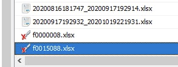
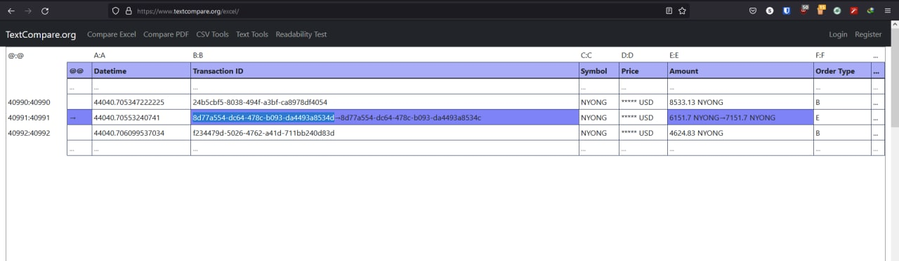

# NYONG Coin

## Description

'Kim' is the CEO of a cryptocurrency exchange 'A'.

He asked the management team for the full transaction history of 'NYONG coin' traded in a specific period.

And here is 'Lee', a member of the management team who hates 'Kim', delivered a maliciously manipulated transaction history to 'Kim' in a USB.

Analyze the USB and find one manipulated transaction in there!

Flag Format: ACSC{lowercase\(MANIPULATED\_TRANSACTION\_ID\)}

Download Link 1: https://1drv.ms/u/s!At0nZXK3fObIgoQAMtilBAZd017Klg?e=7VKBqz

Download Link 2: https://drive.google.com/file/d/10SfzE59dD88A\_TFZTxfAvqoBwsO18dxU

SHA-1: 2E21641DCE2A37959D1010E1637B8FFAEC8CF627

## Solution

Using Autopsy, we can see which files were modified.

Afterwards, diff-ing the files gives the modified row.

The flag is `ACSC{8d77a554-dc64-478c-b093-da4493a8534d}`.

