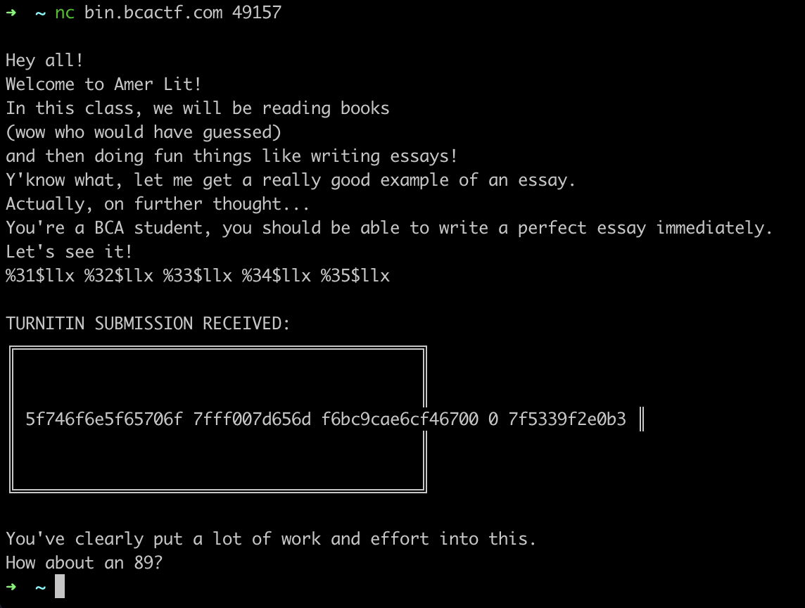
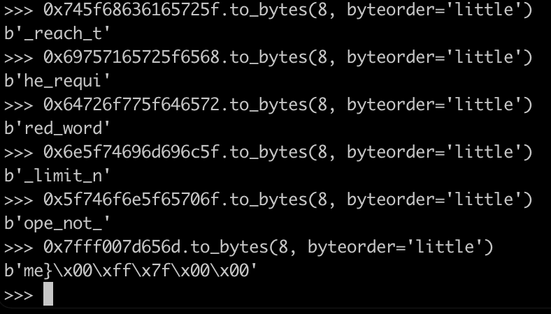

# American Literature

## Problem

Writing essays is so much fun! Watch me write all these totally meaningful words about other words... Actually, wait. You shouldn't be reading my essays. Shoo!

## Solution

We are given the following source code:

```c
int length;
char essay[50];

setbuf(stdout, NULL);
setbuf(stdin, NULL);
setbuf(stderr, NULL);

...

FILE *fp = fopen("flag.txt", "r");
char example_essay[100];

...
	
fgets(example_essay, sizeof(example_essay), fp);

...
	
fgets(essay, sizeof(essay), stdin);
essay[strcspn(essay, "\n")] = 0;
length = strlen(essay);

...
	
printf(essay);

...
```

This is a typical string format vulnerability, where the user input is passed into `printf()` as a format string. Hence, we can use `%<position>$llx` to view the stack values.

Since the `example_essay` buffer also resides on the stack, we can leak the flag.



Then, convert the little endian to big endian to obtain the flag.



