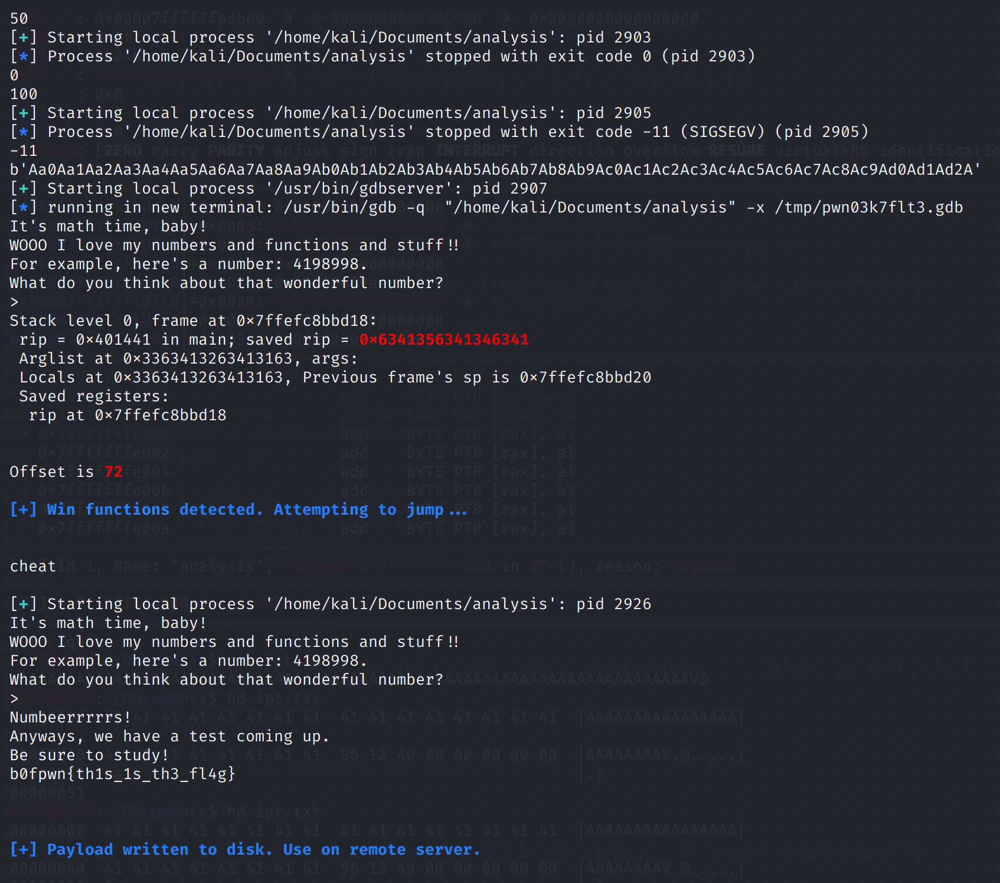
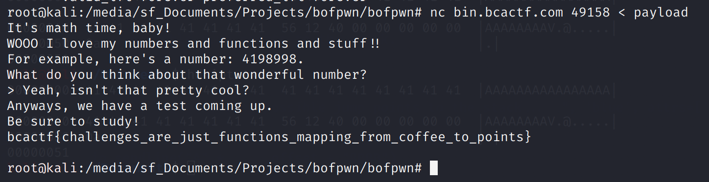

# Math Analysis

## Problem

Congratulations, you've graduated from letters! Now, let's move on to numbers.

From the BCA Course Catalog:

> Analysis I includes linear and quadratic functions, polynomials, inequalities, functions, exponential and logarithmic functions, conic sections, and geometry.

That's a lot of cool stuff! I think you'll have tons of fun learning about functions in this class!

## Solution

This is a classic buffer overflow with a win function.

```c
char response[50];

setbuf(stdout, NULL);
setbuf(stdin, NULL);
setbuf(stderr, NULL);

puts("It's math time, baby!");
puts("WOOO I love my numbers and functions and stuff!!");
printf("For example, here's a number: %d.\n", cheat);
puts("What do you think about that wonderful number?");
printf("> ");
gets(response);
```

We want to jump here:

```c
void cheat() {
    FILE *fp = fopen("flag.txt", "r");
    char flag[100];

    if (fp == NULL) {
        puts("Hmmm... I can't find my answers.");
        puts("That's not good, but at least it means you can't cheat!");
        puts("[If you are seeing this on the remote server, please contact admin].");
        exit(1);
    }

    fgets(flag, sizeof(flag), fp);
    puts(flag);
}
```

I've been writing my own tool for challenges like this, and I'm glad it worked! The general steps are still the same, though - using a cyclic pattern to find the RIP offset, then overwriting the return value to the win function.



Using the payload, we get the flag from the remote server.




