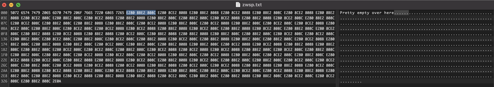
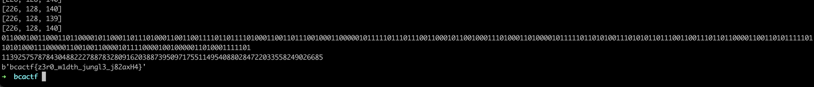

# More Than Meets the Eye

## Problem

My friend just sent me this file, but it looks pretty empty. Are you able to see anything?

## Solution

Opening up the file in a hex editor, we can see that the "empty space" is essentially repetitions of either `E280 8BE2 808C` or `E280 8CE2 808C`.



We can convert this to binary where `E280 8BE2 808C` -&gt; 0 and `E280 8CE2 808C` -&gt; 1.

```python
from Crypto.Util.number import *

with open('zwsp.txt', 'rb') as f:
    data = f.read()

i = 0
curr = []

bin_string = ''

for char in data:
    if char not in b'Pretty empty over here':
        i += 1
        curr.append(char)
        if i % 3 == 0:
            i = 0
            print(curr)

            if curr[-1] == 139:
                bin_string += '0'
            else:
                bin_string += '1'

            curr = []

print(bin_string)
print(int(bin_string, 2))
print(long_to_bytes(int(bin_string, 2)))
```



