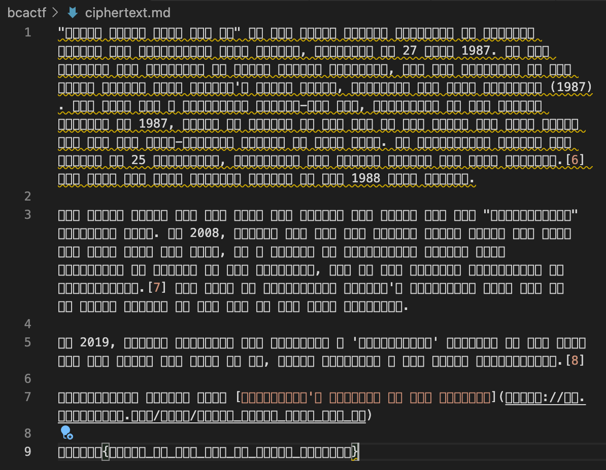
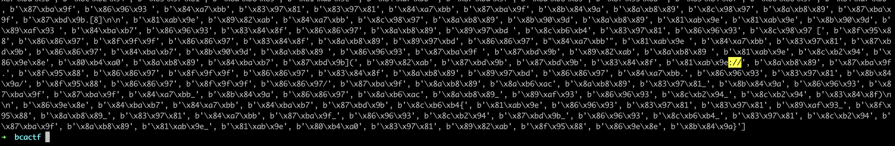
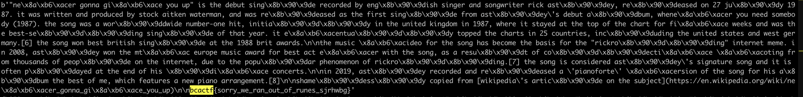

# 􃗁􌲔􇺟􊸉􁫞􄺷􄧻􃄏􊸉

## Problem

Here's some enciphered text. Find the flag.

## Solution

Parts of the ciphertext are ASCII, while the rest is not.



First, I wrote some scripts to understand the ciphertext more.

```python
with open('ciphertext.md', 'rb') as f:
    c = f.read()

freq_dict = {}

print(c)
cipher_chars = []

for char in c:

    try:
        assert chr(char).isascii()

    except:
        cipher_chars.append(char)

        if char in freq_dict:
            freq_dict[char] += 1
        else:
            freq_dict[char] = 1

print(freq_dict, len(freq_dict.items()))
```

I found that there were 40 unique 'undecodable' characters in the cipher, and the frequency dictionary is as follows:

```text
{244: 1013, 135: 170, 186: 105, 159: 99, 138: 152, 184: 138, 137: 241, 182: 37, 172: 14, 131: 82, 151: 196, 129: 137, 139: 67, 132: 140, 154: 29, 134: 236, 150: 71, 147: 91, 167: 66, 187: 66, 175: 20, 140: 72, 178: 29, 148: 29, 143: 54, 171: 117, 158: 93, 189: 131, 155: 91, 130: 43, 142: 19, 144: 38, 157: 38, 183: 26, 149: 25, 136: 25, 128: 3, 180: 26, 160: 3, 152: 20} 40
```

There is a huge number of 244's, so I realised that the ciphertext was essentially characters seperated by `\xf4`.

```python
print(c.split(b'\xf4'))
```



I then found that there was a hyperlink beginning with `https://`. The bytes in question were

```text
b'\x89\x82\xab', b'\x87\xbd\x9b', b'\x87\xbd\x9b', b'\x83\x84\x8f', b'\x81\xab\x9e://'
```

So,

* \x89\x82\xab = h
* \x87\xbd\x9b = t
* \x83\x84\x8f = p
* \x81\xab\x9e = s

Further,

```text
b'\x86\x9e\x8e', b'\x84\xba\xb7', b'\x84\xa7\xbb', b'\x84\xba\xb7', b'\x87\xbd\x9b', b'\x8c\xb6\xb4'
```

is 'bcactf'.

The rest was really guesswork. I made use of text patterns and things like 'a' being the most common letter of the alphabet to guess the remaining characters.

```python
new_c = b''
mapping = {
    b'\x89\x82\xab': b'h',
    b'\x87\xbd\x9b': b't',
    b'\x83\x84\x8f': b'p',
    b'\x81\xab\x9e': b's',
    b'\x86\x9e\x8e': b'b',
    b'\x84\xba\xb7': b'c',
    b'\x84\xa7\xbb': b'a',
    b'\x87\xbd\x9b': b't',
    b'\x8c\xb6\xb4': b'f',
    b'\x80\xb4\xa0': b'j',
    b'\x8c\xb2\x94': b'u',
    b'\x8a\xb8\x89': b'e',
    b'\x86\x96\x93': b'o',
    b'\x83\x97\x81': b'r',
    b'\x87\xba\x9f': b'n',
    b'\x8f\x95\x88': b'w',
    b'\x86\x86\x97': b'i',
    b'\x8f\x9f\x9f': b'k',
    b'\x89\x97\xbd': b'd',
    b'\x8b\x84\x9a': b'g',
    b'\x8c\x98\x97': b'm',
    b'\x89\xaf\x93': b'y'
}

freq_dict = {}
for char in c.split(b'\xf4'):

    if char in freq_dict:
        freq_dict[char] += 1
    else:
        freq_dict[char] = 1

    for pattern in mapping:
        char = char.replace(pattern, mapping[pattern])
    new_c += char
    print(char)

print(new_c)
print(freq_dict, len(freq_dict.items()))
```



