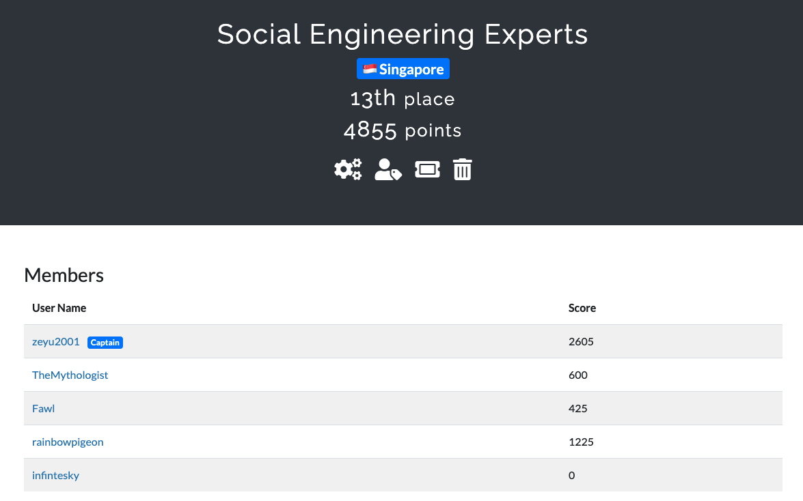

# DawgCTF 2021

I enjoyed myself in this one, although there could have been more web exploitation!

## Challenges

### Pwn

1. [No Step On Snek \(75\)](no-step-on-snek.md)
2. [Jellyspotters \(100\)](jellyspotters.md)
3. [Bofit \(125\)](bofit.md)
4. [MDL Considered Harmful \(225\)](mdl-considered-harmful.md)
5. [Back to the Lab 2 \(250\)](back-to-the-lab-2.md)

### Reversing

1. [Back to the Lab 1](back-to-the-lab-1.md)
2. [Back to the Lab 3](back-to-the-lab-3.md)

### Crypto

1. [Really Secure Algorithm \(150\)](really-secure-algorithm.md)
2. [The Obligatory RSA Challenge \(200\)](the-obligatory-rsa-challenge.md)
3. [TrashChain \(250\)](trash-chain.md)
4. [What the Flip?! \(300\)](what-the-flip.md)

### Audio/Radio

1. [Baby's First Modulation \(50\)](babys-first-modulation.md)

### Fwn \(Forensics/Web/Network\)

1. [Just a Comment \(50\)](just-a-comment.md)
2. [Dr. Hrabowski's Great Adventure \(150\)](dr.-hrabowskis-great-adventure.md)

### Misc

1. [Two Truths and a Fib \(100\)](two-truths-and-a-fib.md)

## Results

We ended up in 13th place.

