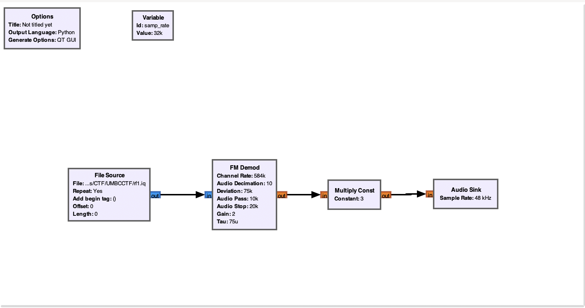

# Baby's First Modulation

## Problem

Our listening station caught this RF recording of a guy reading off the flag. It's FM modulated.

rf1.iq: [https://drive.google.com/file/d/1TSOt9YrljsE8ETSlXRsGLy3Qo8M3g3jQ/view?usp=sharing](https://drive.google.com/file/d/1TSOt9YrljsE8ETSlXRsGLy3Qo8M3g3jQ/view?usp=sharing)

This IQ file was saved in standard GNURadio format \(complex, 32bit float I, 32bit float Q\)

Author: nb

## Solution

Open the `.iq` file in GNURadio and apply the demodulation.

