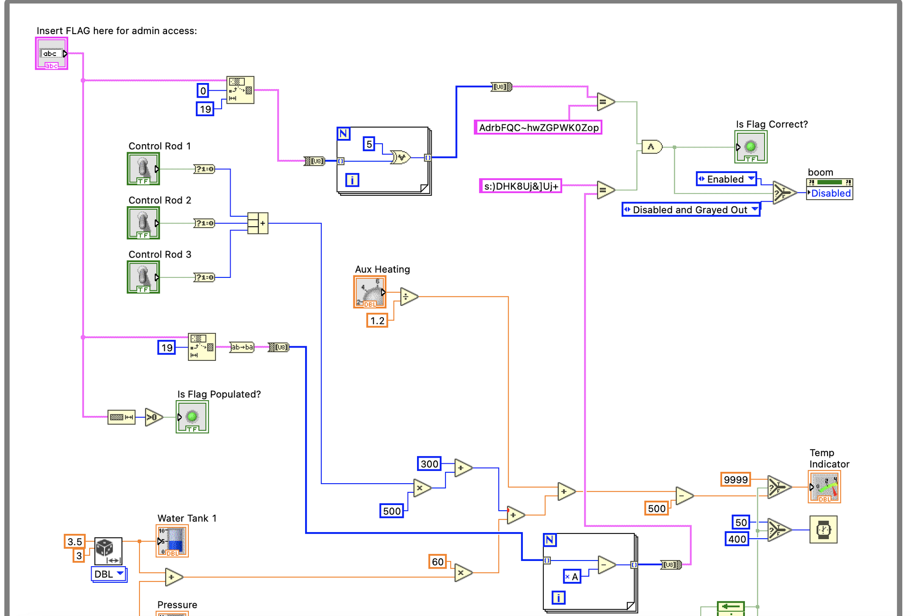
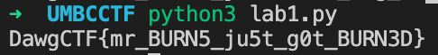

# Back to the Lab 1

## Problem

We've gotten hold of the plant control program, but the MELTDOWN button is locked. Figure out the flag and press the button!

Note: To run the program, you'll have to press the Run button in the upper left of the window. Press the Abort button to stop it.

Note: To run the program, you'll need some rather expensive software; look for the "community edition", it's free. It's bulky, so maybe consider installing on a VM.

Author: nb

## Solution

The source code given is a LabVIEW file. Open it using LabVIEW Community.



For substring \(0, 19\), its XOR with 5 is compared with `AdrbFQC~hwZGPWK0Zop`.

For the rest, `0xA` is subtracted from it and compared with `s:)DHK8Uj&]Uj+`. The string is also reversed.

```python
first_part = 'AdrbFQC~hwZGPWK0Zop'
second_part = 's:)DHK8Uj&]Uj+'

for char in first_part:
    print(chr(ord(char) ^ 5), end='')

result = ''
for char in second_part:
    result += chr(ord(char) + 0xA)

print(result[::-1])
```



