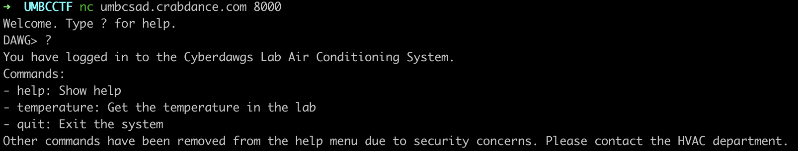
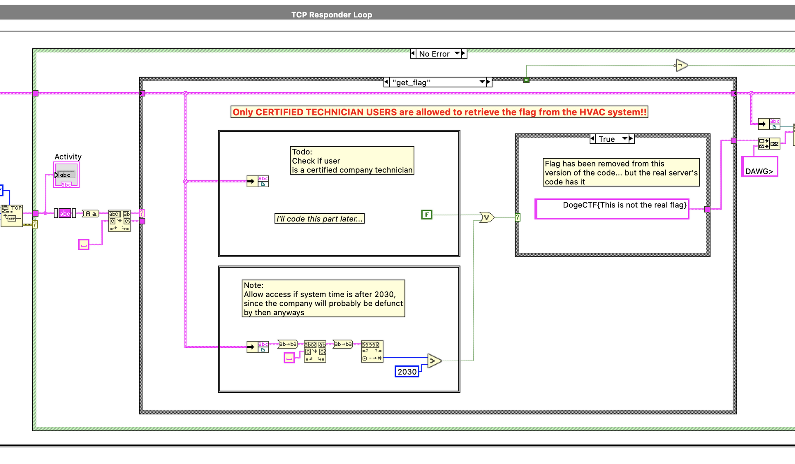
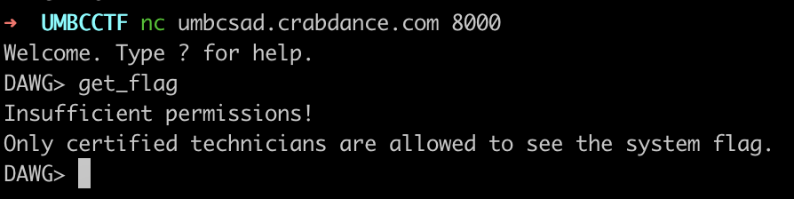
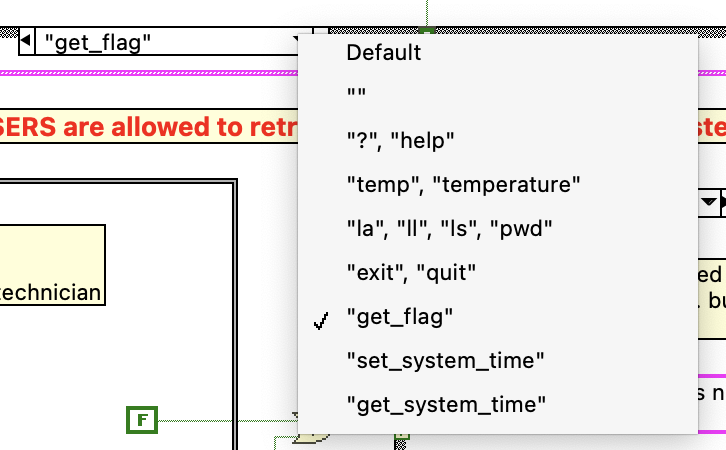
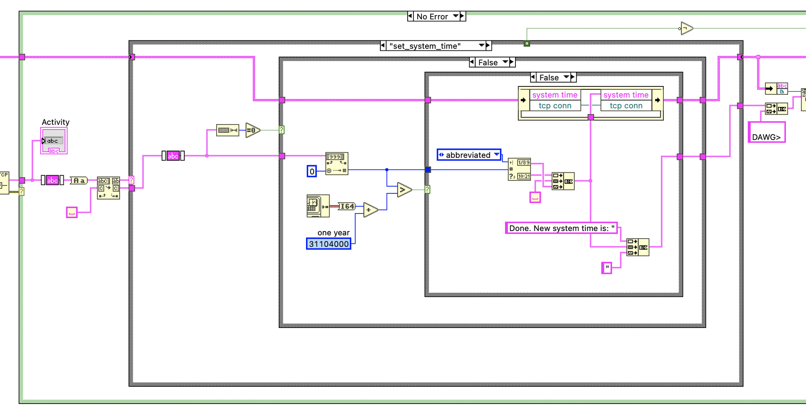
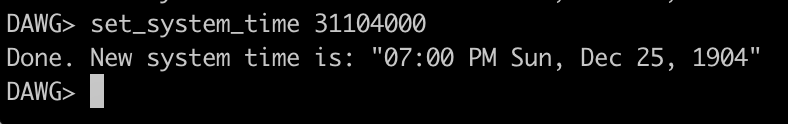
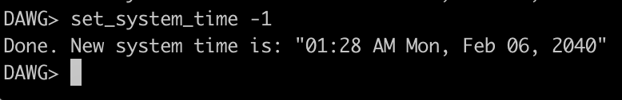
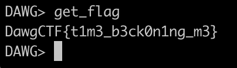

# Back to the Lab 2

## Problem

We installed this new HVAC system in the lab using NI instrumentation. Ooh, it's internet-connected. Can you get the flag off of it? It requires "company technician access" but we managed to convince the company to give us some old source code, maybe you can find a workaround?

nc umbcsad.crabdance.com 8000

back\_to\_the\_lab\_2.vi: [https://drive.google.com/file/d/1Bu7xpMiGCEPONd7Hdl6BQL6JXqrFWE6i/view?usp=sharing](https://drive.google.com/file/d/1Bu7xpMiGCEPONd7Hdl6BQL6JXqrFWE6i/view?usp=sharing)

Author: nb

## Solution

Some commands are not shown. We would have to consult the source code.

The source code given is a LabVIEW file. Open it using LabVIEW Community. We can view the block diagram for the TCP responder loop.

We can see that there is a `get_flag` function.

We can see that there are 2 conditions from the source code

1. Not yet implemented \(always False\)
2. System time is after 2030

If we look at the list of commands, there is a `set_system_time` and `get_system_time` function.

If we look at the `set_system_time` function, we see we can set the system time.

For instance:

However, a check is performed so that we cannot set the system time more than 1 year ahead of the actual time. This check is performed by checking whether the input number is greater than a certain value.

What if we used negative values instead?

This sets the time to 2040, and bypasses the `>` check.

Now we can use the `get_flag` command.

