# Back to the Lab 3

## Problem

I think you just have to unzip it and open up \_main.vi. ... Oh god, what... what is this?

back\_to\_the\_lab\_3.7z: [https://drive.google.com/file/d/184nf-brey1pmk7uvW0VaZ234hrpB3Mgi/view?usp=sharing](https://drive.google.com/file/d/184nf-brey1pmk7uvW0VaZ234hrpB3Mgi/view?usp=sharing)

Author: nb

## Solution

First things first, it's pretty annoying that you only get one try, and we need to debug this multiple times later on. We can patch the program and make sure that the checker always allows the rest of the program to run by replacing it with 1.

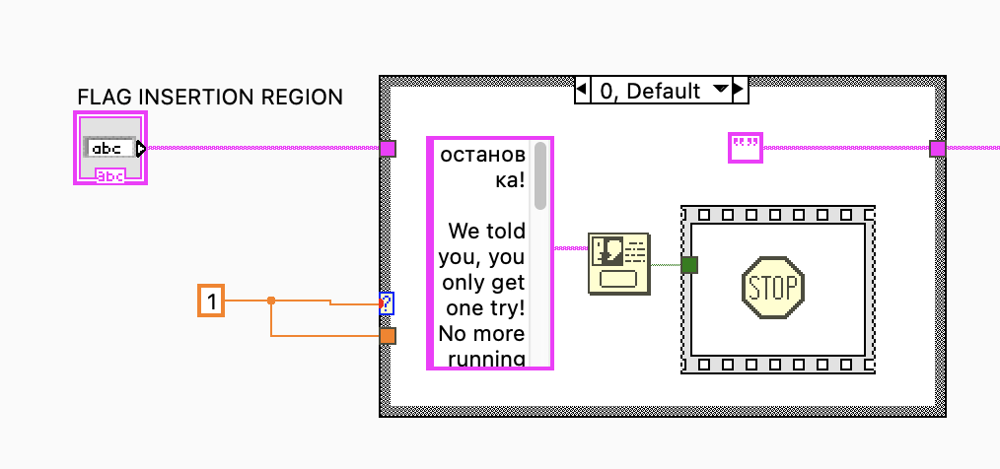

### First 14 Chars

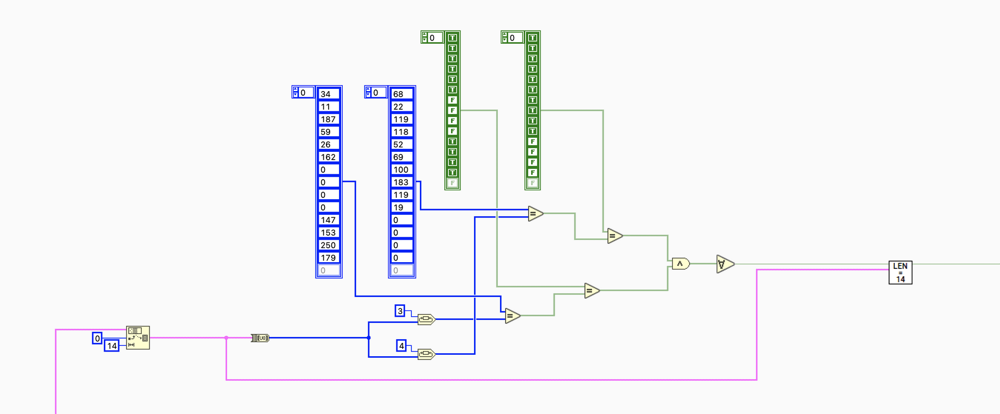

The bytearray with each number rotated left by 3 bits and 4 bits respectively is compared with two constant bytearrays. But note that the bytes are treated as 8-bit unsigned integers, so our implementation needs to consider that.

### Second 14 Chars

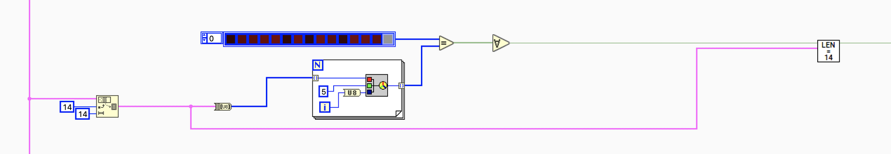

The bytearray is represented as RGB values.

* R = byte value
* G = 5 \(constant\)
* B = array index

We can inspect the RGB values:

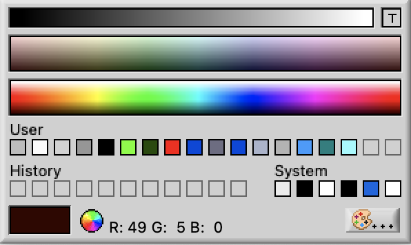

## Third 14 Chars

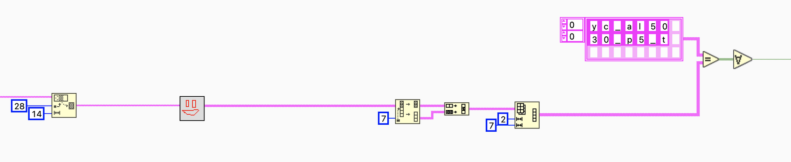

The input is split into the first 7 and last 7 bytes, then interleaved.

## Fourth 14 Chars

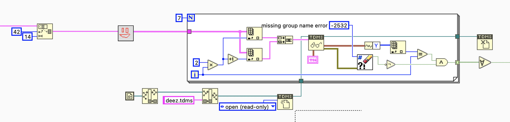

Every 2 characters in the array are concatenated and used as the "group name" to read the TDMS file. The Y-value is compared to the array index. Use the probe watch window to debug the program.

Y-value for "ru" is 0

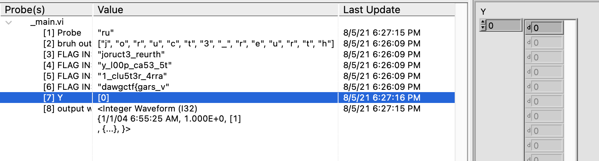

Y-value for "ct" is 1

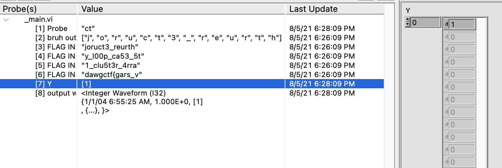

"3\_" is 3

"ur" is 2

"th" is 4

"r1" is 6

"e\_" is 5

Then, rearrange so that we go from 0 to 6.

## Fifth 14 Chars

There are multiple parts to this.

First, we know it starts with 'd', since other options give us False immediately.

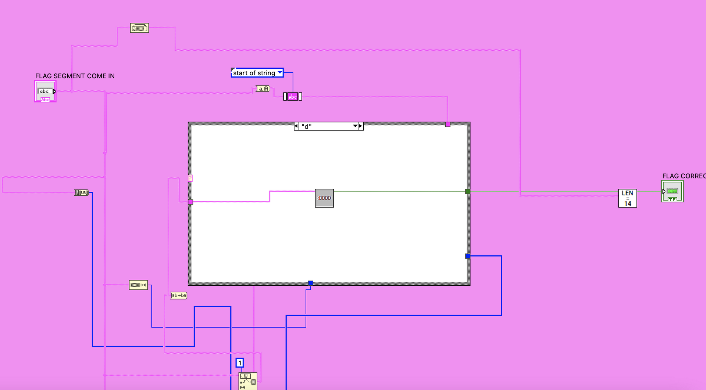

One of the parts is password protected. If we drag the comment out we can see the hidden password.

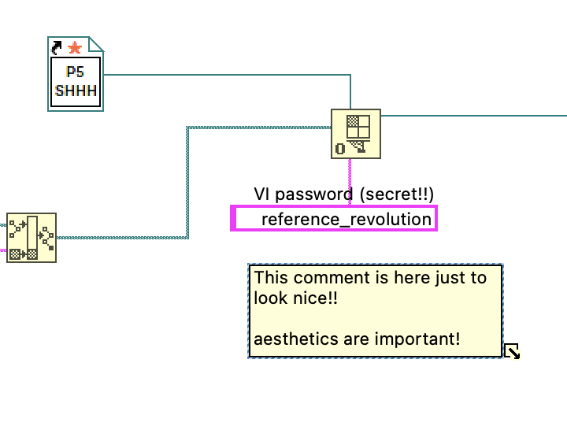

This unlocks the block diagram.

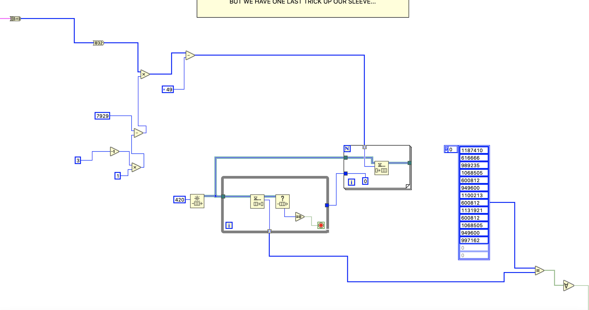

The input is first converted to their ASCII values, then multiplied with 7927.

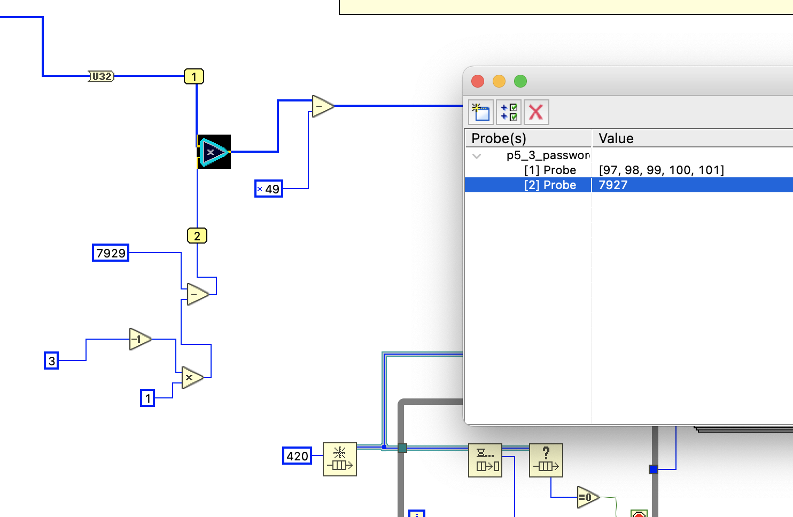

Then, 0x49 is subtracted.

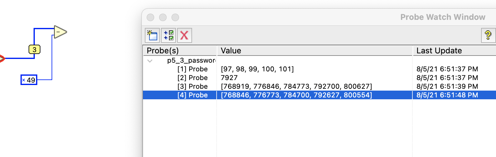

Then it goes through some redundant enqueuing, and is compared to some constants.

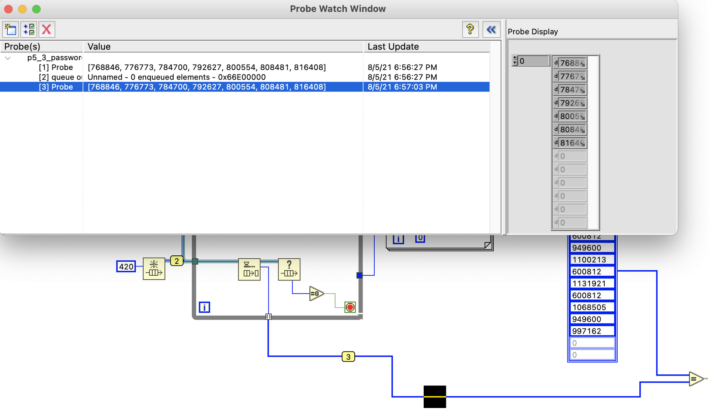

But we get some weird results. 990802 = 1187410?

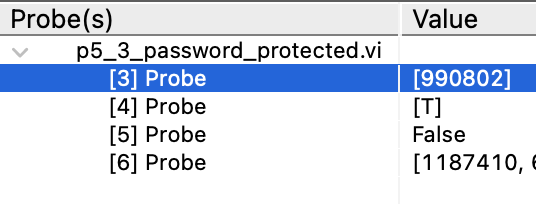

Then I realised that the last 16 bits are equal. We are probably comparing 16 bit numbers!

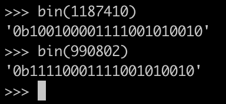

## Final Script

Finally!

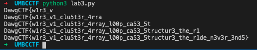

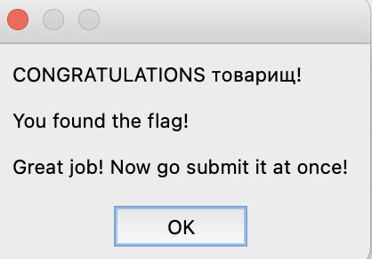

```python
import string

INT_BITS = 8

def leftRotate(n, d):
    result = bin(n << d)
    if len(result) - 2 > 8:
        result = result[-8:-1 * (len(result) - 2 - 8)] + result[2:-8]

    return int(result, 2)

rotated_left_3 = [34, 11, 187, 59, 26, 162, 0, 0, 0, 0, 147, 153, 250, 179]
rotated_left_4 = [68, 22, 119, 118, 52, 69, 100, 183, 119, 19, 0, 0, 0, 0]

flag = ''

for i in range(14):
    for char in string.ascii_letters + string.digits + '-_{}':
        if leftRotate(ord(char), 3) == rotated_left_3[i] or leftRotate(ord(char), 4) == rotated_left_4[i]:
            flag += char

    i += 1

print(flag)
assert len(flag) == 14

r_values = [49, 95, 99, 108, 117, 53, 116, 51, 114, 95, 52, 114, 114, 97]
flag += ''.join([chr(x) for x in r_values])

print(flag)
assert len(flag) == 28

flag += 'y_l00p_ca53_5t'
print(flag)
assert len(flag) == 42

flag += 'ructur3_the_r1'
print(flag)
assert len(flag) == 56

fragment = ''
results = [1187410, 616666, 989235, 1068505, 600812, 949600, 1100213, 600812, 1131921, 600812, 1068505, 949600, 997162]
for result in results:
    for char in string.ascii_letters + string.digits + '-_{}':
        output = ord(char) * 7927 - 0x49
        if int(bin(output)[-16:], 2) == int(bin(result)[-16:], 2):
            fragment += char
            break

flag += 'd'
flag += fragment[::-1]
print(flag)
```

