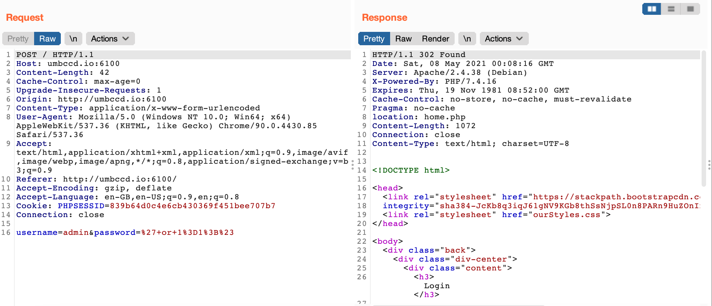
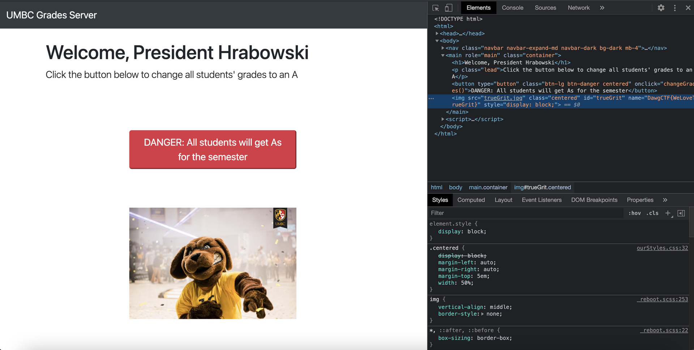

# Dr. Hrabowski's Great Adventure

## Problem

President Freeman Hrabowski is having a relaxing evening in Downtown Baltimore. But he forgot his password to give all UMBC students an A in all their classes this semester! Find a way to log in and help him out.

[http://umbccd.io:6100](http://umbccd.io:6100)

\(If you get an SSL error, try a different browser\)

Author: Clearedge

## Solution

To bypass authentication, the basic payload `username=admin&password=' or 1=1;#` works.

The flag is in the image's name attribute.

