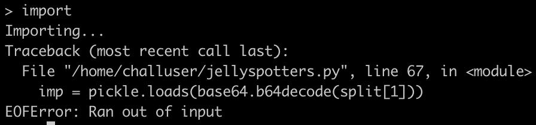
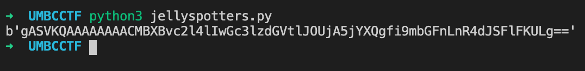
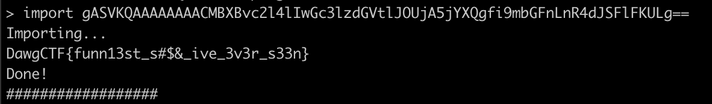

# Jellyspotters

## Challenge

The leader of the Jellyspotters has hired you to paint them a poster for their convention, using this painting program. Also, the flag is in ~/flag.txt.

nc umbccd.io 4200

Author: nb

## Solution

B64 encoded pickle string is loaded.

Reference: [https://davidhamann.de/2020/04/05/exploiting-python-pickle/](https://davidhamann.de/2020/04/05/exploiting-python-pickle/)

We can leverage the `__reduce__` method to call `os.system()` with `cat ~/flag.txt`.

Passing the b64 encoded string into the input, we get the flag.

