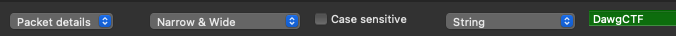
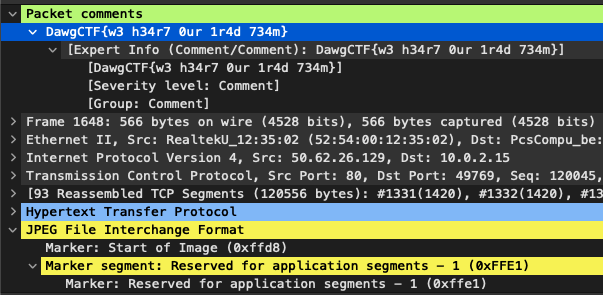

# Just a Comment

## Problem

Just a comment, we love our people here at ClearEdge!

justacomment.pcapng: [https://drive.google.com/file/d/1vcLdCLi-zYTe\_WPtXyu2Gr3rM0a3Ct7h/view?usp=sharing](https://drive.google.com/file/d/1vcLdCLi-zYTe_WPtXyu2Gr3rM0a3Ct7h/view?usp=sharing)

Author: Clearedge

## Solution

Search the PCAP by string.

In one of the packet comments, we find the flag.

