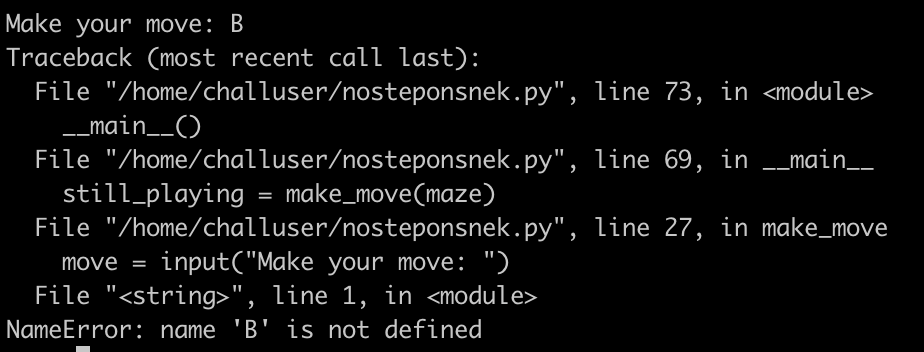
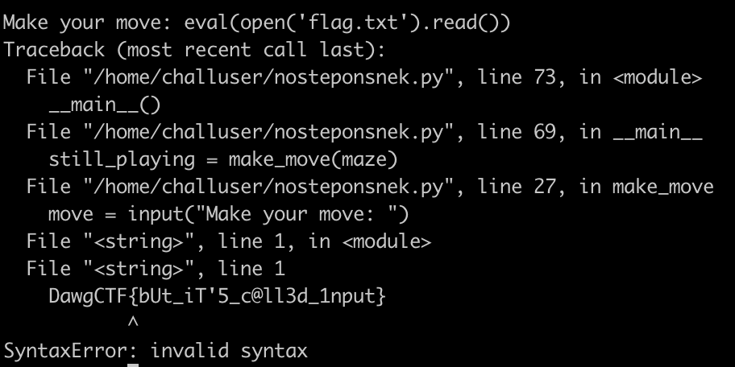

# No Step On Snek

## Challenge

I heard you guys like python pwnables

nc umbccd.io 4000

Author: trashcanna

## Solution

A different board is shown every time.

`move = input("Make your move: ")`

The output shows us that Python 2 is used -- the code tries to evaluate the input.

We can pass in `eval(open('flag.txt').read())` as the input. In the traceback, we get the flag.

