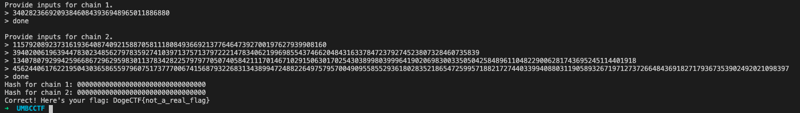
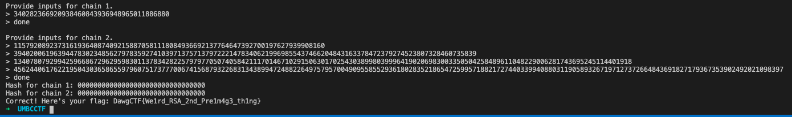

# Trash Chain

## Problem

It seems that my problems with hashing just keep multiplying...

nc umbccd.io 3100

Author: RJ

## Solution

The challenge is as follows:

Welcome to TrashChain! In this challenge, you will enter two sequences of integers which are used to compute two hashes. If the two hashes match, you get the flag! Restrictions:

* Integers must be greater than 1.
* Chain 2 must be at least 3 integers longer than chain 1
* All integers in chain 1 must be less than the smallest element in chain 2

  Type "done" when you are finished inputting numbers for each chain.

Hash function:

```python
def H(val, prev_hash, hash_num):
    return (prev_hash * pow(val + hash_num, B, A) % A)
```

Computing hashes:

```python
hashes = []
for chain_num in range(len(chains)):
    cur_hash = 1
    for i, val in enumerate(chains[chain_num]):
        cur_hash = H(val, cur_hash, i+1)
    hashes.append(cur_hash)
```

Leverage the fact that $$A^B\mod{A}=0$$. If we simply pass in A as the input, the hash will be 0, and we can make the two hashes collide by forcing them both to be 0.

Since chain 2 must be 3 numbers longer than chain 1, we can simply use $$A^{nB}\mod{A}=0$$, where _n_ is any positive integer.

Testing our theory:



Of course, this works on the actual server as well.



