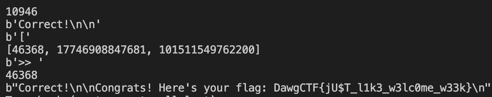

# Two Truths and a Fib

## Problem

Can you catch the fibber?

nc umbccd.io 6000

Author: Trashcanna

## Solution


```python
import math
from pwn import *

# A utility function that returns true if x is perfect square
def isPerfectSquare(x):
    s = int(math.sqrt(x))
    return s*s == x

# Returns true if n is a Fibinacci Number, else false
def isFibonacci(n):

    # n is Fibinacci if one of 5*n*n + 4 or 5*n*n - 4 or both
    # is a perferct square
    return isPerfectSquare(5*n*n + 4) or isPerfectSquare(5*n*n - 4)

conn = remote('umbccd.io', 6000)

done = False
while not done:
    print(conn.recvuntil('['))
    arr = eval('[' + conn.recvline().decode())

    print(arr)
    print(conn.recv())

    for num in arr:
        if isFibonacci(num):
            print(num)
            conn.send(str(num) + '\r\n')
            break

    print(conn.recv())

conn.close()
```

Eventually we get the flag:



