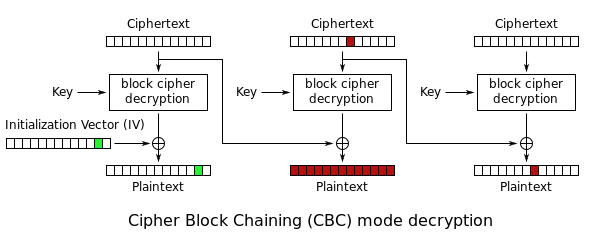
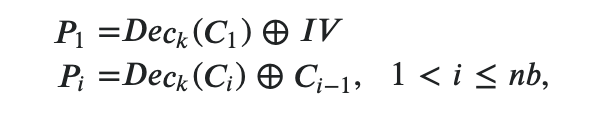
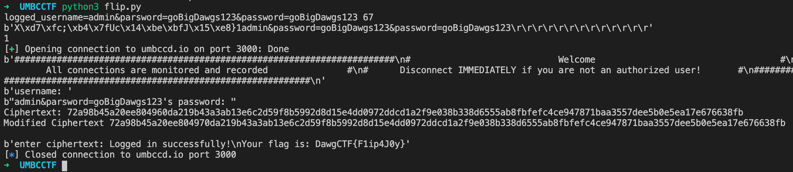

# What the Flip?!

## Problem

Hackers have locked you out of your account! Fortunately their netcat server has a vulnerability.

nc umbccd.io 3000

This netcat server is username and password protected. The admin login is known but forbidden. Any other login entered gives a cipher.

Author: Clearedge

## Solution

We can input the `user` and `passwd` into the below string, which is encrypted. `admin&password=goBigDawgs12` is not allowed.

```python
msg = 'logged_username=' + user +'&password=' + passwd

try:
    assert('admin&password=goBigDawgs123' not in msg)
except AssertionError:
    send_msg(s, 'You cannot login as an admin from an external IP.\nYour activity has been logged. Goodbye!\n')
    raise
```

The ciphertext is given to us, and we are prompted to enter another ciphertext.

```python
send_msg(s, "Leaked ciphertext: " + encrypt_data(msg)+'\n')
send_msg(s,"enter ciphertext: ")
```

Then, in `decrypt_data()`, the presense of `admin&password=goBigDawgs12` is checked. The goal is to submit a ciphertext such that the corresponding plaintext contains `admin&password=goBigDawgs12`.

```python
def decrypt_data(encryptedParams):
    cipher = AES.new(key, AES.MODE_CBC,iv)
    paddedParams = cipher.decrypt(unhexlify(encryptedParams))
    print(paddedParams)
    if b'admin&password=goBigDawgs123' in unpad(paddedParams,16,style='pkcs7'):
        return 1
    else:
        return 0
```

From `encrypt_data()`, we can see that AES CBC encryption is used, with a block size of 16.

```python
def encrypt_data(data):
    padded = pad(data.encode(),16,style='pkcs7')
    cipher = AES.new(key, AES.MODE_CBC,iv)
    enc = cipher.encrypt(padded)
    return enc.hex()
```

Since we are given a ciphertext and tasked to find another ciphertext that decodes into a different string, an AES CBC **byte flipping attack** can be used.



In CBC, each block of plaintext depends on the previous ciphertext.



So if we manage to change the ciphertext in a previous block, we can change the plaintext in the next block.

We can send a payload like `logged_username=admin&parsword=goBigDawgs123` \(note the purposeful misspelling of `password` as `parsword`\). Then, we will edit the previous block of ciphertext such that `r` becomes `s` at the misspelt index. We simply have to change the ciphertext at the correct index.

For instance, the following code gives us the edited ciphertext.

```python
user = ''
password = 'goBigDawgs123'
msg = 'logged_username=admin&parsword=goBigDawgs123' + user +'&password=' + password
print(msg, len(msg))

xor = ord('r') ^ ord('s')
cipher = encrypt_data(msg)
cipher = cipher[:16] + hex(int(cipher[16:18], 16) ^ xor)[2:] + cipher[18:]
print(decrypt_data(cipher))
```

Notice that the second block has been changed to the desired string. Since we modified the first block, it will no longer decode properly \(but in this case it doesn't matter since only the desired string is checked\).

```text
b'X\xd7\xfc;\xb4\x7fUc\x14\xbe\xbfJ\x15\xe8}1admin&password=goBigDawgs123&password=goBigDawgs123\r\r\r\r\r\r\r\r\r\r\r\r\r'
```

Putting it all together:

```python
from Crypto.Cipher import AES
from Crypto.Util.Padding import pad,unpad
from Crypto.Util.number import bytes_to_long
from Crypto.Random import get_random_bytes
from binascii import unhexlify
from pwn import *
import re

key = get_random_bytes(16)
iv = get_random_bytes(16)

def encrypt_data(data):
    padded = pad(data.encode(),16,style='pkcs7')
    cipher = AES.new(key, AES.MODE_CBC,iv)
    enc = cipher.encrypt(padded)
    return enc.hex()

def decrypt_data(encryptedParams):
    cipher = AES.new(key, AES.MODE_CBC,iv)
    paddedParams = cipher.decrypt( unhexlify(encryptedParams))
    print(paddedParams)
    if b'admin&password=goBigDawgs123' in unpad(paddedParams,16,style='pkcs7'):
        return 1
    else:
        return 0

user = ''
password = 'goBigDawgs123'
msg = 'logged_username=admin&parsword=goBigDawgs123' + user +'&password=' + password
print(msg, len(msg))

xor = ord('r') ^ ord('s')
cipher = encrypt_data(msg)
cipher = cipher[:16] + hex(int(cipher[16:18], 16) ^ xor)[2:] + cipher[18:]
print(decrypt_data(cipher))

conn = remote('umbccd.io', 3000)

print(conn.recv())
print(conn.recv())
conn.send('admin&parsword=goBigDawgs123\r\n')
print(conn.recv())
conn.send('\r\n')

match = re.match(r'Leaked ciphertext: (.+)\n', conn.recv().decode())
print('Ciphertext:', match[1])

cipher = match[1]
cipher = cipher[:16] + hex(int(cipher[16:18], 16) ^ xor)[2:] + cipher[18:]
print('Modified Ciphertext', cipher)

print()
conn.send(cipher + '\r\n')
print(conn.recv())

conn.close()
```



