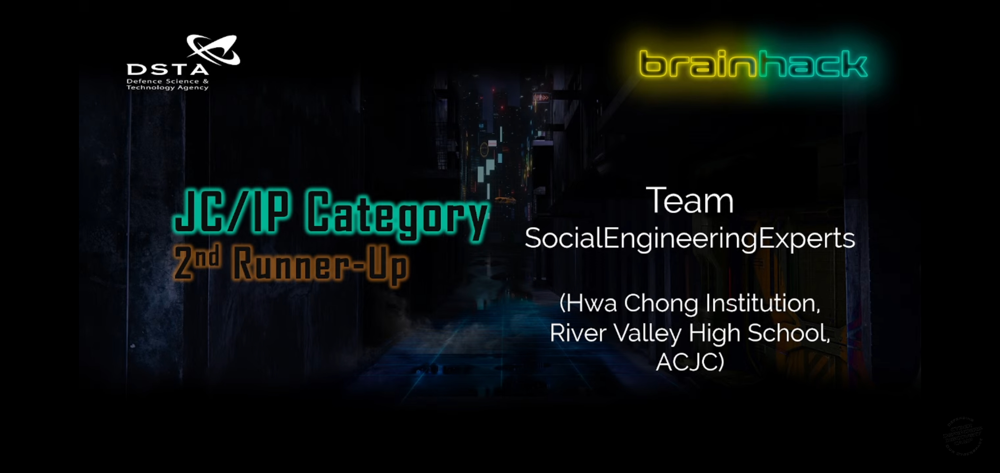

# DSTA BrainHack CDDC21

## Preface

BrainHack Cyber Defenders Discovery Camp \(CDDC\) is an annual local CTF competition held in Singapore.

I'll be honest. This was _not_ a good CTF. It mainly had to do with the vendor that was organizing the CTF \(BSW\), which proved to be thoroughly unprepared to prevent and mitigate technical issues during the CTF. We have compiled several of the main issues with the planning and execution of the event in the following document.



**SocialEngineeringExperts obtained 3rd place in the JC/IP category.** However, I'm sure that title could easily have gone to other teams if the challenges were properly planned - it didn't take us long to realise that the top teams would have obtained the maximum possible score long before the CTF ended due to the lack of difficult and diverse challenges. I arrived at work an hour early just to ensure that I'll make it in time for the last challenge release: the CTF was 'over' \(we knew the winners\) less than an hour later.

Nevertheless, previous years have shown that CDDC _can be good._ Here's to hoping for a better event next year.

## Challenges

The challenges are split into "Missions". Each mission contains a set of challenges. 

* [File It Away \(Pwn\)](file-it-away-pwn.md)
* [Linux Rules the World \(Linux\) ](linux-rules-the-world-linux.md)
* [Going Active \(Reconnaissance\)](going-active-reconnaissance.md)
* [Break it Down \(Crypto\)](break-it-down-crypto.md)
* [Behind the Mask \(Windows\)](behind-the-mask-windows.md)
* [Web Takedown Episode 2 \(Web\)](web-takedown-episode-2-web.md)

