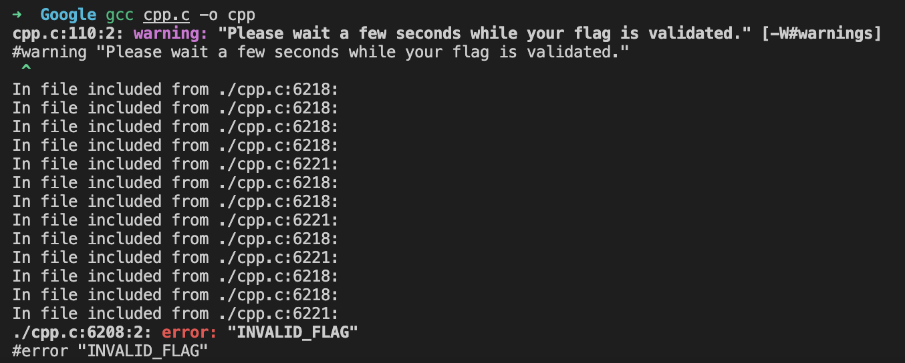

# CPP

We are provided with the following 6234-line source code:



Essentially, the flag is checked through a bunch of `#define` and `#ifdef` statements in the source code. Compiling the code gives the following output:



The way it works is that you define your flag here:

```c
#if __INCLUDE_LEVEL__ == 0
// Please type the flag:
#define FLAG_0 CHAR_C
#define FLAG_1 CHAR_T
#define FLAG_2 CHAR_F
#define FLAG_3 CHAR_LBRACE
#define FLAG_4 CHAR_w
#define FLAG_5 CHAR_r
#define FLAG_6 CHAR_i
#define FLAG_7 CHAR_t
#define FLAG_8 CHAR_e
#define FLAG_9 CHAR_UNDERSCORE
#define FLAG_10 CHAR_f
#define FLAG_11 CHAR_l
#define FLAG_12 CHAR_a
#define FLAG_13 CHAR_g
#define FLAG_14 CHAR_UNDERSCORE
#define FLAG_15 CHAR_h
#define FLAG_16 CHAR_e
#define FLAG_17 CHAR_r
#define FLAG_18 CHAR_e
#define FLAG_19 CHAR_UNDERSCORE
#define FLAG_20 CHAR_p
#define FLAG_21 CHAR_l
#define FLAG_22 CHAR_e
#define FLAG_23 CHAR_a
#define FLAG_24 CHAR_s
#define FLAG_25 CHAR_e
#define FLAG_26 CHAR_RBRACE
```

and the following preprocessor directives determine whether the flag is valid.

## Analysis \(Part 1\)

Looking through the code, here are some findings. First, the `ROM_x_y` macros represent the bits of each flag character. 

`ROM_x_y` is the $$y$$-th bit of the flag character$$F_{x-128}$$, where $$x$$ is in binary. 

```c
#if FLAG_0 & (1<<0)
#define ROM_10000000_0 1
#else
#define ROM_10000000_0 0
#endif

...

#if FLAG_1 & (1<<0)
#define ROM_10000001_0 1
#else
#define ROM_10000001_0 0
#endif

...
```

Next,  

* `LD(x, y)` means `ROM_ ## x ## _ ## y` \(concatenate\)
* `l` means `l7 ## l6 ## l5 ## l4 ## l3 ## l2 ## l1 ## l0` \(concatenate\)

```c
#define _LD(x, y) ROM_ ## x ## _ ## y
#define LD(x, y) _LD(x, y)
#define _MA(l0, l1, l2, l3, l4, l5, l6, l7) l7 ## l6 ## l5 ## l4 ## l3 ## l2 ## l1 ## l0
#define MA(l0, l1, l2, l3, l4, l5, l6, l7) _MA(l0, l1, l2, l3, l4, l5, l6, l7)
#define l MA(l0, l1, l2, l3, l4, l5, l6, l7)
```

Subsequently, `LD(l, y)` is used to check whether the flag characters are valid. The first example of this is after `if S == 34` \(line 4229\).

First, the bits `l0` to `l7` are set, where `lx` is the `x`-th bit. Together, `l7 l6 ... l0` form the `x` \(flag index\) in `ROM_x_y`. 

```c
#ifdef B0
#define l0 1
#else
#define l0 0
#endif

...

#ifdef B7
#define l7 1
#else
#define l7 0
#endif
```

Then, `LD(l, y)` is used to check the `y`-th bit of the flag character.

```c
#if LD(l, 0)
#define A0
#else
#undef A0
#endif

...

#if LD(l, 7)
#define A7
#else
#undef A7
#endif
```

Finally, note that all of this only happens when `__INCLUDE_LEVEL__ > 12`. Before that, it recursively includes itself. Note the definition of the pre-defined `__INCLUDE_LEVEL__` macro:

> This macro expands to a decimal integer constant that represents the depth of nesting in include files. The value of this macro is incremented on every ‘\#include’ directive and decremented at the end of every included file. It starts out at 0, its value within the base file specified on the command line.

The following `else` statement corresponds to the previous `if __INCLUDE_LEVEL__ > 12` which, if passed, checks the flag.

```c
#else
#if S != -1
#include "cpp.c"
#endif
#if S != -1
#include "cpp.c"
#endif
#endif
```

Before the `__INCLUDE_LEVEL__` goes to 13, it recursively includes itself.

## Converting to Python Code

In an attempt to make the code more readable and to analyse the checking of the flag, I wrote a script to convert the preprocessor directives to Python code.

```python
with open("cpp.c", 'r') as infile, open("converted.py", 'w') as outfile:
    line = infile.readline()[:-1]
    
    curr_indent = 0
    
    while line != '#include <stdio.h>':
        
        if line.startswith('//'):
            line = infile.readline()[:-1]
            continue
    
        if line.startswith('#define'):
            line_data = line.split()
            if len(line_data) == 3:
                outfile.write(f"{curr_indent * ' '}{line_data[1]} = {line_data[2]}\n")
                
            else:
                outfile.write(f"{curr_indent * ' '}{line_data[1]} = None\n")
                
        elif line.startswith('#ifdef'):
            outfile.write(f"{curr_indent * ' '}if '{line.split()[1]}' in locals() or '{line.split()[1]}' in globals():\n")
            curr_indent += 4
        
        elif line.startswith('#ifndef'):
            outfile.write(f"{curr_indent * ' '}if '{line.split()[1]}' not in locals() and '{line.split()[1]}' not in globals():\n")
            curr_indent += 4
        
        elif line.startswith('#undef'):
            outfile.write(f"{curr_indent * ' '}if '{line.split()[1]}' in locals() or '{line.split()[1]}' in globals():\n")
            outfile.write(f"{(curr_indent + 4) * ' '}del {line.split()[1]}\n")
        
        elif line.startswith('#if'):
            outfile.write(f"{curr_indent * ' '}{line[1:]}:\n")
            curr_indent += 4
           
        elif line.startswith('#else'):
            outfile.write(f"{(curr_indent - 4) * ' '}else:\n")
            
        elif line.startswith('#endif'):
            curr_indent -= 4
            
        elif line.startswith('#error'):
            outfile.write(f"{curr_indent * ' '}print({' '.join(line.split()[1:])})\n")
        
        else:
            print(line)
        
        line = infile.readline()[:-1]
```

The result is something like this:

```python
S = 0

if INCLUDE_LEVEL > 12:

    if S == 0:
        if 'S' in locals() or 'S' in globals():
            del S
        S = 1
        if 'S' in locals() or 'S' in globals():
            del S
        S = 24
    if S == 1:
        if 'S' in locals() or 'S' in globals():
            del S
        S = 2
        if 'R0' in locals() or 'R0' in globals():
            if 'R0' in locals() or 'R0' in globals():
                del R0
        else:
            R0 = None
        if 'R1' in locals() or 'R1' in globals():
            if 'R1' in locals() or 'R1' in globals():
                del R1
                
...

else:
    if S != -1:
        INCLUDE_LEVEL += 1
        exec(open('include.py').read())
        INCLUDE_LEVEL -= 1
    if S != -1:
        INCLUDE_LEVEL+= 1
        exec(open('include.py').read())
        INCLUDE_LEVEL -= 1
```

This is Python code that performs the same checking functionality as the preprocessor directives. This works by replacing `ifdef` and `ifndef` with checking whether the variable exists, which is basically the same thing!

For `LD(x, y)`, we can define the following function which accepts `l` as an array of `[l7, l6, ..., l0]`:

```python
 def LD(l, n):
    return eval(f"ROM_{''.join([str(x) for x in l])}_{n}")
```

## Analysis \(Part 2\)

After some dynamic analysis, I found that the code essentially checks each character of the flag one by one, starting from index 0. The value of `S` follows a predictable sequence for the checking of the first few characters, then goes to `S = 56` before the program says `INVALID_FLAG`.

Let's inspect this part of the code then.

```python
if S == 56:
    print(S)
    if 'S' in locals() or 'S' in globals():
        del S
    S = 57
    if 'Q0' not in locals() and 'Q0' not in globals():
        if 'Q1' not in locals() and 'Q1' not in globals():
            if 'Q2' not in locals() and 'Q2' not in globals():
                if 'Q3' not in locals() and 'Q3' not in globals():
                    if 'Q4' not in locals() and 'Q4' not in globals():
                        if 'Q5' not in locals() and 'Q5' not in globals():
                            if 'Q6' not in locals() and 'Q6' not in globals():
                                if 'Q7' not in locals() and 'Q7' not in globals():
                                    if 'S' in locals() or 'S' in globals():
                                        del S
                                    S = 58
if S == 57:
    if 'S' in locals() or 'S' in globals():
        del S
    S = 58
    print("INVALID_FLAG")
if S == 58:
    if 'S' in locals() or 'S' in globals():
        del S
    S = 59
    if 'S' in locals() or 'S' in globals():
        del S
    S = -1
```

At `S = 56`, if any of `Q0` to `Q7` is defined, then `S` is set to 57, and this results in `INVALID_FLAG`. However, if all of `Q0` to `Q7` is not defined, then it skips this part of the code and jumps to `S = 58`.

## Solving

This knowledge greatly reduces the time complexity of a bruteforce solution. The idea is that when any of `Q0` to `Q7` is set, we can conclude that the last-checked character is wrong. Previously, we would have no way of knowing whether each individual character is correct, only that the flag as a whole is wrong.

The following solver script implements this, albeit in a very hacked-together kind of way. Since `LD(l, n)` is called for each bit in each flag character, we know that the `i`-th character is wrong if by the `i+1`-th character, any of `Q0` to `Q7` is set. This is then handled by the driver code by moving on to the next possible `i`-th character.

```python
import string
from io import StringIO
from contextlib import redirect_stdout

CHAR_a = 97

...

CHAR_UNDERSCORE = 95

FLAG_0 = CHAR_C

...

FLAG_26 = CHAR_RBRACE

result = ''

for i in range(27):
    def LD(l, n):
        global i
        if f"ROM_{''.join([str(x) for x in l])}_{n}" == f"ROM_{bin(i + 128 + 1)[2:]}_0":
            if 'Q0' in locals() or 'Q0' in globals() or \
                'Q1' in locals() or 'Q1' in globals() or \
                'Q2' in locals() or 'Q2' in globals() or \
                'Q3' in locals() or 'Q3' in globals() or \
                'Q4' in locals() or 'Q4' in globals() or \
                'Q5' in locals() or 'Q5' in globals() or \
                'Q6' in locals() or 'Q6' in globals() or \
                'Q7' in locals() or 'Q7' in globals():
                    raise Exception

        print(f"ROM_{''.join([str(x) for x in l])}_{n}", eval(f"ROM_{''.join([str(x) for x in l])}_{n}"))
        return eval(f"ROM_{''.join([str(x) for x in l])}_{n}")

    f = StringIO()

    for char in string.ascii_letters + string.digits + "_{}":
        print(f"Trying FLAG_{i} = {char}...")
        exec(f"FLAG_{i} = ord(char)")

        try:
            with redirect_stdout(f):
                exec(open('converted.py').read())
                
        except:
            continue
            
        else:
            break

    print(char, "works!")

    result += char

print('FLAG:', result)
```

This gives us the flag relatively quickly: `CTF{pr3pr0cess0r_pr0fe5sor}`


