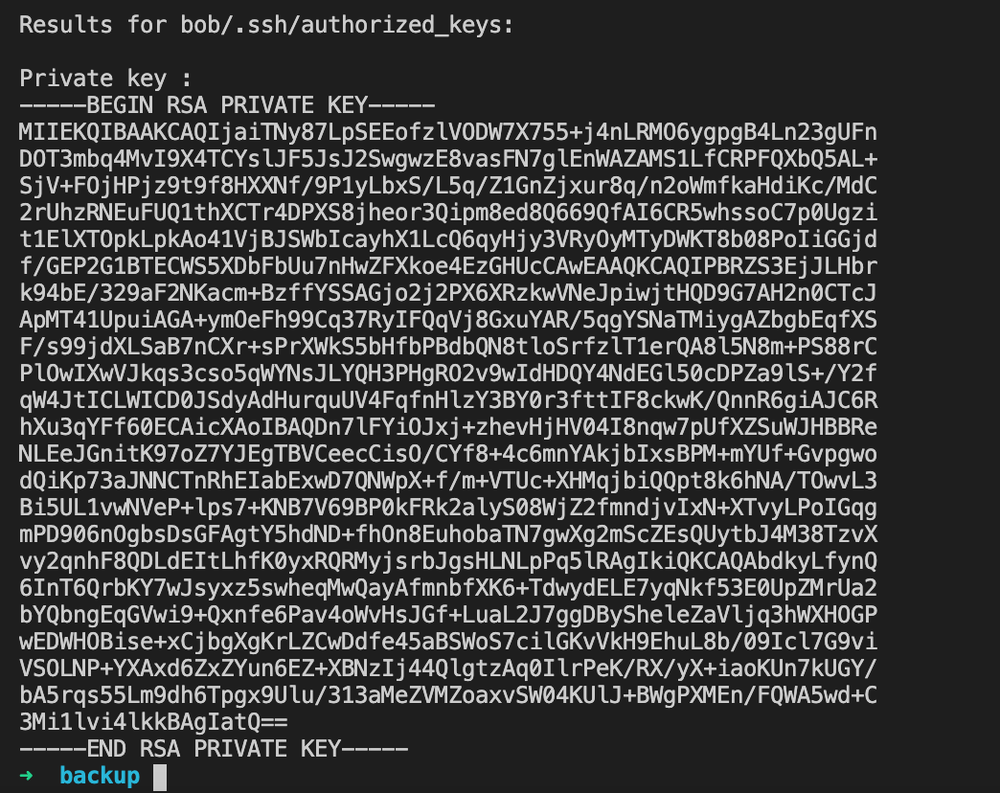
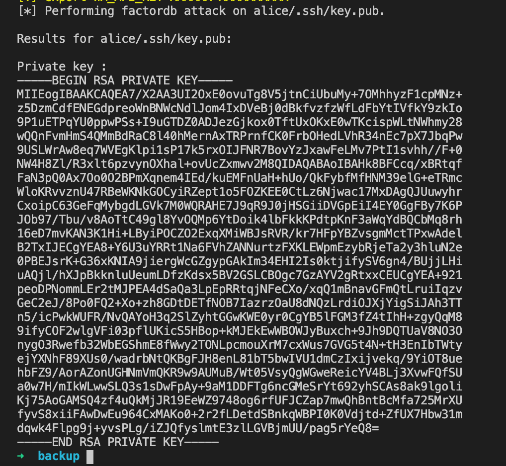

# Backups

## Problem

The backup of the home directories might contain too much information.



## Bob

Factordb attack worked.

`backup ~/Tools/RsaCtfTool/RsaCtfTool.py --publickey bob/.ssh/authorized_keys --private`



```bash
$ chmod 600 .ssh/id_rsa
$ ssh -p2222 -i .ssh/id_rsa bob@backup-01.play.midnightsunctf.se
midnight{Turn_electricity_t0_h347}
```

## Alice

Same thing for the first key, alice@work.



```bash
$ chmod 600 .ssh/id_rsa
$ ssh -p2222 -i .ssh/id_rsa alice@backup-01.play.midnightsunctf.se
midnight{factorization_for_the_Win}
Connection to backup-01.play.midnightsunctf.se closed.
```

