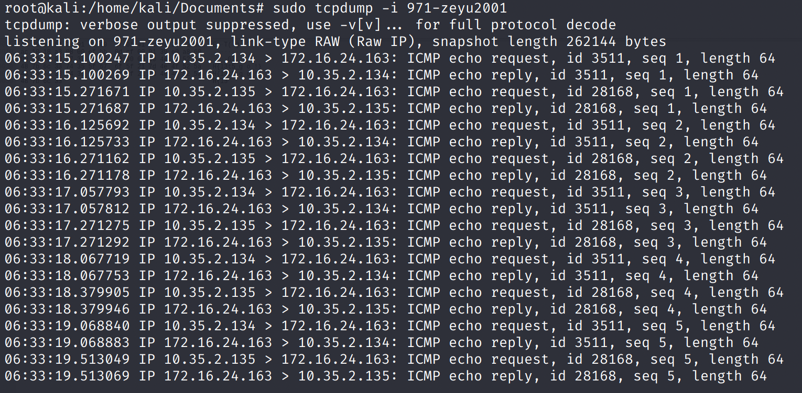
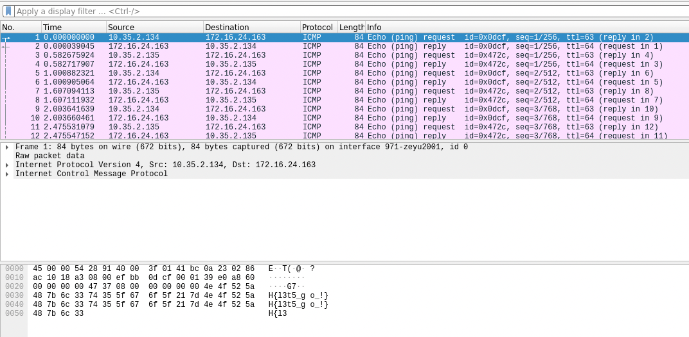

# Discovery

## Problem

I feel something tickling me, what is it?

## Solution

The description says that something is "tickling" me. It turns out that this was referring to network tickling. When I connected to the VPN, `tcpdump` showed that `10.35.2.134` is periodically pinging me.

Let's open this in Wireshark to inspect the packet contents. The flag is in the ICMP data.

