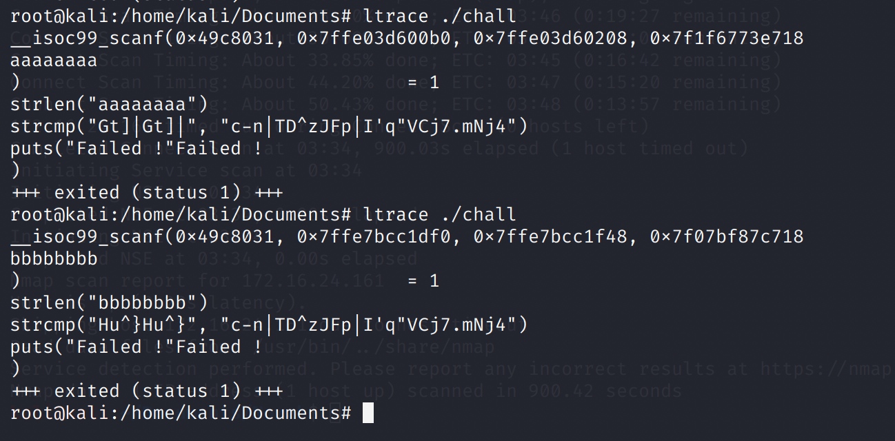

# Secure Auth v0

## Problem

One of NorzhNuclea's developers joined the team last quarter, specialized in authentication systems he found one he developed a few years ago with a innovative obfuscation method. Find the correct password to validate the checks.

by Masterfox

## Solution

Decompiling the binary shows that it’s filled with a large number of NOPs.

However, it turns out we can use `ltrace` to view the library calls and see the `strcmp` parameters. This is the part where our password gets checked against a hardcoded string.



Our password goes through some transformation before being compared, so we have to fuzz the input to understand what transformations are being applied. From the above screenshot, we can see that 4 characters are processed at a time.

By changing one character at a time, we can understand how these 4 characters are transformed. 

* 4 characters are processed at a time
* First character of plaintext, `p1` is related to the fourth character of ciphertext `c4` 
* `p2` is related to `c3` 
* `p3` is related to `c2`
* `p4` is related to `c1`
* By incrementing one character at a time, we know that this is a substitution cipher.

The solution is as follows:

```python
TARGET = "c-n|TD^zJFp|I'q\"VCj7.mNj4"

result = b''

low = 0
high = 4
while high < len(TARGET):
    chars = TARGET[low:high]

    c1 = chr(ord(chars[3]) - 27)
    c4 = chr(ord(chars[0]) + 26)

    c2 = chr(ord(chars[2]) + 4)
    c3 = chr(ord(chars[1]) - 19)

    if c1 < ' ':
        c1 = chr(ord('{') + ord(c1) - 0x1c)
        pass

    if c3 < ' ':
        c3 = chr(ord('{') + ord(c3) - 0x1c)
        pass

    print(c1.encode() + c2.encode() + c3.encode() + c4.encode())
    result = c1.encode() + c2.encode() + c3.encode() + c4.encode() + result

    low = high
    high += 4

result = chr(ord('a') + ord(TARGET[-1]) - ord('G')).encode() + result

print(result)
```


