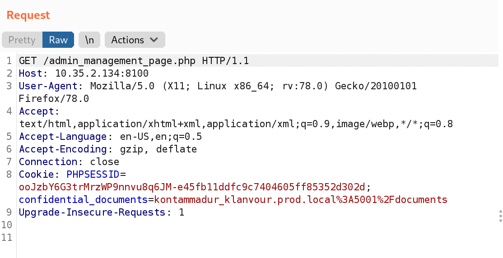
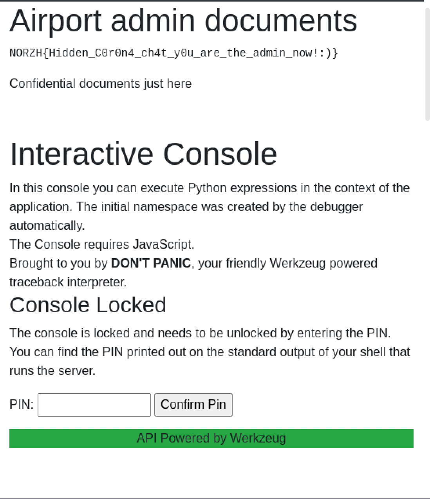
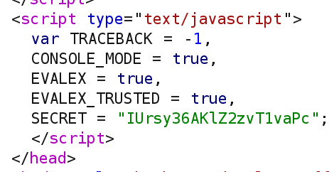
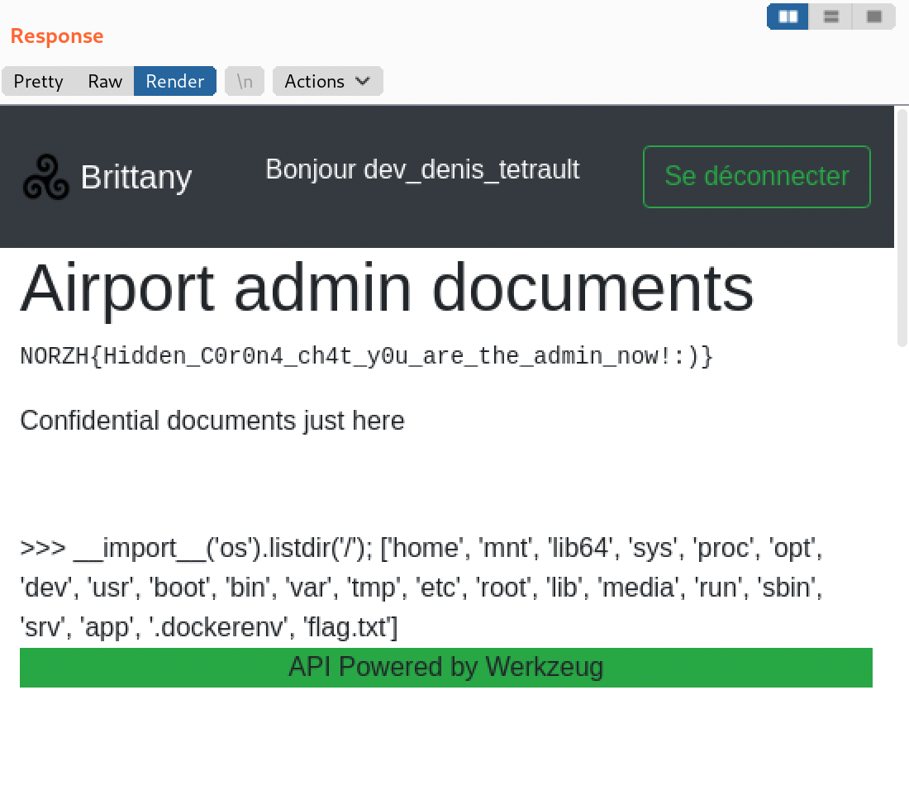

# Triskel 3: Dead End

## Problem

You are admin now... Anyway now you can't access any information or have more privileges so I guess it's the end of your journey haha!

by Remsio

## Solution

We can now see that in the cookies, we have a value for `confidential_documents`, which seems like another "API call".

We are told that the API is powered by Werkzeug, which includes a debugging console at `/console` if debugging is enabled.

The current cookie is set to the production server. If debugging is enabled, it would probably be at the development server.

If we go over to `confidential_documents=kontammadur_klanvour.dev.local%3A5001%2Fconsole`, we can see that there is a Werkzeug console.

The secret key for the debugger is hardcoded in the JavaScript.

Hence, we can craft a request as follows to achieve RCE.

`confidential_documents=kontammadur_klanvour.dev.local%3A5001%2Fconsole?__debugger__=yes&cmd=__import__('os').listdir('/')%3b&frm=0&s=IUrsy36AKlZ2zvT1vaPc`

We find `flag.txt` in the `/` directory, so we can simply send another request to read the flag.

References:

* [https://www.netscylla.com/blog/2018/10/03/werkzeug-debugger.html](https://www.netscylla.com/blog/2018/10/03/werkzeug-debugger.html)

