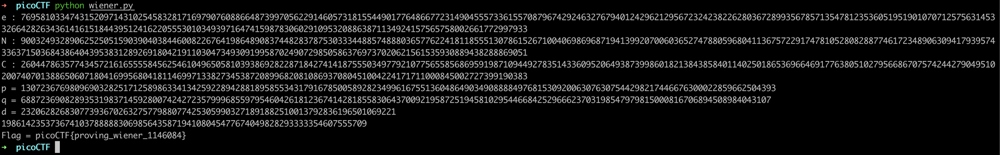

# Dachshund Attacks \(80\)

## Problem

What if `d` is too small? Connect with `nc mercury.picoctf.net 31133`.

## Solution

When RSA private key `d` is small, Wiener's Attack may be used.



```python
"""
MxRy - 2016 - Wiener's attack 
useful link : http://math.unice.fr/~walter/L1_Arith/cours2.pdf
"""
import math

def DevContinuedFraction(num, denum) :
    partialQuotients = []
    divisionRests = []
    for i in range(int(math.log(denum, 2)/1)) :
        divisionRests = num % denum
        partialQuotients.append(num / denum)
        num = denum
        denum = divisionRests
        if denum == 0 :
            break
    return partialQuotients

""" (cf. useful link p.2) Theorem :
p_-2 = 0 p_-1 = 1   p_n = a_n.p_n-1 + p_n-2
q_-2 = 1 q_-1 = 0   q_n = a_n.q_n-1 + q_n-2 
"""
def DivergentsComputation(partialQuotients) :
    (p1, p2, q1, q2) = (1, 0, 0, 1)
    convergentsList = []
    for q in partialQuotients :
        pn = q * p1 + p2
        qn = q * q1 + q2
        convergentsList.append([pn, qn])
        p2 = p1
        q2 = q1
        p1 = pn
        q1 = qn
    return convergentsList    

"""  
https://dzone.com/articles/cryptographic-functions-python
Be careful to physical attacks see sections below
"""
def SquareAndMultiply(base,exponent,modulus):
    binaryExponent = []
    while exponent != 0:
        binaryExponent.append(exponent%2)
        exponent = exponent/2
    result = 1
    binaryExponent.reverse()
    for i in binaryExponent:
        if i == 0:
            result = (result*result) % modulus
        else:
            result = (result*result*base) % modulus
    return result

def WienerAttack(e, N, C) :
    testStr = 42 
    C = SquareAndMultiply(testStr, e, N)
    for c in DivergentsComputation(DevContinuedFraction(e, N)) :
        if SquareAndMultiply(C, c[1], N) == testStr :
            FullReverse(N, e, c)
            return c[1]
    return -1

"""
Credit for int2Text : 
https://jhafranco.com/2012/01/29/rsa-implementation-in-python/
"""
def GetTheFlag(C, N, d) :
    p = pow(C, d, N)
    print p
    size = len("{:02x}".format(p)) // 2
    print "Flag = "+"".join([chr((p >> j) & 0xff) for j in reversed(range(0, size << 3, 8))])

"""
http://stackoverflow.com/questions/356090/how-to-compute-the-nth-root-of-a-very-big-integer
"""
def find_invpow(x,n):
    high = 1
    while high ** n < x:
        high *= 2
    low = high/2
    while low < high:
        mid = (low + high) // 2
        if low < mid and mid**n < x:
            low = mid
        elif high > mid and mid**n > x:
            high = mid
        else:
            return mid
    return mid + 1

"""
On reprend la demo on cherche (p, q), avec la recherche des racines du P
de scd degre : x^2 - (N - phi(N) + 1)x + N
"""
def FullReverse(N, e, c) :
    phi = (e*c[1]-1)//c[0]
    a = 1
    b = -(N-phi+1)
    c = N
    delta =b*b - 4*a*c
    if delta > 0 :
        x1 = (-b + find_invpow((b*b - 4*a*c), 2))/(2*a)
        x2 = (-b - find_invpow((b*b - 4*a*c), 2))/(2*a)
        if x1*x2 == N :
            print "p = "+str(x1)
            print "q = "+str(x2)
        else :
            print "** Error **"
    else :
        print "** ERROR : (p, q)**"

"""
Si N, e, C en hex ::> int("0x0123456789ABCDEF".strip("0x"), 16)
"""
if __name__ == "__main__":
    C = 26044786357743457216165555845625461049650581039386928228718427414187555034977921077565585686959198710944927835143360952064938739986018213843858401140250186536966469177638051027956686707574244279049510200740701388650607180416995680418114699713382734538720899682081086937080451004224171711000845002727399190383 
    e = 76958103347431520971431025458328171697907608866487399705622914605731815544901776486677231490455573361557087967429246327679401242962129567232423822628036728993567857135478123536051951901070712575631453326642826343614161518443951241622055530103493971647415987830602910953208863871134924157565758002661772997933
    N = 90032493289062525051590390403844600822676419864890837448283787530333448857488803657762241811855513078615267100406986968719413992070060365274788059680411367572291747810528082887746172348906309417939574336371503684386404395383128926918042191103047349309199587024907298505863769737020621561535930889438288869051

    print "e : "+str(e)
    print "N : "+str(N)
    print "C : "+str(C)
    d = WienerAttack(e, N, C)
    if d != -1 :
        print "d = "+str(d)
        GetTheFlag(C, N, d)
    else :
        print "** ERROR : Wiener's attack Impossible**"
```

