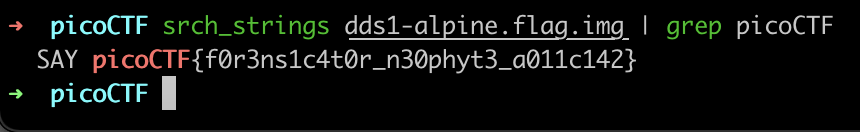
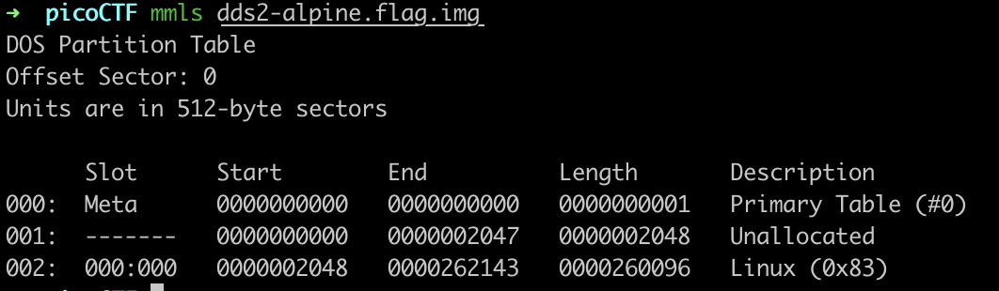
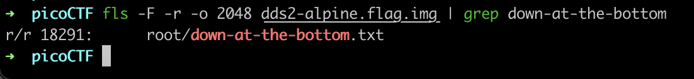
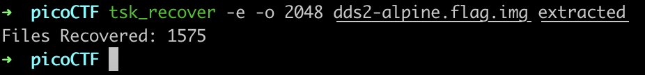
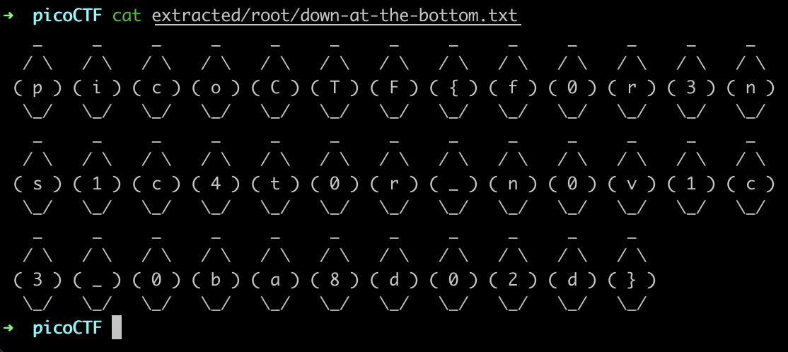

# Disk, Disk, Sleuth! \(110 + 130\)

### DDS 1

`srch_strings dds1-alpine.flag.img | grep picoCTF`

### DDS 2

Note that our Linux partition offset is 2048. We will need to specify this in the `-o 2048` option subsequently.

Find the location of the file:

Recover the files:

`tsk_recover -e -o 2048 dds2-alpine.flag.img extracted`

Then navigate to the location \(`root/down-at-the-bottom.txt`\) found previously. Our flag is there.

