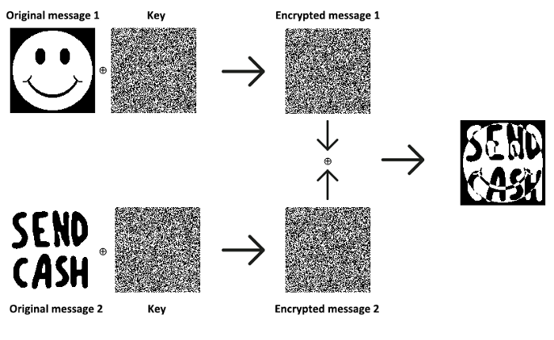
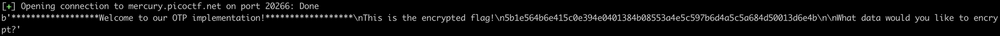
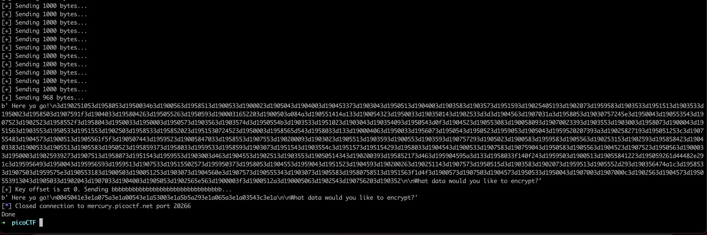
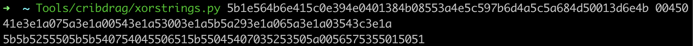
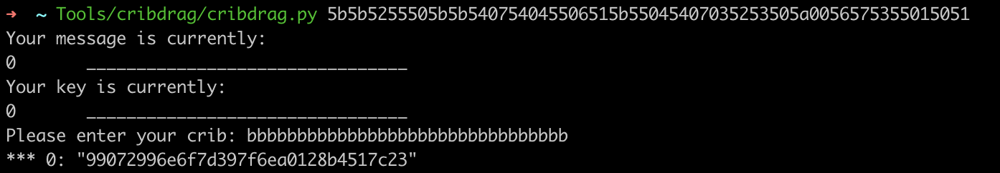

# Easy Peasy \(40\)

## Problem

A one-time pad is unbreakable, but can you manage to recover the flag? \(Wrap with picoCTF{}\) `nc mercury.picoctf.net 20266` [otp.py](https://mercury.picoctf.net/static/84c434ada6e2f770b5000292cadae7eb/otp.py)

## Solution

Source code:

```python
#!/usr/bin/python3 -u
import os.path

KEY_FILE = "key"
KEY_LEN = 50000
FLAG_FILE = "flag"


def startup(key_location):
    flag = open(FLAG_FILE).read()
    kf = open(KEY_FILE, "rb").read()

    start = key_location
    stop = key_location + len(flag)

    key = kf[start:stop]
    key_location = stop

    result = list(map(lambda p, k: "{:02x}".format(ord(p) ^ k), flag, key))
    print("This is the encrypted flag!\n{}\n".format("".join(result)))

    return key_location

def encrypt(key_location):
    ui = input("What data would you like to encrypt? ").rstrip()
    if len(ui) == 0 or len(ui) > KEY_LEN:
        return -1

    start = key_location
    stop = key_location + len(ui)

    kf = open(KEY_FILE, "rb").read()

    if stop >= KEY_LEN:
        stop = stop % KEY_LEN
        key = kf[start:] + kf[:stop]
    else:
        key = kf[start:stop]
    key_location = stop

    result = list(map(lambda p, k: "{:02x}".format(ord(p) ^ k), ui, key))

    print("Here ya go!\n{}\n".format("".join(result)))

    return key_location


print("******************Welcome to our OTP implementation!******************")
c = startup(0)
while c >= 0:
    c = encrypt(c)
```

A few things here:

* `startup()` and `encrypt()` increment the key offset by the length of the data encrypted.
* We know that the flag is 32 bytes, since the ciphertext is printed to us.
* Once the key is **reused**, we can use the **Crib Drag Attack** to decode the ciphertext.

So, the goal is to make the key be used twice. This can easily be achieved by calculating the remaining bytes until `stop % KEY_LEN` eventually becomes 0. This means we have to encrypt a total of 50000 - 32 bytes of data.

### Theory

If the key $$k$$ is reused such that

$$
c_1=m_1 \oplus k \\
c_2 = m_2 \oplus k \\
$$

then we can XOR the two ciphertexts to get

$$
c_1 \oplus c_2 = m_1 \oplus m_2
$$



In this case, we can control $$m_2$$. Since $$x \oplus x = 0$$ and $$x \oplus 0 = x$$, then

$$
m_1 \oplus m_2 \oplus m_2 = m_1 \oplus 0 = m_1
$$

Sidenote: if we don't know $$m_2$$, we can use the crib drag attack to guess parts of the message at a time.

### Exploitation

The script will calculate the number of bytes so that the key is reused against our custom payload.

```python
from pwn import *

conn = remote('mercury.picoctf.net', 20266)
print(conn.recvuntil('What data would you like to encrypt?'))

remaining_bytes = 50000 - 32    # flag is 32 bytes
while remaining_bytes >= 1000:
    print('[+] Sending 1000 bytes...')
    conn.send('a' * 1000 + '\r\n')
    remaining_bytes -= 1000
    conn.recvuntil('What data would you like to encrypt?')

print(f'[+] Sending {remaining_bytes} bytes...')
conn.send('a' * remaining_bytes + '\r\n')
print(conn.recvuntil('What data would you like to encrypt?'))

print(f'[+] Key offset is at 0. Sending bbbbbbbbbbbbbbbbbbbbbbbbbbbbbbbb...')
conn.send('b' * 32 + '\r\n')
print(conn.recvuntil('What data would you like to encrypt?'))

conn.close()
print("Done")
```

1\) c1 = flag XOR key = 5b1e564b6e415c0e394e0401384b08553a4e5c597b6d4a5c5a684d50013d6e4b



2\) c2 = custom payload \(`'b' * 32`\) XOR key = 0045041e3e1a075a3e1a00543e1a53003e1a5b5a293e1a065a3e1a03543c3e1a



3\) m1 XOR m2 = c1 XOR c2 = 5b5b5255505b5b540754045506515b55045407035253505a0056575355015051



4\) m1 XOR m2 XOR m2 = m1 = 99072996e6f7d397f6ea0128b4517c23

This is the flag!



## References

1. [https://crypto.stackexchange.com/questions/59/taking-advantage-of-one-time-pad-key-reuse](https://crypto.stackexchange.com/questions/59/taking-advantage-of-one-time-pad-key-reuse)
2. [https://github.com/SpiderLabs/cribdrag](https://github.com/SpiderLabs/cribdrag)

