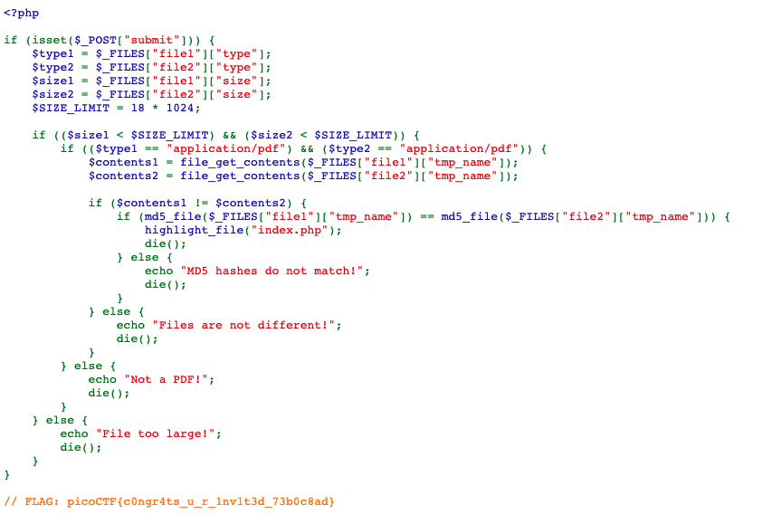

# It Is My Birthday (100)

## Problem

I sent out 2 invitations to all of my friends for my birthday! I'll know if they get stolen because the two invites look similar, and they even have the same md5 hash, but they are slightly different! You wouldn't believe how long it took me to find a collision. Anyway, see if you're invited by submitting 2 PDFs to my website.



## Solution

It is now trivial to generate an MD5 collision of two images / PDF files.

Take any two PDFs of different contents, we can make them have the same MD5 hash.

BTW, there is a size limit so choose small PDFs.

```python
import os
import sys
import hashlib

def EnclosedString(d, starts, ends):
  off = d.find(starts) + len(starts)
  return d[off:d.find(ends, off)]

def getCount(d):
  s = EnclosedString(d, "/Count ", "/")
  count = int(s)
  return count

def procreate(l): # :p
  return " 0 R ".join(l) + " 0 R"


if len(sys.argv) == 1:
  print("PDF MD5 collider")
  print("Usage: pdf.py <file1.pdf> <file2.pdf>")
  sys.exit()

os.system('mutool merge -o first.pdf %s' % sys.argv[1])
os.system('mutool merge -o second.pdf %s' % sys.argv[2])
os.system('mutool merge -o merged.pdf dummy.pdf %s %s' % (sys.argv[1], sys.argv[2]))

with open("first.pdf", "rb") as f:
  d1 = f.read()

with open("second.pdf", "rb") as f:
  d2 = f.read()

with open("merged.pdf", "rb") as f:
  dm = f.read()


COUNT1 = getCount(d1)
COUNT2 = getCount(d2)


kids = EnclosedString(dm, "/Kids[", "]")

# we skip the first dummy, and the last " 0 R" string
pages = kids[:-4].split(" 0 R ")[1:]

template = """%%PDF-1.4
1 0 obj
<<
  /Type /Catalog
  %% for alignements (comments will be removed by merging or cleaning)
  /MD5_is__ /REALLY_dead_now__
  /Pages 2 0 R
  %% to make sure we don't get rid of the other pages when garbage collecting
  /Fakes 3 0 R
  %% placeholder for UniColl collision blocks
  /0123456789ABCDEF0123456789ABCDEF012
  /0123456789ABCDEF0123456789ABCDEF0123456789ABCDEF0123456789ABCDEF0
>>
endobj
2 0 obj
<</Type/Pages/Count %(COUNT2)i/Kids[%(KIDS2)s]>>
endobj 
3 0 obj
<</Type/Pages/Count %(COUNT1)i/Kids[%(KIDS1)s]>>
endobj
4 0 obj %% overwritten - was a fake page to fool merging
<< >>
endobj
"""

KIDS1 = procreate(pages[:getCount(d1)])

KIDS2 = procreate(pages[getCount(d1):])


with open("hacked.pdf", "wb") as f:
  f.write(template % locals())
  # adjust parents for the first set of pages
  f.write(dm[dm.find("5 0 obj"):].replace("/Parent 2 0 R", "/Parent 3 0 R", COUNT1))

# let's adjust offsets - -g to get rid of object 4 by garbage collecting
# (yes, errors will appear)
print
print "KEEP CALM and IGNORE THE NEXT ERRORS"
os.system('mutool clean -gggg hacked.pdf cleaned.pdf')

with open("cleaned.pdf", "rb") as f:
  cleaned = f.read()

# some mutool versions do different stuff :(
cleaned = cleaned.replace(
  " 65536 f \n0000000016 00000 n \n",
  " 65536 f \n0000000018 00000 n \n",
  1)

with open("pdf1.bin", "rb") as f:
  prefix1 = f.read()

with open("pdf2.bin", "rb") as f:
  prefix2 = f.read()

file1 = prefix1 + "\n" + cleaned[192:]
file2 = prefix2 + "\n" + cleaned[192:]

with open("collision1.pdf", "wb") as f:
  f.write(file1)

with open("collision2.pdf", "wb") as f:
  f.write(file2)

os.remove('first.pdf')
os.remove('second.pdf')
os.remove('merged.pdf')
os.remove('hacked.pdf')
os.remove('cleaned.pdf')

md5 = hashlib.md5(file1).hexdigest()

assert md5 == hashlib.md5(file2).hexdigest()

print
os.system('mutool info -X collision1.pdf')
print
print
os.system('mutool info -X collision2.pdf')

print
print "MD5: %s" % md5
print "Success!"
```

These are the PDFs I generated. Note that they have different content, yet the same MD5.





After we've generated the two colliding PDFs, uploading them to the challenge page unlocks the flag and source code.



## References

1. [https://github.com/corkami/collisions](https://github.com/corkami/collisions)
