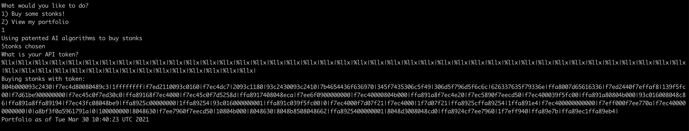

# Stonks \(20\)

## Problem

I decided to try something noone else has before. I made a bot to automatically trade stonks for me using AI and machine learning. I wouldn't believe you if you told me it's unsecure! [vuln.c](https://mercury.picoctf.net/static/fdf270d959fa5231e180e2bd11421d0c/vuln.c) `nc mercury.picoctf.net 16439`

## Solution

This is a format string vulnerability.

Note that the `user_buf` is printed directly without any format specifier.

```c
    char *user_buf = malloc(300 + 1);
    printf("What is your API token?\n");
    scanf("%300s", user_buf);
    printf("Buying stonks with token:\n");
    printf(user_buf);
```

We will send a series of `%llx` strings, which stands for long long hex values. This will print the stack values:



We can then look for what may be strings. Taking into consideration the range of ASCII values that correspond to alphabets, this portion looks interesting:

`7b4654436f636970|345f7435306c5f49|306d5f796d5f6c6c|626337635f79336e`

It is in little endian, so we would need to convert it to big endian first. We have:

`7069636F4354467B495F6C3035745F346C6C5F6D795F6D306E33795F63376362`

which when converted, gives us the following string:

`picoCTF{I_l05t_4ll_my_m0n3y_c7cb`

We are missing part of the flag, and that is due to the next element in the stack, `ffa8007d65616336`, which is `366361657D00A8FF` in big endian. Note the `\x00` byte - that is the string terminator. The remaining part of the flag is `6cae}`.

