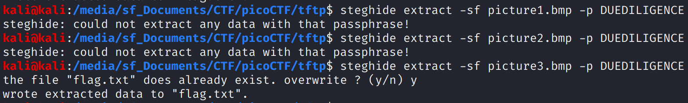

# Trivial Flag Transfer Protocol \(90\)

## Problem

Figure out how they moved the [flag](https://mercury.picoctf.net/static/88553d672efbccbc5868002f4c6eb737/tftp.pcapng).

## Solution

In Wireshark, Export Objects &gt; TFTP &gt; Extract All

The program.deb installs steghide.

instructions.txt - Caesar Cipher

```text
GSGCQBRFAGRAPELCGBHEGENSSVPFBJRZHFGQVFTHVFRBHESYNTGENAFSRE.SVTHERBHGNJNLGBUVQRGURSYNTNAQVJVYYPURPXONPXSBEGURCYNA
```

=

```text
TFTPDOESNTENCRYPTOURTRAFFICSOWEMUSTDISGUISEOURFLAGTRANSFER.FIGUREOUTAWAYTOHIDETHEFLAGANDIWILLCHECKBACKFORTHEPLAN
```

TFTP DOESNT ENCRYPT OUR TRAFFIC SO WE MUST DISGUISE OUR FLAG TRANSFER. FIGURE OUT A WAY TO HIDE THE FLAG AND I WILL CHECK BACK FOR THE PLAN

plan.txt - Caesar Cipher

```text
VHFRQGURCEBTENZNAQUVQVGJVGU-QHRQVYVTRAPR.PURPXBHGGURCUBGBF
```

=

```text
I USED THE PROGRAM AND HID IT WITH-DUEDILIGENCE. CHECK OUT THE PHOTOS
```

Use the DUEDILIGENCE passphrase:



