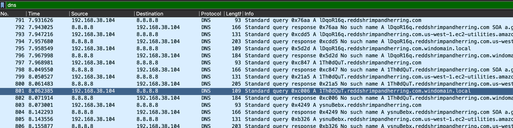
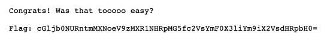
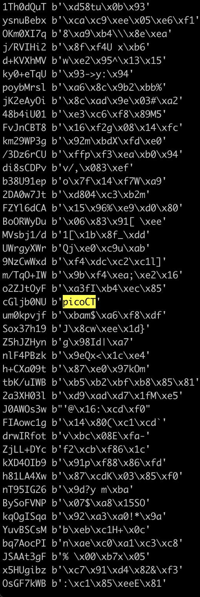
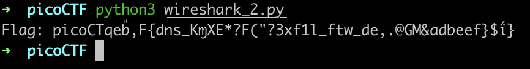
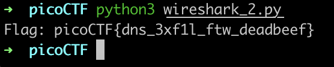

# Wireshark twoo twooo two twoo... \(100\)

Suspicious DNS traffic:



Note that DNS traffic is often used to exfiltrate data.

If you open up one of the sites requested by DNS, you get this:



The domains are humorously named `xxxx.reddshrimpandherring.com`.

\(A red herring is "a clue or piece of information which is or is intended to be misleading or distracting."\)

Instead of using this B64 encoded "flag", if you look at the bigger picture, the entire chain of DNS requests _themselves_ form a B64 encoded string, ending with the `==` padding:


In Wireshark, export packet dissections as CSV.

Then we can parse the CSV file to extract the B64 string using Python.

At first, I extracted all the DNS requests and combined the B64-decoded strings together. This did not work, however, as I realised that most of the traffic was noise to hide the actual traffic that is being exfiltrated:



We can see that `picoCT` is in the data, as well as `{` and `}`. This proved to me that the flag was indeed in the DNS data, but we needed to filter out the noise. First, I got rid of all the non-ASCII outputs. We were left with this:



This is much better. After adding a validation function that only allows alphanumeric characters, `{`, `}` and `_`, we get:



Which was the correct flag!

Script to get the flag:

```python
import re
import base64

result = ''

def val(s):
    for c in s:
        if not c.isalpha() and not c.isnumeric() and not c == '{' and not c == '}' and not c == '_':
            return False
    return True

with open('wireshark_2.csv', 'r') as f:
    line = f.readline()
    while line:
        if 'Standard query' in line:
            m = re.search(r"Standard query .+ A (.+)", line)
            b64_portion = m[1].split('.')[0]
            b64_decoded = base64.b64decode(b64_portion)

            try:
                ascii_portion = b64_decoded.decode('utf-8')

            except:
                pass

            else:
                if val(ascii_portion) and not result.endswith(ascii_portion):
                    result += ascii_portion

        line = f.readline()

print('Flag:', result)
```

