# Level 1 - Scratching the Surface

## Scenario 1

### Challenge 1

> _We've sent the following secret message on a secret channel._
>
> _Submit your flag in this format: TISC{decoded message in lower case}_

We have a .wav audio file.

Open in Sonic Visualizer, and see that the channel 2 spectrogram looks like morse code.

.png>)

Extract the second channel into a seperate `out.r.wav` file:

```
sox file1.wav out.r.wav remix 2
```

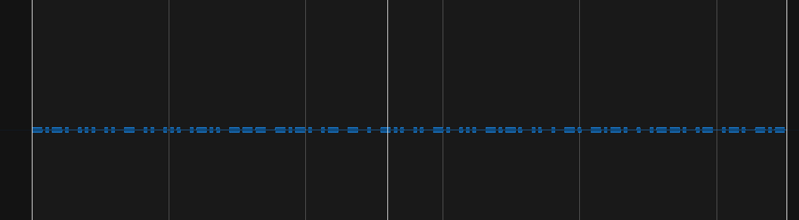

Decode the morse code:

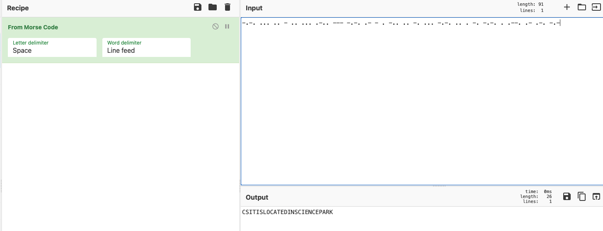

The flag is `TISC{csitislocatedinsciencepark}`

### Challenge 2

> This is a generic picture. What is the modify time of this photograph?
>
> Submit your flag in the following format: TISC{YYYY:MM:DD HH:MM:SS}

We can see this in the EXIF data.

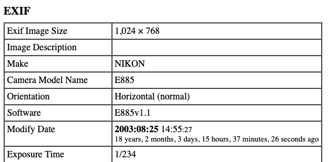

The flag is `TISC{2003:08:25 14:55:27}`

### Challenge 3

> Nothing unusual about the Singapore logo right?
>
> Submit your flag in the following format: TISC{ANSWER}

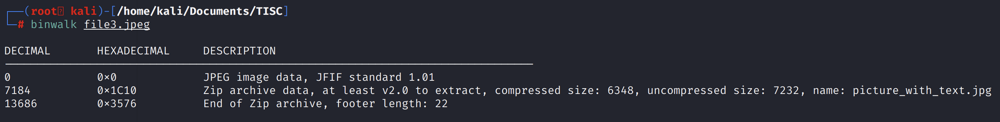

This is a substitution cipher, the answer is

```
ANSWER TO THIS CHALLENGE IS HERE APPLECARROTPEAR
```

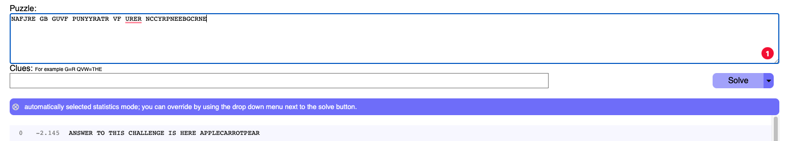

## Scenario 2

> Excellent! Now that you have show your capabilities, CSIT SOC team have given you an .OVA virtual image in investigating a snapshot of a machine that has been compromised by PALINDROME. What can you uncover from the image?
>
> Once you download the VM, use this free flag TISC{Yes, I've got this.} to unlock challenge 4 - 10.
>
> Check MD5 hash: c5b401cce9a07a37a6571ebe5d4c0a48
>
> For guide on how to import the ova file into VirtualBox, please follow the VM importing guide attached.

### Challenge 4

> What is the name of the user?
>
> Submit your flag in the format: TISC{name}.

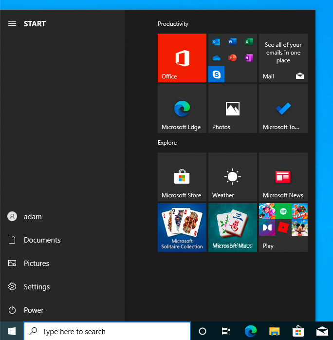

The name is adam.

### Challenge 5

> Which time was the user's most recent logon? Convert it UTC before submitting.
>
> Submit your flag in the UTC format: TISC{DD/MM/YYYY HH:MM:SS}.

Windows Security Logs log the Logon events (event ID 4624).

Note that the required time is in UTC, which is provided in the raw XML.

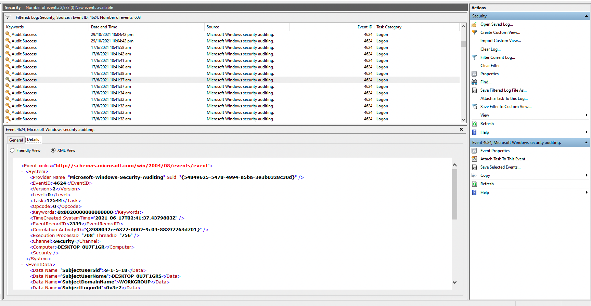

### Challenge 6

> A 7z archive was deleted, what is the value of the file CRC32 hash that is inside the 7z archive?
>
> Submit your flag in this format: TISC{CRC32 hash in upper case}.

The command `7z l -slt archive.zip` shows us extended info for the files in the archive, including the CRC32 hash.

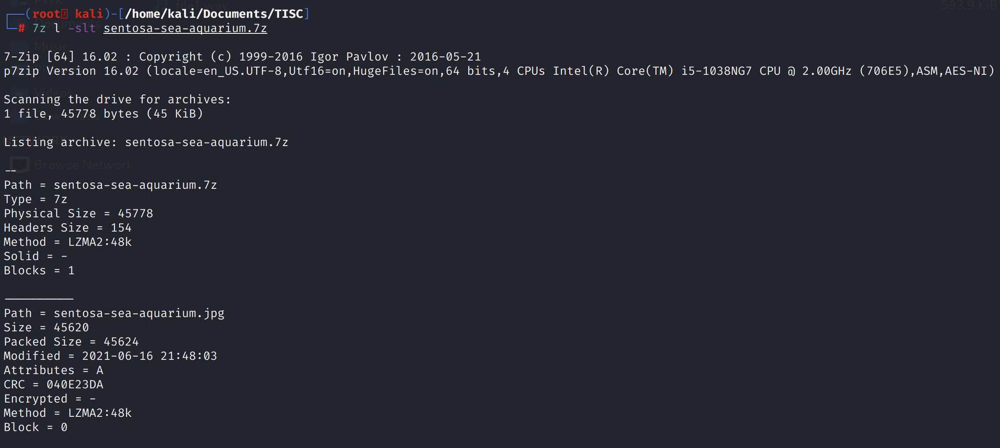

We can see the CRC value in the output.

```
CRC = 040E23DA
```

### Challenge 7

> Question1: How many users have an RID of 1000 or above on the machine?
>
> Question2: What is the account name for RID of 501?
>
> Question3: What is the account name for RID of 503?
>
> Submit your flag in this format: TISC{Answer1-Answer2-Answer3}. Use the same case for the Answers as you found them.

This information can be obtained using `wmic useraccount get name,sid`. The RID is the last part of the SID shown.

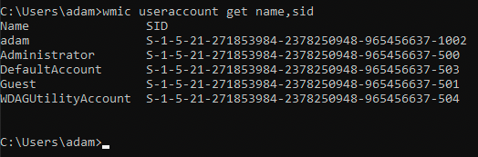

The flag is `TISC{1-Guest-DefaultAccount}`.

### Challenge 8

> Question1: How many times did the user visit https://www.csit.gov.sg/about-csit/who-we-are ?
>
> Question2: How many times did the user visit https://www.facebook.com ?
>
> Question3: How many times did the user visit https://www.live.com ?
>
> Submit your flag in this format: TISC{ANSWER1-ANSWER2-ANSWER3}.

Edge has a `History` SQLite database that contains the web history.

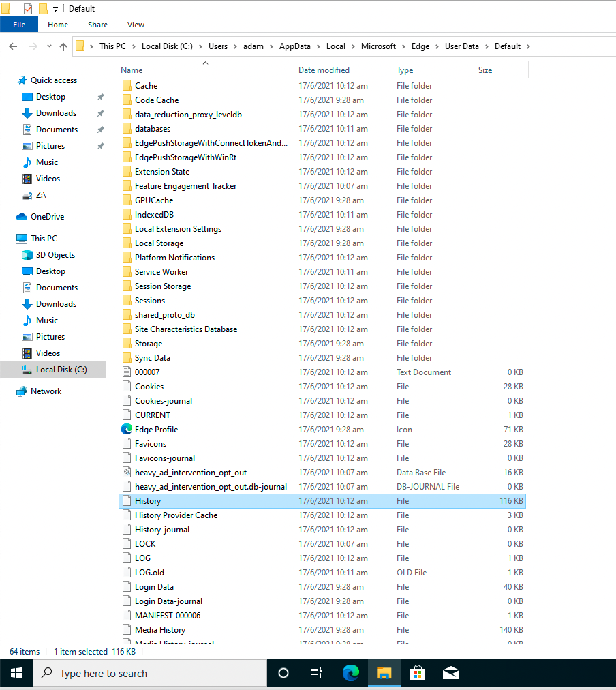

The who-are-we page was visited twice. The other two websites were visited 0 times.&#x20;

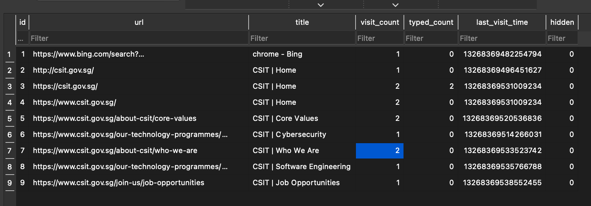

The flag is `TISC{2-0-0}`.

### Challenge 9

> A file with SHA1 0D97DBDBA2D35C37F434538E4DFAA06FCCC18A13 is in the VM… somewhere. What is the name of the file that is of interest?

I wrote a simple PowerShell script to find this.

```powershell
Get-ChildItem -Path "C:\" -Recurse -Force |

ForEach-Object {
    if ((Get-FileHash -algorithm sha1 $_.FullName).Hash -eq "0D97DBDBA2D35C37F434538E4DFAA06FCCC18A13")
    {
        Write-Output $_.FullName
        break
    }
}
```

This outputs `C:\Users\adam\AppData\Roaming\Microsoft\Windows\Recent\otter-singapore.lnk`, which links to `otter-singapore.jpg`.
