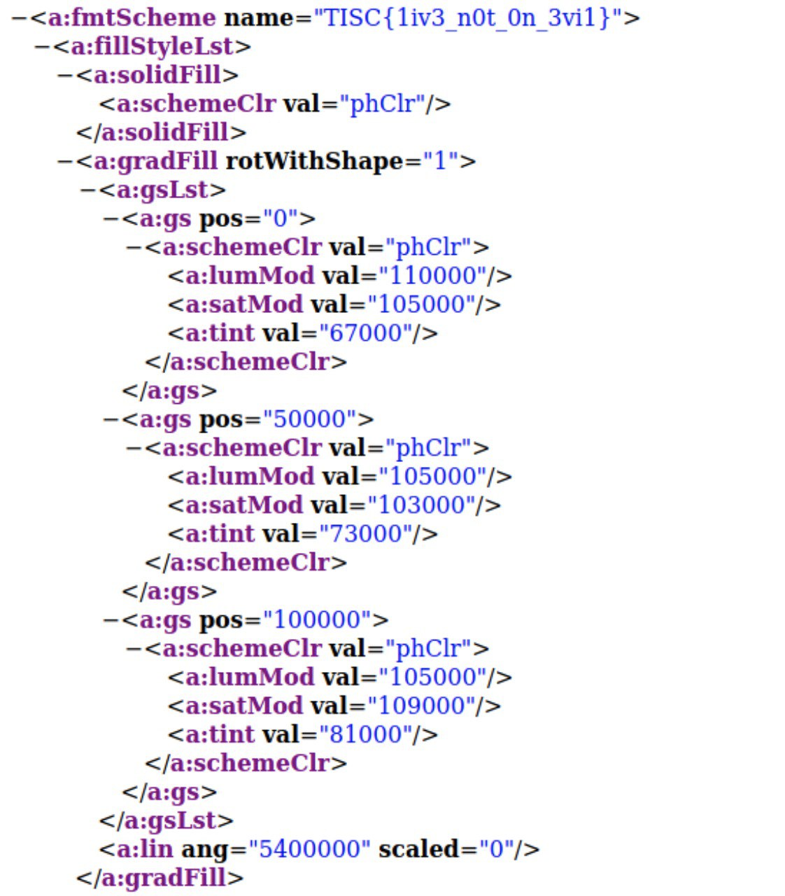

# Level 2 - Dee Na Saw as a need

> We have detected and captured a stream of anomalous DNS network traffic sent out from one of the PALINDROME compromised servers. None of the domain names found are active. Either PALINDROME had shut them down or there's more to it than it seems.
>
> This level contains 2 flags and both flags can be found independently from the same pcap file as attached here.
>
> Flag 1 will be in this format, TISC{16 characters}.

We are provided with a PCAP capture containing some suspicious DNS traffic.


The DNS queries follow the format d33d<2 numbers><7 characters>

### Part 1

After some analysis, I found that the 2 numbers ranged from 0 to 64. This would be base-64 encoding. Some scripting would help us to recover the encoded content.

```python
from scapy.all import *
from Crypto.Util.number import *
import base64

result = ''

scapy_cap = rdpcap('traffic.pcap')

b64_string = ''
std_base64chars = "ABCDEFGHIJKLMNOPQRSTUVWXYZabcdefghijklmnopqrstuvwxyz0123456789+/"

prev = ''
for packet in scapy_cap:
    qname = packet[DNSQR].qname.decode()
    curr = qname[4:][:2]
    b64_string += std_base64chars[int(curr) - 1]

b64_string = b64_string.encode()

missing_padding = len(b64_string) % 4
if missing_padding:
    b64_string += b'='* (4 - missing_padding)

result = base64.b64decode(b64_string)

with open('outfile', 'wb') as f:
    f.write(result)
```

It turns out the output was a Microsoft Word document.

```
$ file outfile
outfile: Microsoft OOXML
```


Since these documents are essentially zip files, I unzipped the Word document and did a recursive grep for the flag: `grep -r "TISC" .`

In `theme1.xml` lies the flag.



### Part 2

The 2nd part (7 characters) comprised of upper case alphabets and numbers. This was base-32 encoding. The flag was hidden in the decoded output.


